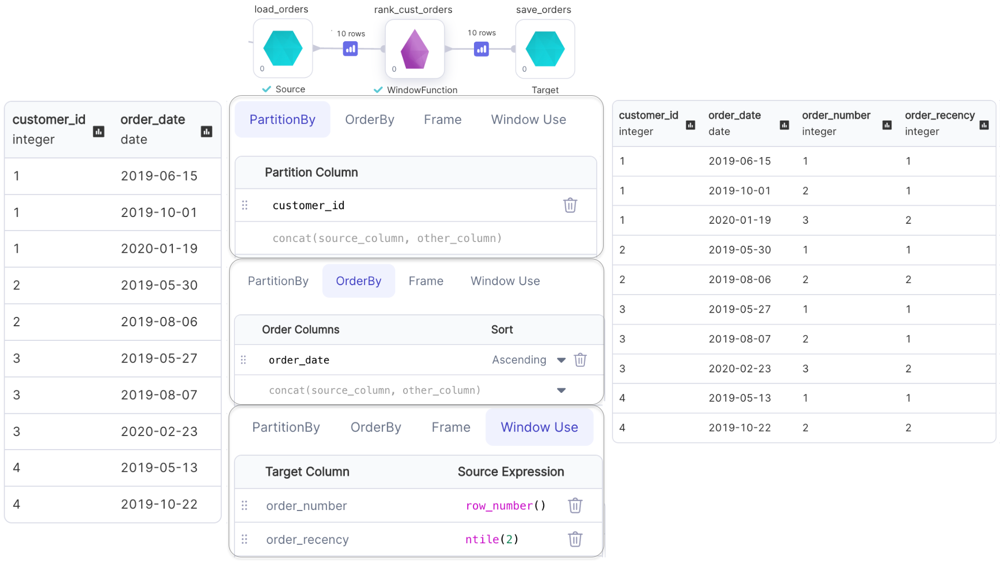
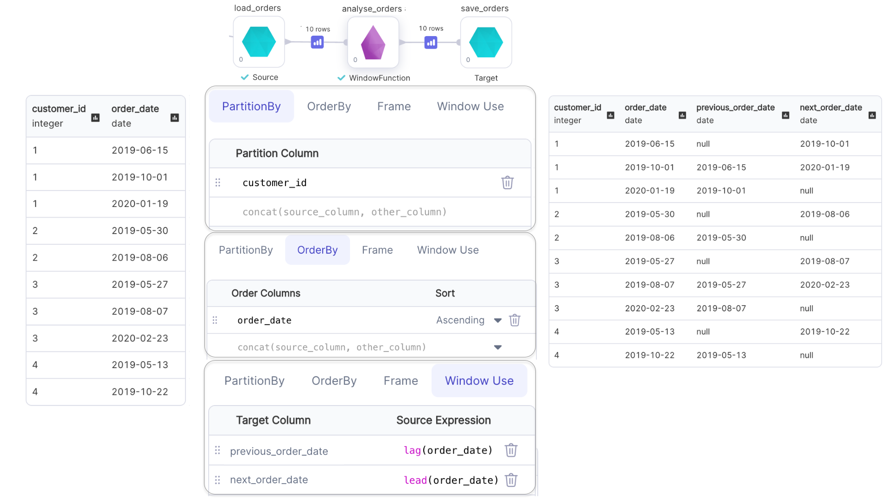
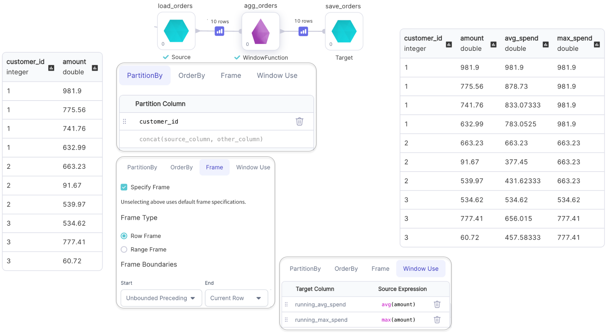

<h3>SQL Gem</h3>

The WindowFunction lets you define a **WindowSpec** and apply window functions on a model.

### Parameters

| Parameter         | Description                                                                                 | Required                                                                                                  |
| ----------------- | ------------------------------------------------------------------------------------------- | --------------------------------------------------------------------------------------------------------- |
| Model             | Input Source                                                                                | True                                                                                                      |
| Target column     | Output Column name                                                                          | True                                                                                                      |
| Source expression | Window function expression to perform over the created Window                               | True                                                                                                      |
| Order columns     | Columns to order by in Window. Must be a numeric type column if a `Range Frame` is selected | Required when `Source expression` has a Ranking/Analytical function **OR** when `Range Frame` is selected |
| Partition column  | Column to partition by in Window                                                            | False                                                                                                     |
| Row frame         | Row based frame boundary to apply on Window                                                 | False                                                                                                     |
| Range frame       | Range based frame boundary to apply on Window                                               | False                                                                                                     |

:::info
When `Order Columns` are not defined, an unbounded window frame `(rowFrame, unboundedPreceding, unboundedFollowing)` is used by default.
:::
:::info
When `Order Columns` are defined, a growing window frame `(rangeFrame, unboundedPreceding, currentRow)` is used by default.
:::

### Examples

---

#### Ranking Functions with Window

Examples of ranking functions are: `row_number()`, `rank()`, `dense_rank()` and `ntile()`
:::info
Only the default window frame `(rowFrame, unboundedPreceding, currentRow)` can be used with Ranking functions
:::

---

#### Analytical Functions with Window

Examples of analytical functions are: `lead()`, `lag()`, `cume_dist()`, etc.
:::info
Window frame for `lead()` and `lag()` can not be specified.
:::
:::info
Only the default window frame `(rangeFrame, unboundedPreceding, currentRow)` can be used with `cume_dist()`
:::

#### Aggregate Functions with Window

Examples of analytical functions are: `min()`, `max()`, `avg()`, etc.

