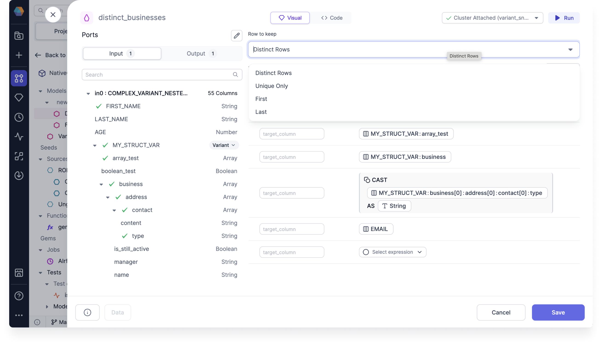
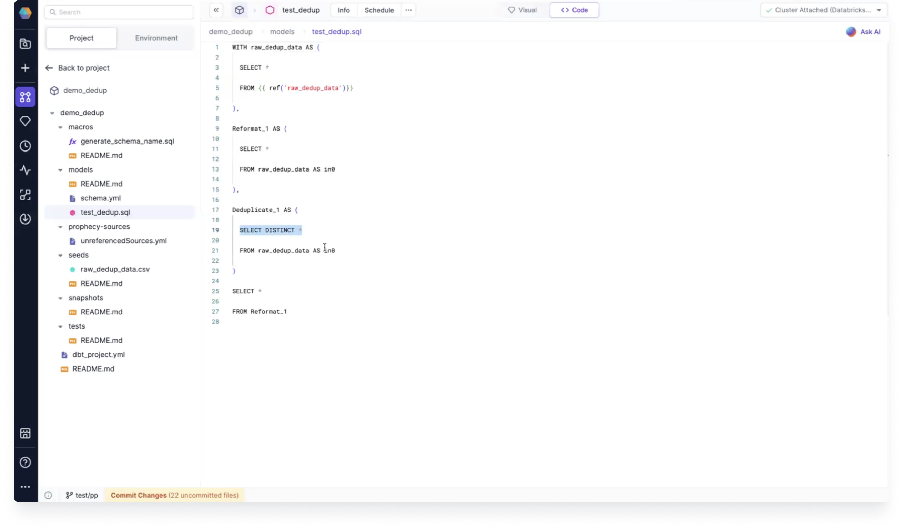

Removes rows with duplicate values of specified columns.

## Parameters

| Parameter              | Description                                                                                                                                                                                                                                                                                                                | Required |
| :--------------------- | :------------------------------------------------------------------------------------------------------------------------------------------------------------------------------------------------------------------------------------------------------------------------------------------------------------------------- | :------- |
| Source                 | Input source                                                                                                                                                                                                                                                                                                               | True     |
| Row to keep            | - `Distinct Rows`: Keeps all distinct rows. This is equivalent to performing a `df.distinct()` operation  - `Unique Only`: Keeps rows that don't have duplicates  - `First`: Keeps first occurrence of the duplicate row  - `Last`: Keeps last occurrence of the duplicate row  Default is `Distinct Rows` | True     |
| Deduplicate On Columns | Columns to consider while removing duplicate rows (not required for `Distinct Rows`)                                                                                                                                                                                                                                       | True     |

## Row to keep options

As mentioned in the previous parameters, there are four Row to keep options that you can use in your deduplicate Gem.

In the Code view, you can see that the Deduplicate Gem contains `SELECT DISTINCT *` when using the `Distinct Rows` option.

## Example

Suppose you're deduplicating the following table.

| First_Name | Last_Name | Type  | Contact           |
| :--------- | :-------- | :---- | :---------------- |
| John       | Doe       | phone | 123-456-7890      |
| John       | Doe       | phone | 123-456-7890      |
| John       | Doe       | phone | 123-456-7890      |
| Alice      | Johnson   | phone | 246-135-0987      |
| Alice      | Johnson   | phone | 246-135-0987      |
| Alice      | Johnson   | email | alice@johnson.com |
| Alice      | Johnson   | email | alice@johnson.com |
| Bob        | Smith     | email | bob@smith.com     |

For `Distinct Rows`, the interim data will show the following:

| First_Name | Last_Name | Type  | Contact           |
| :--------- | :-------- | :---- | :---------------- |
| John       | Doe       | phone | 123-456-7890      |
| Alice      | Johnson   | phone | 246-135-0987      |
| Alice      | Johnson   | email | alice@johnson.com |
| Bob        | Smith     | email | bob@smith.com     |

The `First` and `Last` options work similarly to `Distinct Rows`, but they keep the first and last occurrence of the duplicate rows respectively.

For `Unique Only`, the interim data will look like the following:

| First_Name | Last_Name | Type  | Contact       |
| :--------- | :-------- | :---- | :------------ |
| Bob        | Smith     | email | bob@smith.com |

You'll be left with only one unique row since the rest were all duplicates.

---

You can add `First_Name` and `Last_Name` to Deduplicate On Columns if you want to further deduplicate the table.

For `Distinct Rows`, the interim data will show the following:

| First_Name | Last_Name |
| :--------- | :-------- |
| John       | Doe       |
| Alice      | Johnson   |
| Bob        | Smith     |

:::note

For `First`, `Last`, and `Unique Only`, the interim data will contain all columns, irrespective of the columns that were added.

For `First` and `Last`, the interim data will look like the following:

| First_Name | Last_Name | Type  | Contact           |
| :--------- | :-------- | :---- | :---------------- |
| John       | Doe       | phone | 123-456-7890      |
| Alice      | Johnson   | phone | 246-135-0987      |
| Alice      | Johnson   | email | alice@johnson.com |
| Bob        | Smith     | email | bob@smith.com     |

For `Unique Only`, the interim data will look like the following:

| First_Name | Last_Name | Type  | Contact       |
| :--------- | :-------- | :---- | :------------ |
| Bob        | Smith     | email | bob@smith.com |

:::
