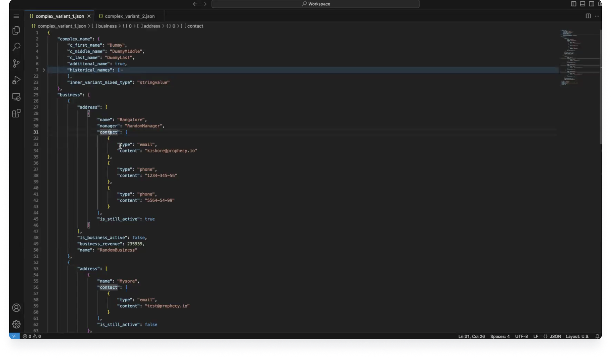
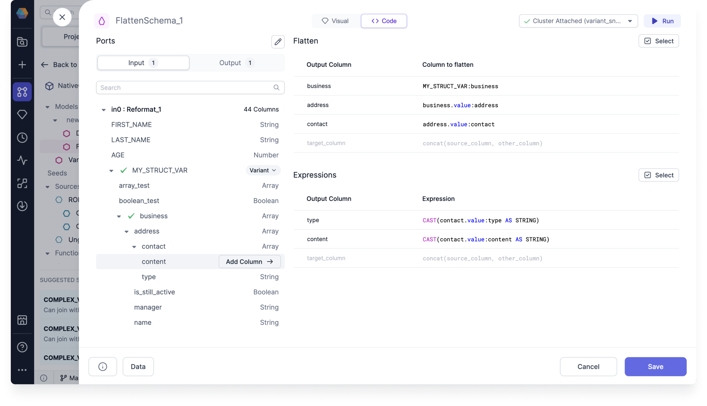
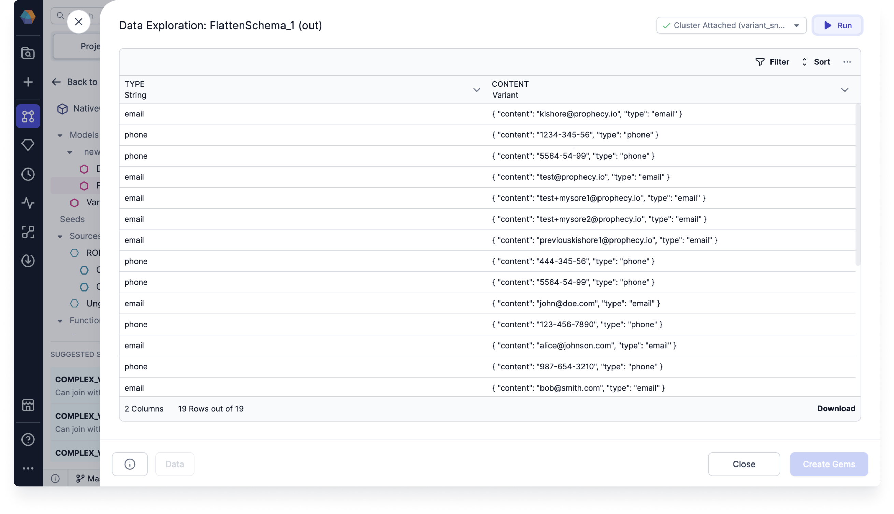

When processing raw data it can be useful to flatten complex data types like `Struct`s and `Array`s into simpler, flatter schemas. This allows you to preserve all schemas, and not just the first one.

## The Input

FlattenSchema works on Snowflake sources that have nested columns that you'd like to extract into a flat schema.

For example, with an input schema like so:

And the data looks like so:

We want to extract the `contact`, and all of the columns from the `struct`s in `content` into a flattened schema.

## The Expressions

Having added a `FlattenSchema` Gem to your Model, all you need to do is click the column names you wish to extract and they'll be added to the `Expressions` section. Once added you can change the `Output Column` for a given row to change the name of the Column in the output.

## The Output

If we check the `Output` tab in the Gem, you'll see the schema that we've created using the selected columns.

And here's what the output data looks like:

The nested contact information has been flatten so that you have individual rows for each content type.

## Advanced settings

If you're familiar with Snowflake's `FLATTEN` table function, you can use the advanced settings to customize the optional column arguments.

To use the advanced settings, hover over a column, and click the dropdown arrow.

You can customize the following options:

- Path to the element: The path to the element within the variant data structure that you want to flatten.
- Flatten all elements recursively: If set to `false`, only the element mentioned in the path is expanded. If set to `true`, all sub-elements are expanded recursively. This is set to false by default.
- Preserve rows with missing fields: If set to `false`, rows with missing fields are omitted from the output. If set to `true`, rows with missing fields are generated with `null` in the key, index, and value columns. This is set to false by default.
- Datatype that needs to be flattened: The data type that you want to flatten. You can choose `Object`, `Array`, or `Both`. This is set to `Both` by default.
