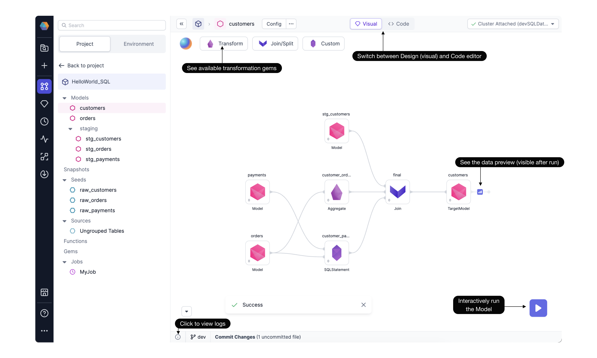

Prophecy Data Transformation Copilot for SQL combines the best of both worlds; **high-quality code** based on software engineering best practices with a complete, **easy-to-use visual** environment.

## Editor interface

Prophecy Copilot for SQL includes a visual editor and a code editor. They will always be in sync—any changes made in the visual editor generate high-quality code on Git. And, any changes in the code editor can be visualized back as a visual graph.


### Visual editor

The visual canvas is the main place to develop data models.
Open any SQL Project in Prophecy to find the complete end-to-end **Project Lineage**. The Project Lineage provides a quick understanding of how Models refer to other Models, Seeds, or Sources. This quick, high-level project overview is explainable without having to read code.


The Project Browser displays entities available or used within this Project. Just click the Environment tab to browse through available databases and tables. Each Project connects to a Fabric, or execution environment. This Fabric defines the SQL Warehouse where each Model will materialize a single table or view. There are lots of additional features to learn more about, including configurations and committing code to Git. A single Project page contains lots of capabilities!

From here you can easily create new models by clicking on **+** next to the Models pane, or you can edit existing Models.


Once a Model is open, the model-editing canvas appears.



Here we can see the `customers` Model starts with three existing Models. The data is transformed according to Aggregate, SQLStatement, and Join gems. The available Transformation gems are available by clicking the dropdown menu. As you develop the Model, you can iteratively run and see sample data as well as the relevant logs.

### Code editor

As a visual developer, you'll appreciate the drag-n-drop canvas, but sometimes it's also nice to view the code. Prophecy creates highly performant code behind the scenes. Click the **Code View** to reveal the SQL queries we've generated using our visual design editor. Each gem is represented by a CTE or subquery.


You may wish to edit the code view. Add a SQL statement in the code view and notice the visual editor displays the updated code. For example, we've added a limit statement in the code view, and a new limit gem appears in the visual view.

## Version control

Projects built through Prophecy are stored in the dbt Core format as repositories on Git, which allows data teams to follow best software engineering practices like CI/CD.

Prophecy automatically saves your work as you develop in a working directory securely stored on the cloud. Just make sure to commit your changes every once in a while, to see your code reflected on your Git and to collaborate easier with your team.

## SQL and dbt constructs

The vast majority of dbt and SQL constructs are supported within the Prophecy Visual editor. However, if something is not yet supported, don’t worry!

- **For SQL** - Prophecy automatically maps unsupported SQL statements to a generic SQL gem, allowing you to still freely edit even unsupported code.
- **For dbt** - Features in dbt-core that may lack their visual-editor alternatives still work as expected from the standard dbt cli. Prophecy will never modify your existing codebase in unsupported ways.

## Interactive development

At any step of the process, data users can interactively run their models to make sure they're going in the right direction. Models can be additionally tested to ensure robustness over time. Power users can also extend the visual canvas through custom gems; making even the most complex logic easily accessible in the visual view.

As you're building your Model by adding [individual gems](/docs/SQL/gems/gems.md), see how the process is going by interactively running the model. To learn more, see [Data Explorer](docs/SQL/execution/data-explorer.md).

## Share Projects as Packages

Data users can import an existing dbt Core project or start from scratch. They can publish those projects to other teams or subscribe to already existing ones. Projects published as packages contain models, functions and gems allowing for code reusability at every level.

## Learn more

A word from Prophecy's co-Founder, Maciej! See how Prophecy allows every team, whether visual or code developers, to use the same software development best practices.

<div class="wistia_responsive_padding" style={{padding:'56% 0 0 0', position:'relative'}}>
<div class="wistia_responsive_wrapper" style={{height:'100%',left:0,position:'absolute',top:0,width:'100%'}}>
<iframe src="https://fast.wistia.net/embed/iframe/3i9g2dciah?seo=false?videoFoam=true" title="Design a Pipeline Video" allow="autoplay; fullscreen" allowtransparency="true" frameborder="0" scrolling="no" class="wistia_embed" name="wistia_embed" msallowfullscreen width="100%" height="100%"></iframe>
</div></div>
<script src="https://fast.wistia.net/assets/external/E-v1.js" async></script>

## Hands-on

To get started developing SQL models, check out the pages below or try this guide for [Databricks](/docs/getting-started/getting-started-with-low-code-sql.md) or [Snowflake](/docs/getting-started/getting-started-sql-snowflake.md).

```mdx-code-block
import DocCardList from '@theme/DocCardList';
import {useCurrentSidebarCategory} from '@docusaurus/theme-common';

<DocCardList items={useCurrentSidebarCategory().items}/>
```
