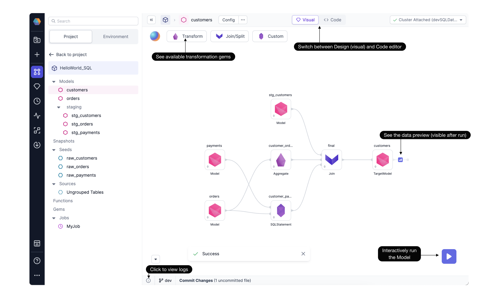

Prophecy’s visual interface is where you can build data pipelines using a drag and drop interface or with SQL code. As a business user, you can visually create your SQL data models with Prophecy's visual canvas, with all of your work automatically turning into high-quality SQL code on Git.

## Visual Canvas

The visual canvas is the main place to develop data models.
Open any SQL Project in Prophecy to find the complete end-to-end **Project Lineage**. The Project Lineage provides a quick understanding of how Models refer to other Models, Seeds, or Sources. This quick, high-level project overview is explainable without having to read code.


The Project Browser displays entities available or used within this Project. Just click the Environment tab to browse through available databases and tables. Each Project connects to a Fabric, or execution environment. This Fabric defines the SQL Warehouse where each Model will materialize a single table or view. There are lots of additional features to learn more about, including configurations and committing code to Git. A single Project page contains lots of capabilities!

From here you can easily create new models by clicking on **+** next to the Models pane, or you can edit existing Models.


Once a Model is open, the model-editing canvas appears.



Here we can see the `customers` Model starts with three existing Models. The data is transformed according to Aggregate, SQLStatement, and Join Gems. The available Transformation Gems are available by clicking the dropdown menu. As you develop the Model, you can iteratively run and see sample data as well as the relevant logs.

## What's next

To continue developing with the visual editor, see the following pages:

```mdx-code-block
import DocCardList from '@theme/DocCardList';
import {useCurrentSidebarCategory} from '@docusaurus/theme-common';

<DocCardList items={useCurrentSidebarCategory().items}/>
```
