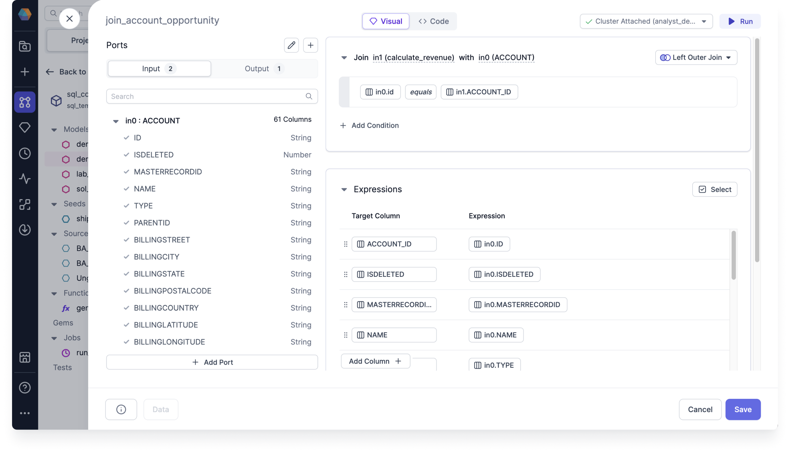
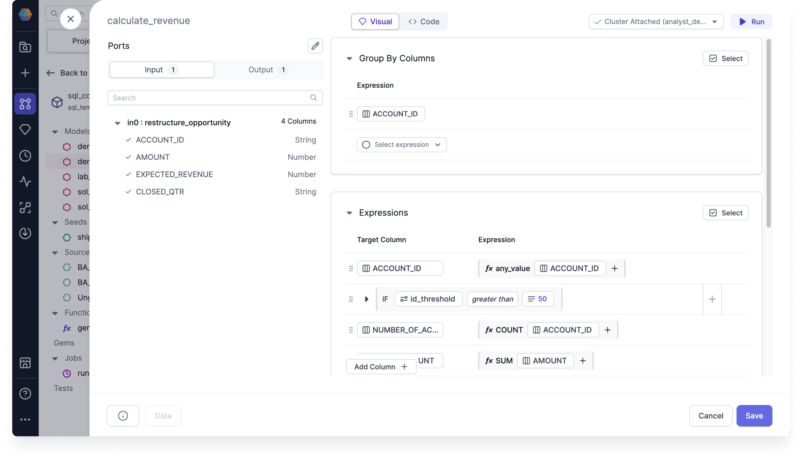
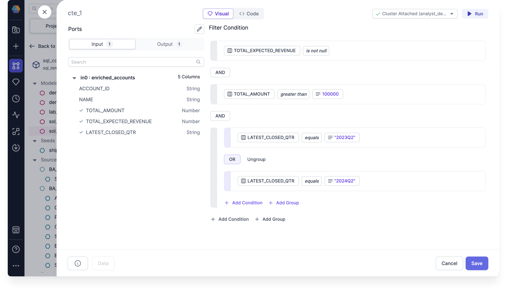

Develop your SQL expressions by using the Visual Expression Builder, which shows you available columns and functions that you can use to build your expressions.

## Navigate to the Visual Expression Builder

The Visual Expression Builder is supported wherever you see Visual and Code views within your transformation gems.

- Create or open an existing transformation gem, and select the **Visual** view.

:::note

The view you select persists across your gems.

:::

All of the expressions you build using the Visual Expression Builder are converted to code in the gem and model code views. Similarly, edits you make in the Code view, whether it's in an expression or condition editor, will be converted into Visual view.

This allows you to take advantage of both Visual and Code views when building your expressions.

## Build an expression

Using the Visual Expression Builder, you can build an expression using the following modes:

- **Simple Expression**: This mode allows you to choose an expression, like a column, function, or Case statement.
- **Comparison**: This mode allows you to compare two simple expressions. You have the option of using conditions, such as `IF` and `ELSEIF` statements.
- **Grouping**: This mode allows you to build complex conditions by allowing the combinations of comparision expressions using logical operators `AND` or `OR`.

See which gems support which modes in the following table:

|           | Simple Expression mode   | Comparison mode          | Grouping mode            |
| --------- | ------------------------ | ------------------------ | ------------------------ |
| Aggregate |   |   |  |
| Filter    |  |  |   |
| Join      |   |   |   |
| Reformat  |   |   |  |

### Build using the Simple Expression mode

Let's use a Join gem to build simple expressions.

#### Join example

In our Join example, we want to join the `in0` account table with the `in1` expected revenue table matching the account IDs.

To set up the join condition, follow these steps:

1. After creating the Join gem, in the Join section, click **+Add Condition**. An option to Select expression appears.
2. Click **Select expression** and select **Column**. Search for or click to select `in0.id` from the populated list. An option to Select operator appears.
3. Click **Select operator** and select the Comparison operator `equals`. An option to Select expression appears.
4. Click **Select expression** and select **Column**. Search for or click to select `in1.ACCOUNT_ID` from the populated list.

To set up the simple expressions, follow these steps:

1. In the Expressions section, click **Add Column +**. A new expression row appears.
2. Click **target_column**, and then search for or click to select `ACCOUNT_ID` from the populated list.
3. Click **Select expression** and select **Column**. Search for or click to select `in0.ID` from the populated list.
4. Repeat steps 1 to 3 to set up the rest of the matching columns.

### Build using the Comparison mode

Let's use a Reformat gem and a Aggregate gem to build comparison expressions.

#### Reformat example

In our Reformat example, we want to stratify the accounts based on their annual revenues. Each condition we set up is limited to one comparison.

To set up the comparison expressions, follow these steps:

1. After creating the Reformat gem, click **target_column**, and then search for or click to select `ANNUALREVENUE` from the populated list.
2. Click **Select expression** and select **Conditional**. A `WHEN` clause appears.
3. For `WHEN`, click **Select expression** and select **Function**. Search for and click to select `TRY_CAST`, which converts a value of one data type into another data type. An option to select source_string_expr appears.
4. Click **source_string_expr** and select **Column**. Search for or click to select `ANNUALREVENUE AS FLOAT` from the populated list.
5. Click **Select operator** and select the Comparison operator `less than`.
6. Click **Select expression** and select **Value**. Enter `1000000` as the value.
   :::tip
   Whenever you enter a numerical or boolean value, a checkbox appears on the value dialog giving you the option to **Check to read value as string**.
   :::
7. For `THEN`, click **Select expression** and select **Value**. Enter `Low Revenue` as the value.
8. Click **+** on the next line and select **Add CASE** to add another `WHEN` clause.
9. Repeat steps 3 to 8 to set up the rest of the comparison expressions.
10. Click **+** on the next line and select **Add ELSE** to add an `ELSE` statement.
    :::note
    You can add multiple `CASES` of the `WHEN` clause, but you can only have one `ELSE` statement.
    :::
11. Click **Select expression** and select **Value**. Enter `Unknown` as the value.

#### Aggregate example

In our Aggregate example, we want to use other conditional expressions, such as `IF`, to set a threshold limit for `ACCOUNT_ID` using a configuration variable.

To set up additional comparison expressions, follow these steps:

1. After creating and setting up the initial Aggregate gem, hover your pointer between two expression rows and click **+** to add a condition. You're given the option to insert another column or an `IF` or `FOR` condition.
2. Select **IF**. An `IF` condition appears.
3. Click **Select expression** and select **Configuration Variable**. Search for or click to select `id_threshold` from the populated list.
4. Click **Select operator** and select the Comparison operator `greater than`.
5. Click **Select expression** and select **Value**. Enter `50` as the value.
6. Optional: You can hover your pointer below the express row you just created and click **+** to add another condition. You're now given additional options to insert an `ELSEIF` or `ELSE` condition.

### Build using the Grouping mode

Let's use a Filter gem to build grouping expressions.

#### Filter example

In our Filter example, we want to filter for the following:

- Total expected revenue that `is not null`
- Total amounts that are greater than `100000`
- Latest closed quarters that equals `2023Q2` or `2024Q2`

To set up the grouping expressions, follow these steps:

1. After creating the Filer gem, click **Add condition**. An option to Select expression appears.
2. Click **Select expression** and select **Column**. Search for or click to select `TOTAL_EXPECTED_REVENUE` from the populated list. An option to Select operator appears.
3. Click **Select operator** and select the Existence check `is not null`.
4. Click **+ Add Condition**. A new expression row appears.
5. Click **Select expression** and select **Column**. Search for or click to select `TOTAL_AMOUNT` from the populated list. An option to Select operator appears.
6. Click **Select operator** and select the Comparison operator `greater than`. An option to Select expression appears.
7. Click **Select expression** and select **Value**. Enter `100000` as the value.
8. Click **Add Group**. A grouped expression row appears.
9. Click **Select expression** and select **Column**. Search for or click to select `LATEST_CLOSED_QTR` from the populated list. An option to Select operator appears.
10. Click **Select operator** and select the Comparison operator `equals`. An option to Select expression appears.
11. Click **Select expression** and select **Value**. Enter `2023Q3` as the value.
12. Click **+ Add Condition** and repeat steps 9 to 11 to set up the other `OR` condition.
    :::tip
    You can have any number of groups and nestings (a group within a group). And you can change the grouping conditions between `AND` and `OR` by clicking on the labels.
    :::

## Tips

Here are some additional tips to keep in mind when using the Visual Expression Builder:

- The expression dropdowns support search.
- Each argument of your function is another expression since you have the same expression options to choose from.
  - You can add optional arguments to your functions.
- You can drag and drop your comparison expressions.
- Just as with conditions, you can also drag and drop your grouping expressions.
- You can delete individual expressions, conditions, and groupings by clicking the trash icon at the end of the rows.

## Run and Verify the output

Run the pipeline up to and including the gem with your expression, and observe the resulting data sample.

- Click the **Play** button on either the canvas or the gem.

Once the code has finished running, you can verify the results to make sure they match your expectations. This Data is same as what you see in [interims view](docs/SQL/execution/data-explorer.md). By testing and verifying your expressions, you can ensure that your data analysis tasks are accurate and reliable.
