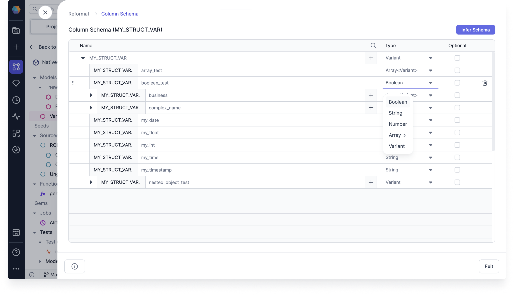
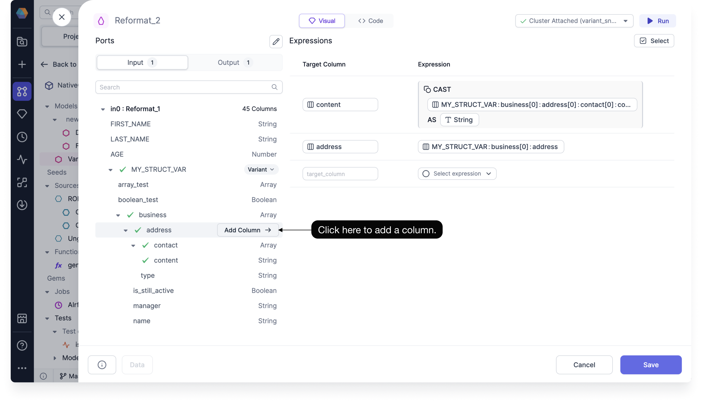

You can use Prophecy to convert your variant schemas into flat, structured formats to make them easier to understand and use for analytics. This is available for when you want to determine the variant schema of your Snowflake array or object.

Using the variant schema functionality, you can do the following:

- Infer the variant schema
- Configure the parsing limit for inferring the column structure
- Use a nested column inside of the Visual Expression Builder

## Inferring the variant schema

Variant schemas are not stored within the table definition and can vary for each row, making them difficult to infer and use. Fortunately, you don't have to infer the schema yourself. You can use the column selector inside of your gems to automatically infer the variant schema, explore the multi-type variant structure, and later select a nested column to use in your transformations.

To automatically infer the variant schema, start by opening a gem that uses a variant column input.

- Select the variant column, and click **Infer Schema**.

Prophecy will automatically detect and identify the variant types in your input data.

:::note

The inferred schema is cached so that you can use it again in the future whenever you reopen the model, gem, or another gem connected to the same input port. Check the bottom of the column selector to see the last time the variant schema was inferred.

To refresh the schema, simply click **Infer Schema** again.

:::

### Editing the variant schema

After you infer the schema, you can click **Edit Schema** to view the variant schema and make edits to it. Use the Type dropdowns to manually choose the data type of each nested schema.

Editing the variant schema is useful in cases where not all of the schema cases were covered while sampling the records.

## Variant sampling setting

When Prophecy infers the variant schema, it samples the records to identify all potential iterations of keys and values within the schema.

The default number of records that Prophecy parses to understand the nested data schema is 100. You can update this limit under the Development Settings, which you can navigate to by clicking **... > Development Settings**.

We recommend that you increase the limit for small structures, or decrease it for larger ones.

:::note

This setting does not rely on the ratio of the data since that would require a complete count of the data records.

:::

## Adding a nested column

With in the column selector, you can add a nested column by clicking **Add Column** next to the input field name.

When adding a column nested within a variant, the output column name, expression, and data type are automatically generated according to the following rules:

- Column name: The column name matches the input field name, and is prefixed with the parent field path. If there's a conflict, Prophecy appends numbers starting with `_0` until it becomes unique.

  For example, if the column name `customers_name` already exists, the new field might be named `customers_name_0`.

- Expression: The expression represents the full path to the selected field, and uses existing flattened subpaths.

- Data type: The data type is automatically `CAST` to the closest inferred type.

### Default casting

Prophecy automatically adds a `CAST` to any column you add from a nested type. By default, the column is cast using the standard `CAST(x AS y)` syntax.

In some cases, a path within a variant may hold different value types across rows. For instance, consider a dataset where each row’s value key contains different data types, such as integer, object, and boolean.

Prophecy supports this scenario by presenting each detected data type for a given key, array, or object as a separate item in the column selector. When you add one of those columns to the expression, we use explicit casting, which may error out if the cast is not possible. You can change this behavior by using `TRY_CAST`, which returns `null` if the cast is not possible.
