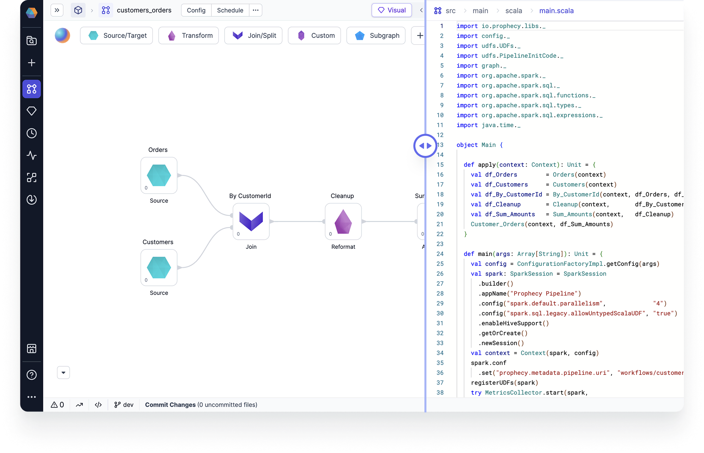

<h3><span class="badge">Spark</span></h3>

Pipeline development is foundational to data engineering. Prophecy simplifies the development of Spark-based data pipelines with a visual interface that automatically compiles pipelines into production-ready code.



## Data transformations

Pipelines include a wide range of pre-built visual components that enable source/target operations, transformations, join/split operations, and machine learning capabilities. These components include datasets, gems, functions, and jobs.

## Interactive development

Prophecy enhances Spark pipeline development with features like interim data sampling, which allows users to troubleshoot by visualizing the data flow, comparing historical runs, and inspecting individual datasets in the visual interface.

## CI/CD

Prophecy supports CI/CD by managing all project version control on Git and providing control over how you release and deploy projects. This way, you can develop your pipelines in accordance with your Git workflows and other CI/CD tools.

## Extensibility

In Prophecy, [extensibility](docs/extensibility/extensibility.md) enables data practitioners to create and share pipeline components through the Package Hub, which allows teams to build reusable elements rather than rebuilding them for each project.

## What's next

Learn more about pipeline development in the following pages.

```mdx-code-block
import DocCardList from '@theme/DocCardList';
import {useCurrentSidebarCategory} from '@docusaurus/theme-common';

<DocCardList items={useCurrentSidebarCategory().items}/>
```
