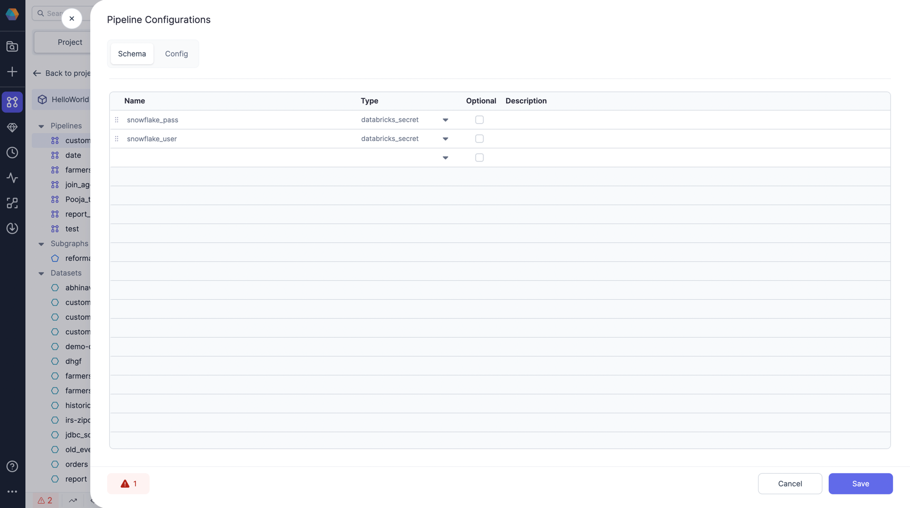
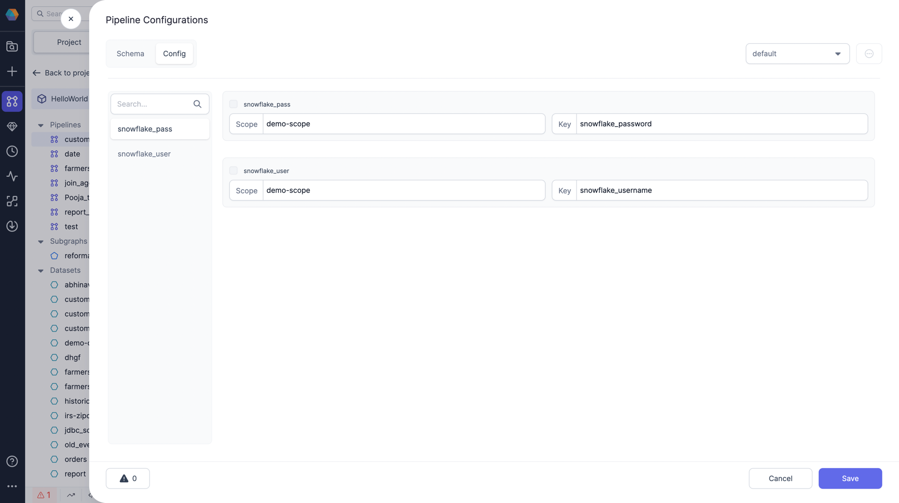
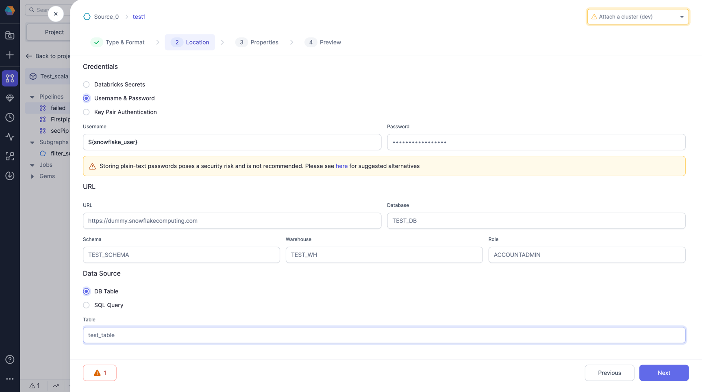

Using hardcoded usernames and passwords is not recommended when working with gems. This approach can result in unsafe code, as the credentials may be exposed in your configured Git repository for the project.

For users who are not using Databricks or have private Git repositories, or for those who simply need to quickly test some gems, plain-text username/password may be used. However, it is strongly advised to utilize the Databricks secrets option when committing the code.

To ensure the security of your credentials and streamline the process, we recommend following this step-by-step guide on how to create secrets in Databricks and effectively utilize them in Prophecy gems. By doing so, you can safeguard sensitive information while maintaining the efficiency and integrity of your project.

In this example, we demonstrate the use of Databricks secrets to configure Snowflake credentials for establishing a connection to Snowflake within a gem.

### Step1: Create Your secrets in Databricks

Please follow this [Secrets Documentation](https://docs.databricks.com/security/secrets/index.html) from Databricks to create your secret scope and keys in Databricks. For this example, You can create one for your Snowflake Username and one for Password. Let's say we created scope `demo-scope` and added two secrets with key `snowflake-username` and `snowflake-password`.

### Step2: Create Config in Pipeline to map to Created Databricks Secrets

Add configs of Type `databricks_secret` in [Pipeline Configs](/docs/Spark/configuration.md). Let's say we call it `snowflake_user` and `snowflake_pass`.

### Step3: Provide value to the config created

Now, lets add value for the created configs `snowflake_user` and `snowflake_pass` in the default config. You can also add multiple values in different configs.
For value, add the scope and key you created for your secret in the first step and save it. Please refer below image

It's now ready to be used in your gems.

### Step4: Add a Snowflake gem to your pipeline and refer the above created Configs in the username and password field

Now that we have a pipeline config to refer our password stored in Databricks secrets securely, We can go ahead and add a Snowflake gem.
Use the Config with syntax as `${snowflake_user}` and `${snowflake_pass}` in the username and password field respectively and define all other required fields in the gem as is.
Your gem is now ready to Used and tested.

If users still use plain-text, they would also see a Warning Diagnostics in their gems.
