Allows you to define configurations to control various aspects of your pipeline.


Prophecy IDE allows you to define three kinds of configurations:

## Spark Configuration

Set runtime Spark configurations as name-value pairs. The name-value pairs will be set inside the Spark runtime configurations as `spark.conf.set(name, value)`

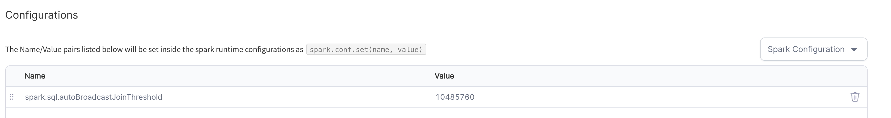

## Hadoop Configuration

Hadoop configurations as name-value pairs. The name-value pairs will be set inside the Hadoop configuration as `spark.sparkContext.hadoopConfiguration.set(name, value)`

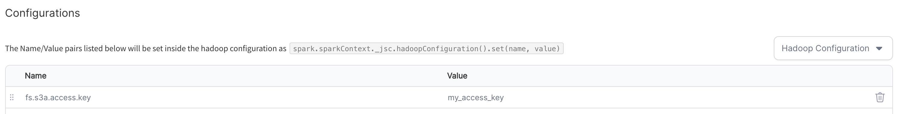

## Pipeline Configuration

Config values which can be set at pipeline level and then be accessed inside any component in the pipeline. [Multiple instances](#pipeline-configuration-instances)
of configuration can be created per pipeline.

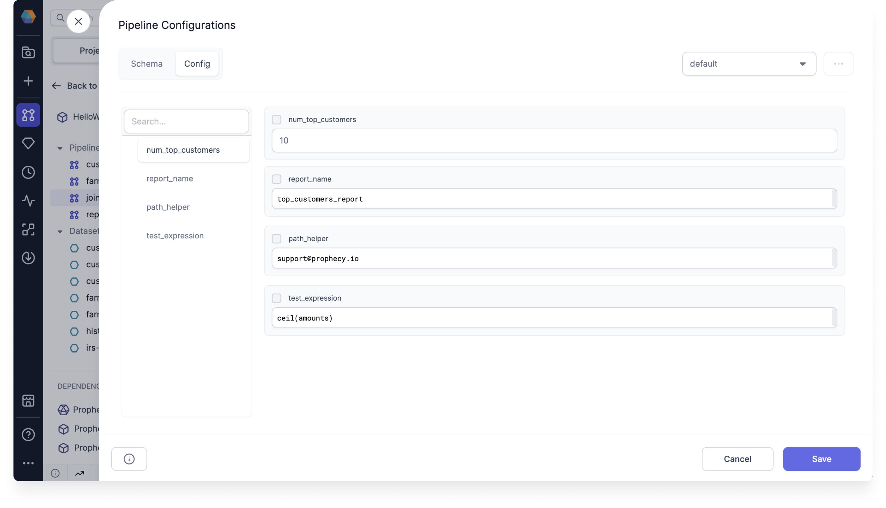

### Syntax for using configuration inside gems

We support language-specific config syntaxes for different data types and coding languages for configurations inside of your Spark gems. We also support a common Jinja config syntax. You can use either syntax or a combination of them.

#### Language-specific Config syntax

See the following language-specific config syntax for SQL, Scala, and Python in Spark.

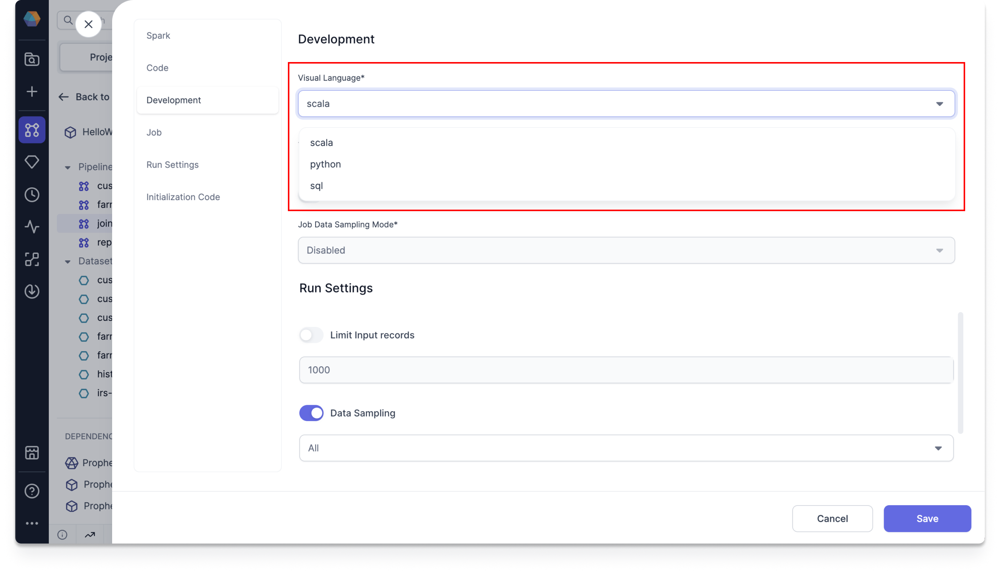

- For visual language SQL: `'$config_name'`

- For visual language Scala/Python: `Config.config_name`

- For using Spark expression with visual language SQL: `expr('$config_name')`

- For using Spark expression with visual language Scala/Python: `expr(Config.config_name)`

#### Jinja Config syntax

You can choose to use a common Jinja config syntax for configurations inside of your Spark gems.

You must enable it by navigating to **...** > **Pipeline Settings**.

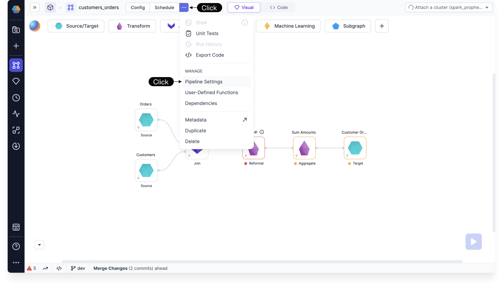

Under the **Code** section, click to enable Jinja config syntax. This setting is toggled on by default for new pipelines.

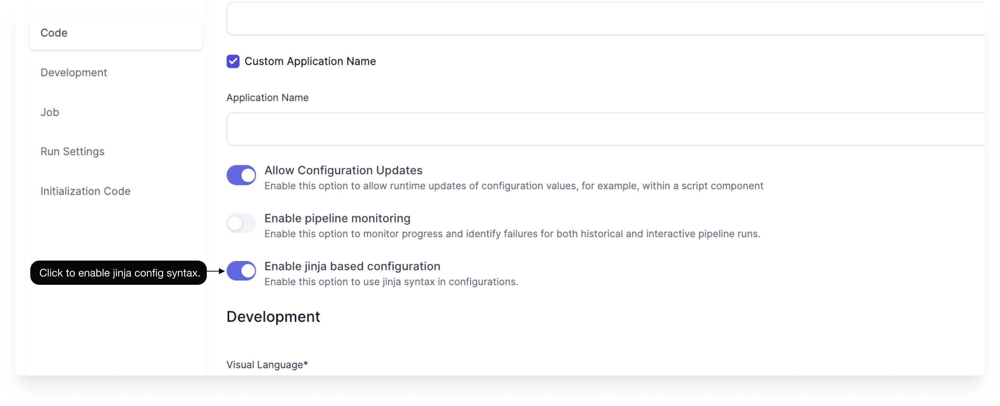

See the following syntax for Jinja in Spark.

- For Jinja: `{{config_name}}`

- For using Spark expression with Jinja: `expr('{{config_name}}')`

So for example, instead of using `'$read_env'` for SQL or `Config.read_env` for Scala/Python, you can use `{{read_env}}`.

Jinja config syntax supports the following functionalities:

- **Integer/String data type** - You can use a data type as it is, such as an integer field as an integer by using `{{ integer_field }}`. For strings, use `<some_character>{{ integer_field }}<some_character>`.
- **Concatenation** - You can define multiple Jinja syntaxes in the same string, and the generated code will be a formatted string. For example, `'{{c_string}}___{{ c_int }}'`
- **SQL Statement queries** - You can use Jinja syntax in SQL Statement gem queries. For example, `select {{col1}} from {{table}} where {{condition}}`
- **Nested `call_func`** - You can use Jinja syntax inside of `call_func` or `call_function`, including those that are nested within other functions.

  ```
  LEAST((LEAST(product.SAS, COALESCE(product.SAS, call_func('data_{{read_env}}.business_rules.datum', DTM, '123456789')))) + 1, cast('9999-12-31' as DATE))
  ```

## Examples for pipeline-level configurations

Now let's use the [above defined configurations](#pipeline-configuration) in the below pipeline.
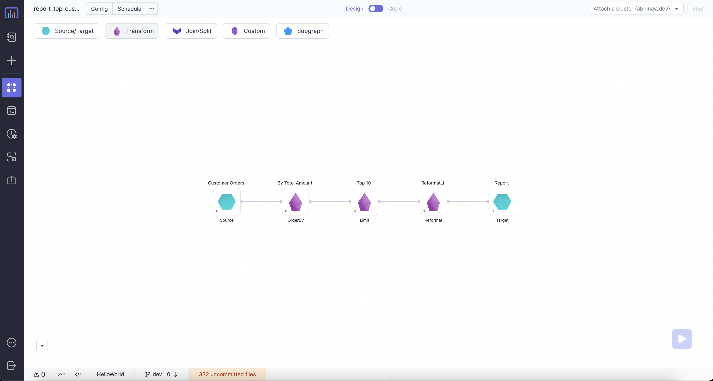

### Using Config in limit gem

#### SQL Visual Language

In the below image `'$num_top_customers'` is fetching the integer value defined in configurations.


#### Scala/Python Visual Language

In the below image `Config.num_top_customers` is fetching the integer value defined in configurations.

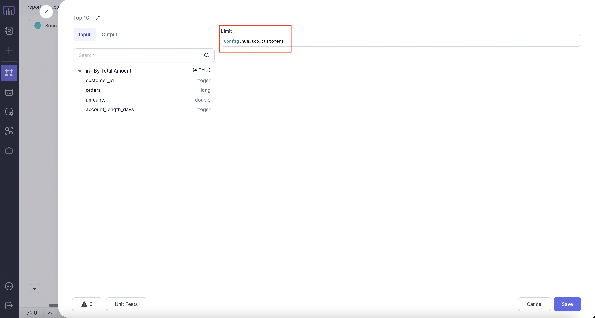

#### Jinja Config

In the below image `{{num_top_customers}}` is fetching the integer value defined in configurations.

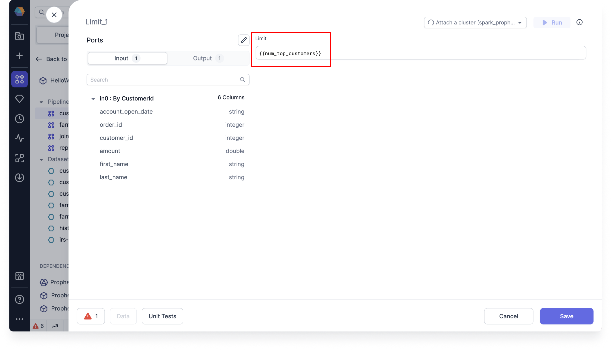

Also see the following syntax examples for specific gem property field data types:

- SColumnExpression: `lit("{{a.b.c}}")`
- SString: `{{ a.b.c }}`
- String: `{{ a.b.c }}`

You can use the following syntax examples for accessing elements of array and record fields:

- For array: `{{ config1.array_config[23] }}`
- For record: `{{ record1.record2.field1 }}`

### Using Spark-expression Config type in gem

Here we have used Spark expression directly from our config value to populate a column.

#### SQL Visual Language {#Spark-expression}

In the below image:<br />

**(1)** `amounts` -> `expr('$test_expression')` is coming from configuration type defined as `Spark-expression` <br />
**(2)** `report_name` -> `'$report_name'` is coming configuration type defined as string


#### Scala/Python Visual Language {#Spark-expression}

In the below image: <br />

**(1)** `amounts` -> `expr(Config.test_expression)` is coming from configuration type defined as `Spark-expression` <br />
**(2)** `report_name` -> `Config.report_name` is coming configuration type defined as string

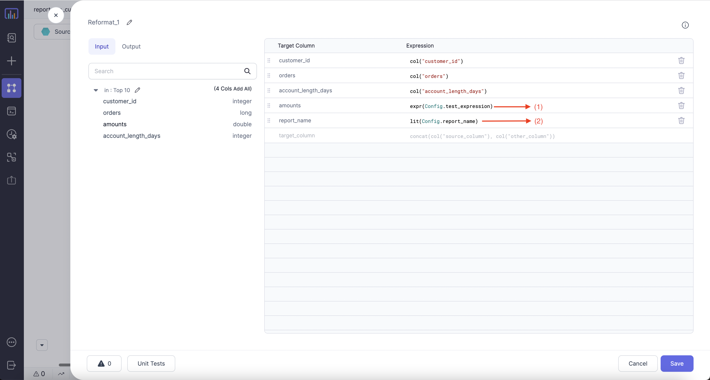

:::note
Similarly configurations defined as type `Spark-expression` can be used directly in filter, join, reformat etc gems directly.
:::

#### Jinja Config {#Spark-expression}

In the below image: <br />

**(1)** `amounts` -> `expr('{{test_expression}}')` is coming from configuration type defined as `Spark-expression` <br />
**(2)** `report_name` -> `{{report_name}}` is coming configuration type defined as string

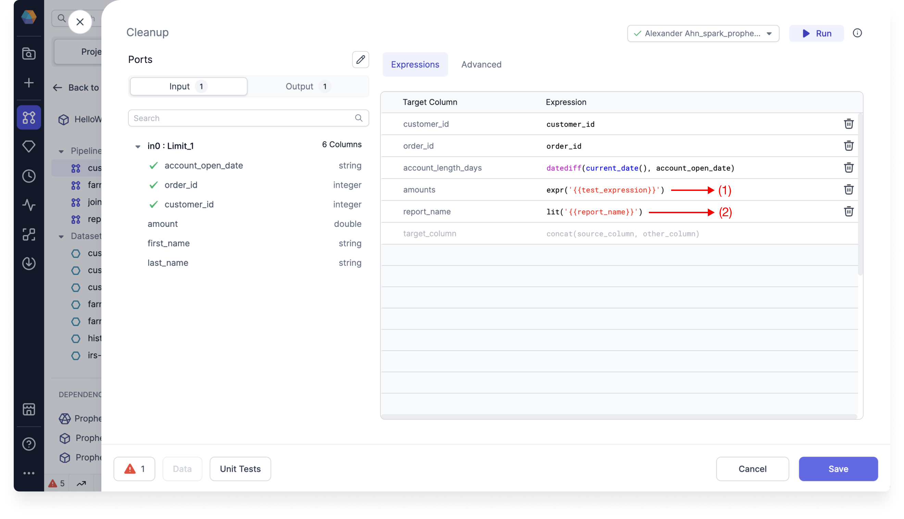

### Using config in paths for Source/Target gems

Config can also be used to refer to paths. This type of configuration comes in handy in situation where you have DEV, QA, and PROD data, and you want to configure Dataset (or in general the Job runs) based on which environment you are running it in.

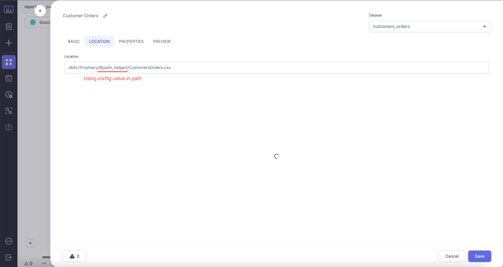

When using Jinja config for the previous example, you would use `dbfs:/Prophecy/{{path_helper}}/CustomersOrders.csv`.

### Edit Pipeline Name

To change the pipeline name itself, go to Prophecy's metadata page. Locate the pipeline within a Project, and click the pencil icon.

<div class="wistia_responsive_padding" style={{padding:'56.25% 0 0 0', position:'relative'}}>
<div class="wistia_responsive_wrapper" style={{height:'100%',left:0,position:'absolute',top:0,width:'100%'}}>
<iframe src="https://fast.wistia.net/embed/iframe/7t778aurgk?seo=false?videoFoam=true" title="Getting Started With SQL Video" allow="autoplay; fullscreen" allowtransparency="true" frameborder="0" scrolling="no" class="wistia_embed" name="wistia_embed" msallowfullscreen width="100%" height="100%"></iframe>
</div></div>                                                                                   <script src="https://fast.wistia.net/assets/external/E-v1.js" async></script>

## Pipeline Configuration instances

Different configuration instances can be defined as per requirement. This comes in handy when pipeline needs to run with different
configurations in different environments or different users.

New instances can be configured to override default values as shown in image below:

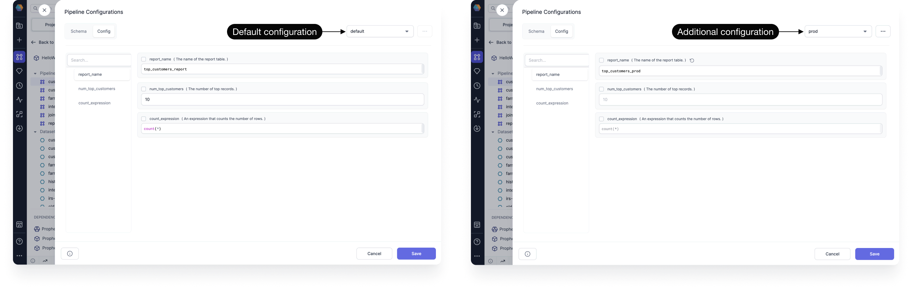


### Using a particular configuration instance for interactive runs

For interactive runs, configuration can be selected as shown in image below.
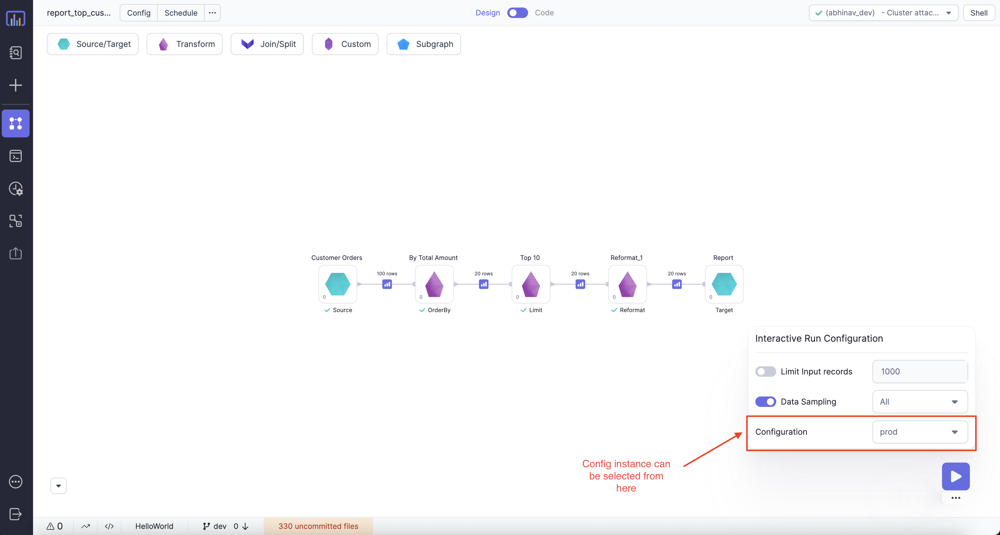

### Using configuration instances in Jobs

Particular instances can also be configured in Databricks Jobs.

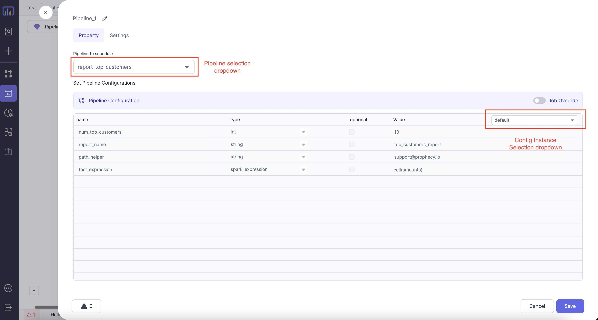

### Overriding configuration values in Jobs

Specific values from configuration instance can be overridden as shown in images below:


## Code

All configuration instances and values are automatically converted to code as well. Default configurations are stored as code and
specific instance overrides are stored as JSON files as shown in image below.

### Scala Config code

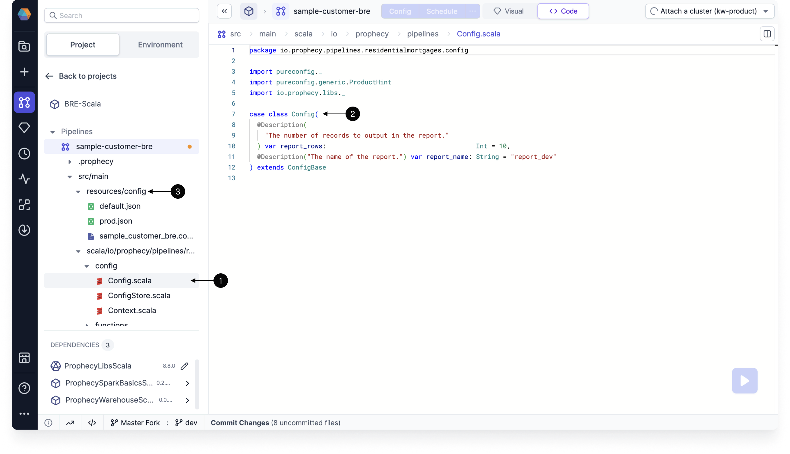

### Python Config code


### Component code

````mdx-code-block
import Tabs from '@theme/Tabs';
import TabItem from '@theme/TabItem';

<Tabs>

<TabItem value="py" label="Python">

```py
def Reformat(spark: SparkSession, in0: DataFrame) -> DataFrame:
    return in0.select(
        col("customer_id"),
        col("orders"),
        col("account_length_days"),
        expr(Config.test_expression).as("amounts"),
        lit(Config.report_name).as("report_name")
    )
```

</TabItem>
<TabItem value="scala" label="Scala">

```scala
object Reformat {

  def apply(spark: SparkSession, in: DataFrame): DataFrame =
    in.select(col("customer_id"),
              col("orders"),
              col("account_length_days"),
              expr(Config.test_expression).as("amounts"),
              lit(Config.report_name).as("report_name")
    )

}

```

</TabItem>
</Tabs>

````

```mdx-code-block
import DocCardList from '@theme/DocCardList';
import {useCurrentSidebarCategory} from '@docusaurus/theme-common';

<DocCardList items={useCurrentSidebarCategory().items}/>
```
