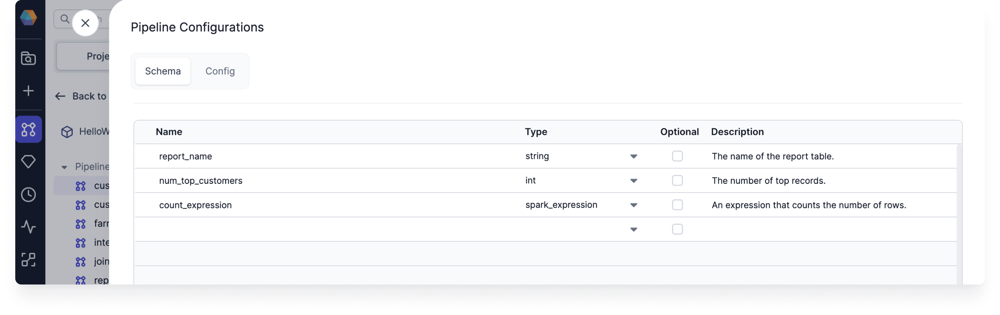
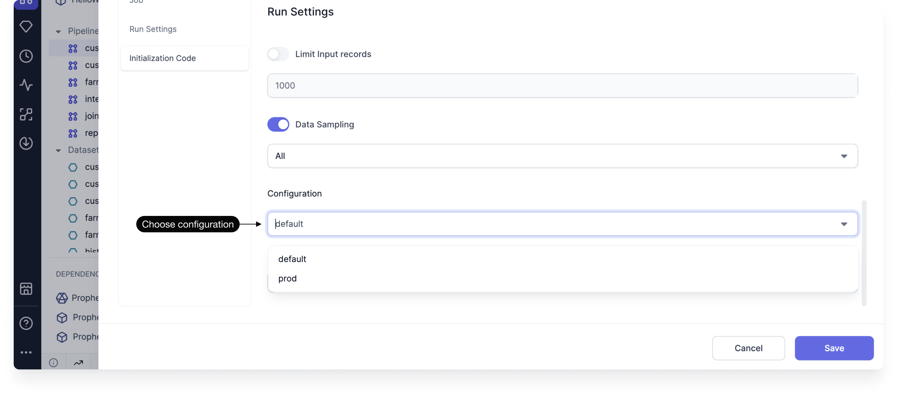
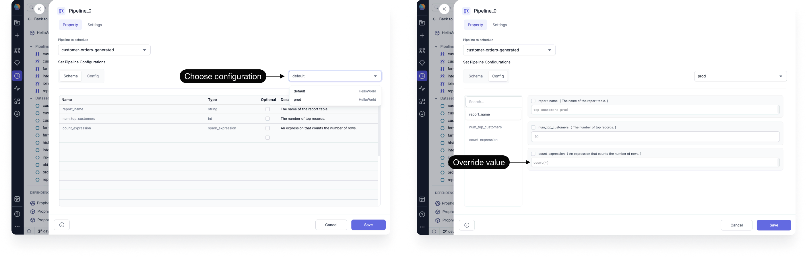
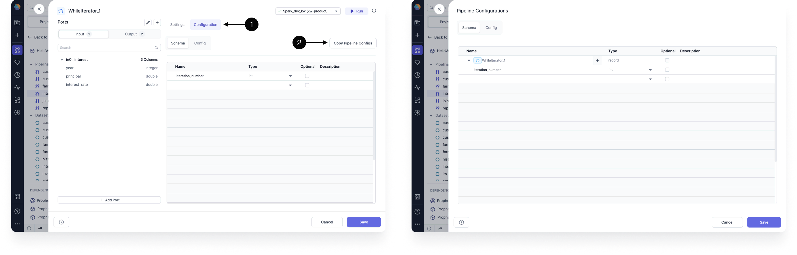

A configuration is a set of predefined variables and values that control how a data pipeline behaves during execution. By using configurations, you can dynamically adapt a pipeline to different environments (e.g., development, testing, production) without modifying the pipeline itself.

## Pipeline configurations

For each pipeline in the project editor, you'll see a **Config** option in the pipeline header. When you open it, you'll see two tabs: Schema and Config.

### Schema tab

The **Schema** tab is where you declare your variables. These variables will be accessible to any component in the respective pipeline.

| Parameter   | Description                                                                                                                                 |
| ----------- | ------------------------------------------------------------------------------------------------------------------------------------------- |
| Name        | The name of the variable.                                                                                                                   |
| Type        | The data type of the variable.                                                                                                              |
| Optional    | A checkbox to define if the variable is optional. When the checkbox is **not** selected, you **must** set a default value for the variable. |
| Description | An optional field where you can describe your variable.                                                                                     |

### Config tab

The Config tab lets you set default values for your variables. You can create multiple configurations with different default values, which is useful when running your pipeline in different environments (like production and development).

You can select which configuration to use when you:

- **Run the pipeline interactively.** To choose the configuration for interactive runs, open the Pipeline Settings and scroll to the Run Settings section. There, you can change the selected configuration.

  

- **Create a job.** When you add a pipeline to your job, you can choose the configuration to use during the job. The configuration defaults can also be overridden here.

  

### Syntax

When you want to use the pipeline configuration variables inside your project, you need to know how to reference them. You can choose the syntax for this using the **Visual Language** field in the Development section of Pipeline Settings.

| Visual Language | Syntax               | Expression usage           |
| --------------- | -------------------- | -------------------------- |
| SQL             | `'$config_name'`     | `expr('$config_name')`     |
| Scala           | `Config.config_name` | `expr(Config.config_name)` |
| Python          | `Config.config_name` | `expr(Config.config_name)` |

For example, you can use a configuration in a path definition like so: `dbfs:/Prophecy/'$path_helper'/CustomersOrders.csv` (SQL syntax). This is useful when you want to configure a target location based on which environment you are running the pipeline in.

#### Jinja

Regardless of the visual language, you also can use Jinja config syntax for configurations inside of your Spark gems. Jinja variable syntax looks like: `{{config_name}}`.

You can use the following syntax examples for accessing elements of array and record fields:

- For an array: `{{ config1.array_config[23] }}`
- For a record: `{{ record1.record2.field1 }}`

:::note

Jinja configurations are enabled by default in new pipelines. To disable this setting, open the Pipeline Settings and turn off the **Enable jinja based configuration** toggle.

:::

## Subgraph configurations

Configurations can also be set inside [subgraphs](docs/Spark/gems/subgraph/subgraph.md). These configurations will apply to execution that happens inside of the subgraph. While each type of subgraph might look different, the configuration settings should include:

1. An area to define configurations. It should have a similar appearance to the pipeline configuration UI.
1. An option to copy pipeline configurations.

Upon creation, subgraph configurations will also be included in the pipeline configurations.

## Code

All configuration instances and values are automatically converted to code.

1. Open the Config file in the pipeline's **config** folder.
1. View the **default** configuration code.
1. Find the additional configurations as JSON files in the **resources/config** folder.

- **Scala configuration code**

  

- **Python configuration code**

  
