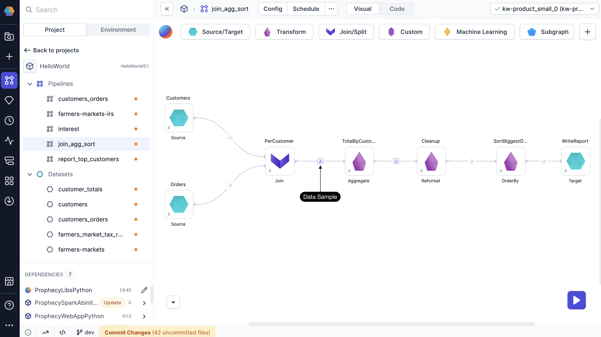
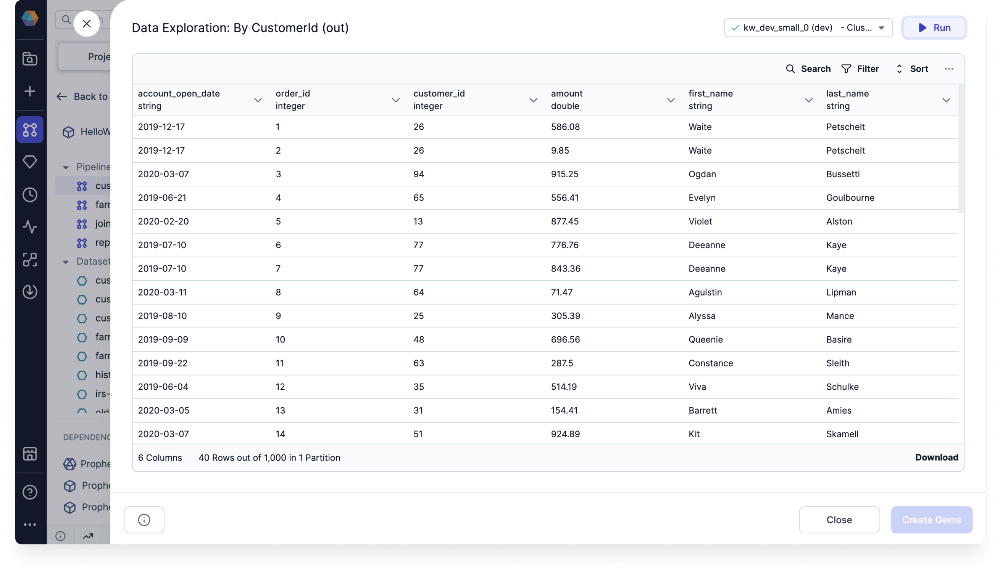

The Data Explorer helps you inspect interim data samples at each stage of your pipeline. By checking column structure, reviewing sample values, and confirming data types, you can catch issues early and ensure your pipeline is working as expected.

## Open the Data Explorer

To use the Data Explorer, you need to [run](/engineers/execution/#interactive-execution) your pipeline to generate data samples. Click on any data sample in your pipeline to open the Data Explorer.

## Leverage the Data Explorer

In the Data Explorer, you can:

- Sort data by columns
- Filter rows by specific values
- Search across all values
- Show or hide columns
- Export the sample as CSV or JSON file
- Save the transformation as a new gem

## View complete dataset

The Data Explorer loads a sample of your data by default. When you sort, filter, or search, these actions apply only to the visible rows in the sample.

To work with the full dataset, do one of the following:

- Click **Load More** at the bottom of the table until all rows are visible.
- Click **Run** in the top-right corner of the preview. This refreshes the view and applies sorting and filtering to the entire dataset.

## Large sample interims

If you want to see larger samples in the Data Explorer, you can enable the [Selective](docs/Spark/execution/data-sampling.md#selective-recommended) data sampling setting. When you enable this option, you will be able to see up to 10,000 rows in the data sample by default. You'll also see all columns by default.

:::note
You can still load more records into the preview when using selective data sampling.
:::
