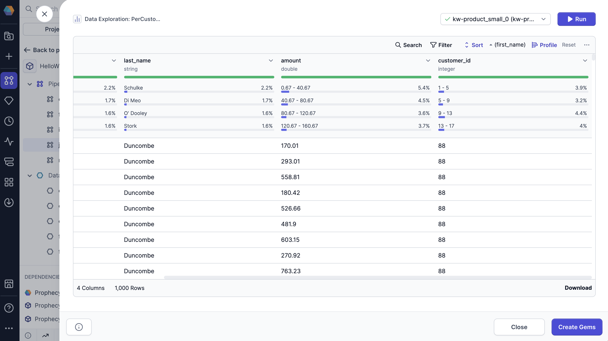
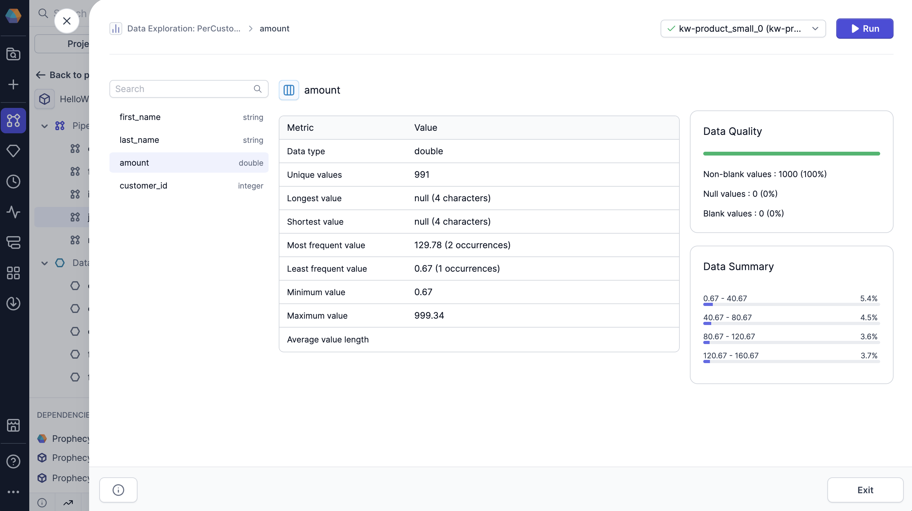
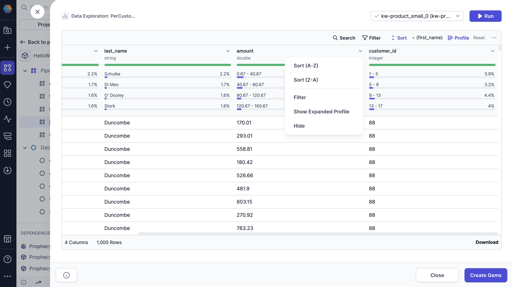

import Requirements from '@site/src/components/gem-requirements';

<Requirements
  python_package_name=""
  python_package_version=""
  scala_package_name=""
  scala_package_version=""
  scala_lib=""
  python_lib="1.9.40"
  uc_single=""
  uc_shared=""
  livy=""
/>

Data profiling allows you to view statistics on interim datasets in your pipeline. When you open a dataset's profile in the [Data Explorer](/engineers/data-explorer), you can visualize value distributions and data completeness to ensure your data matches expectations.

:::info
You must use [selective data sampling mode](/engineers/data-sampling#selective-recommended) to view the data profile in a PySpark project.
:::

## Quick profile

The Data Explorer includes data profiles that are generated on your sample data. You'll be able to see high-level statistics for each column, including:

- **Percent of non-blank values:** The percentage of values in the column that are not blank.
- **Percent of null values:** The percentage of values in the column that are null.
- **Percent of blank values:** The percentage of values in the column that are blank.
- **Most common values:** Displays the top four most frequent values in the column, along with the percentage of occurrences for each.

To view these statistics for your sample data, click **Profile** in the Data Explorer.

## Full profile

When you open the Data Explorer, you'll only see the data profile of the data **sample**. When you load the full data profile, Prophecy generates a more in-depth analysis on **all of the records** in the interim dataset.

The full profile displays the following information:

- **Data type**: The data type of the column.
- **Unique values**: The number of unique values in the column.
- **Longest value**: The longest value in the column and its length.
- **Shortest value**: The shortest value in the column and its length.
- **Most frequent value**: The most frequent value in the column and its number of occurrences.
- **Least frequent value**: The least frequent value in the column and its number of occurrences.
- **Minimum value**: The minimum value in the column.
- **Maximum value**: The maximum value in the column.
- **Average value length**: The average length of each value in the column.
- **Null values**: The percent and number of null values in the column.
- **Blank values**: The percent and number of blank values in the column.
- **Non-blank values**: The percent and number of non-blank values in the column.
- **Data summary**: An overview of the most common values in the column.

:::tip
You can click between columns in the expanded profile for quick access.
:::

### Open expanded profile

To view the expanded profile:

1. Click the dropdown arrow on the column you want to expand.
1. Select **Show Expanded Profile**.

