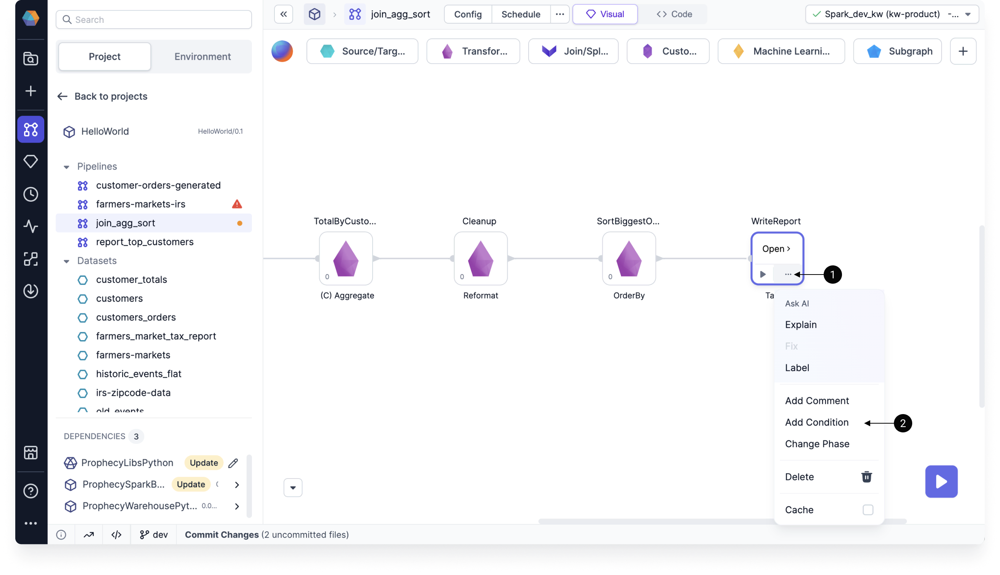
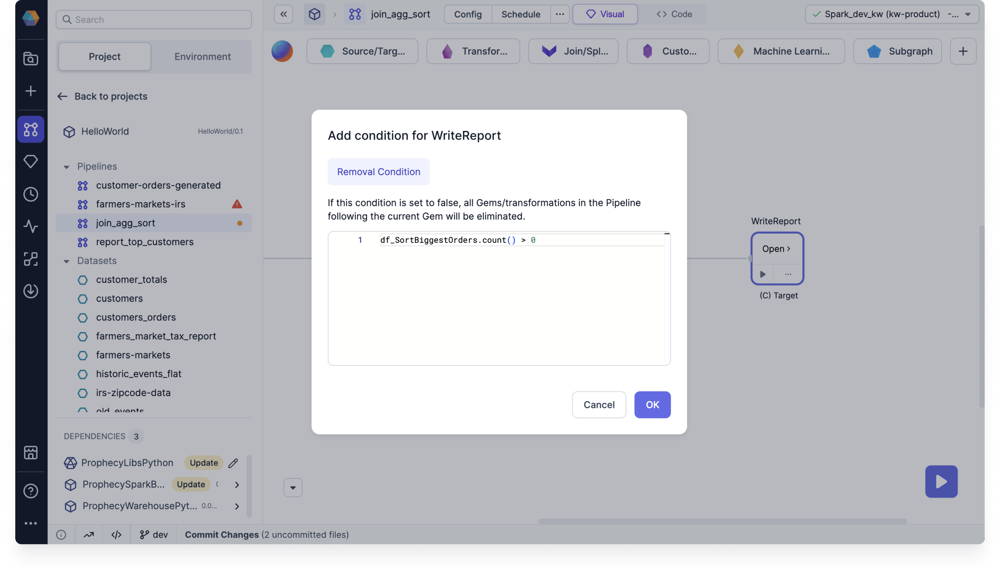

For granular data processing control, you can conditionally run or skip transformations within gems in your pipeline.

This means you can configure **pass-through conditions** on gems to dynamically control whether a transformation is executed. You also have the option to configure a **removal condition** on a gem, which not only skips the transformation but also removes the gem and all associated downstream transformations from pipeline execution.

## Configure conditions

To configure a condition on a gem:

1. Click the **...** (ellipsis) on a gem.
1. Select the **Add Condition** option.
1. Choose the **Pass through condition** or **Remove condition** option.
1. Write your condition in Scala or Python, depending on your project language.

When a condition is set on a gem, a (C) symbol will appear before the gem name. When a gem meets a pass-through or removed condition, the interims will not be displayed on the edges associated with that gem.

## Pass-through condition

Pass-through conditions let you skip the transformation of a gem or subgraph and maintain the input data as the output data. This ensures that the data passes through the gem or subgraph without any modification.

When using pass-through conditions, be aware that:

- The gem or subgraph must be connected in the pipeline, meaning it should have both an input port and an output port. This allows the data to flow through the gem.
- Pass-through conditions are not applicable to source and target elements within the pipeline. These elements represent the data source and destination and do not involve any transformation logic.

## Removal condition

When a removal condition is met, the associated gem and all of its downstream gems are excluded from the pipeline execution. Unlike pass-through conditions, you can use removal conditions on Source and Target gems.

### Example: Run if input record count > 0

Assume you only want to write to a target table if the input record count is greater than zero.

You can use a removal condition to do so:

1. Click the **...** (ellipsis) on the Target gem.
1. Select the **Add Condition** option.
1. Note that you can only define a removal condition.
1. Use the condition `df_<input_gem_name>.count() > 0`. This example is Python code.
1. Click **OK** to save.

