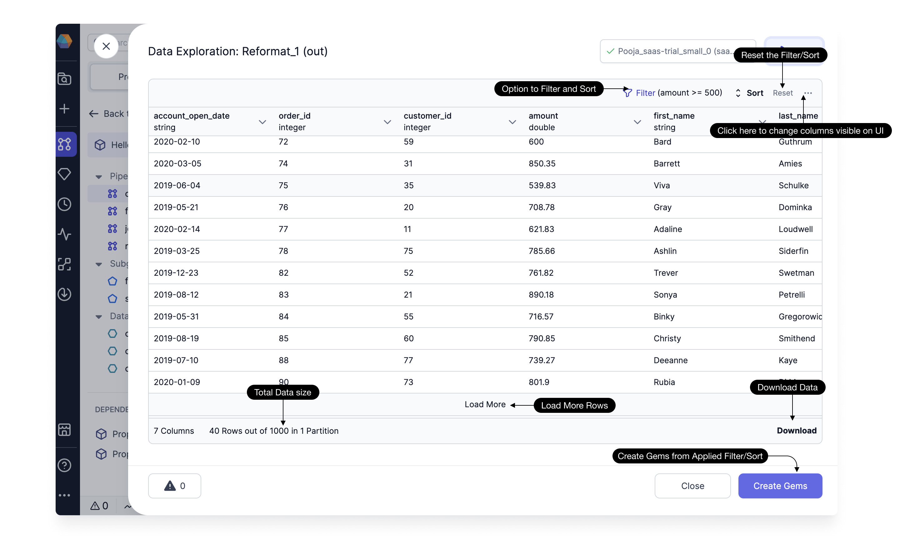

The Data Explorer feature empowers users to seamlessly explore and analyze their data samples directly within the user interface (UI). This feature provides a range of capabilities to help users gain insights, verify data accuracy, and make informed decisions.

### Filter and Sort Options

Users can apply filters and sort rows based on any column, enhancing visibility and improving data analysis.

:::info
After applying or modifying any filter or sort criteria, you need to click the **Run** button to update the displayed data.
:::

### Reset Applied Filters and Sort

Easily reset any applied filters and sorting settings by clicking on the `reset` button.

### Column Visibility Filtering

Conveniently filter columns visible in the UI by clicking on the ellipsis `...` icon. No need to rerun the process to reflect these changes in the UI.

### Load More Rows and Total Count

View and assess a larger dataset by loading more rows. The total count of rows and columns is visible, providing a comprehensive overview of the data.

### Download Data

Download the visible data in the UI in CSV and JSON format using the dedicated download button.

### Create Gems

After analyzing the data, users can retain the filter and sort options in the pipeline by clicking on the **Create gems** option. This action saves the applied filter and sort as a `Filter` and `OrderBy` gem in the pipeline.
