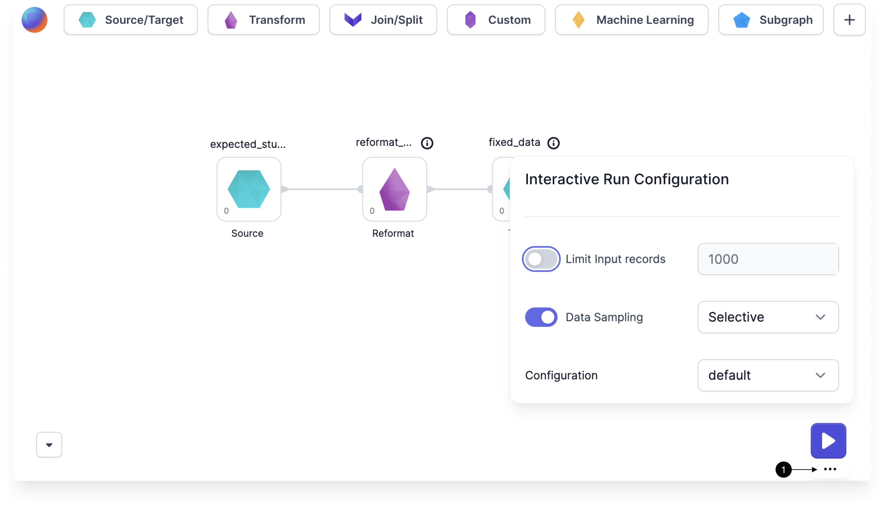
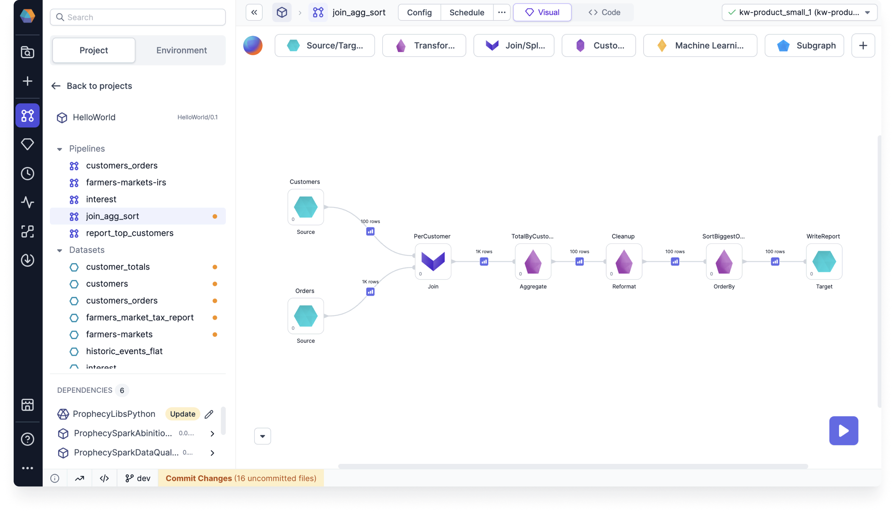
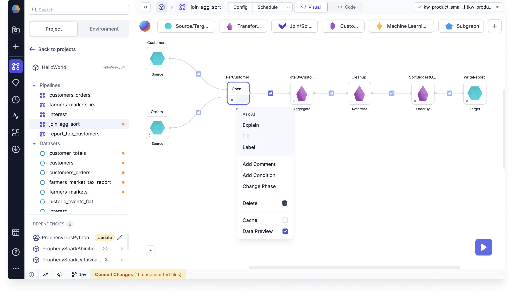
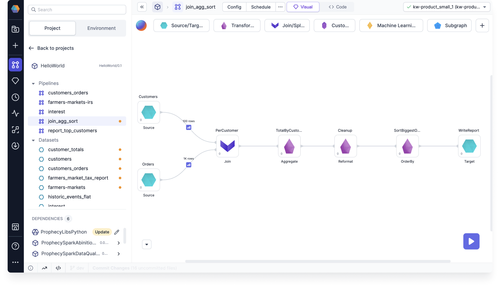
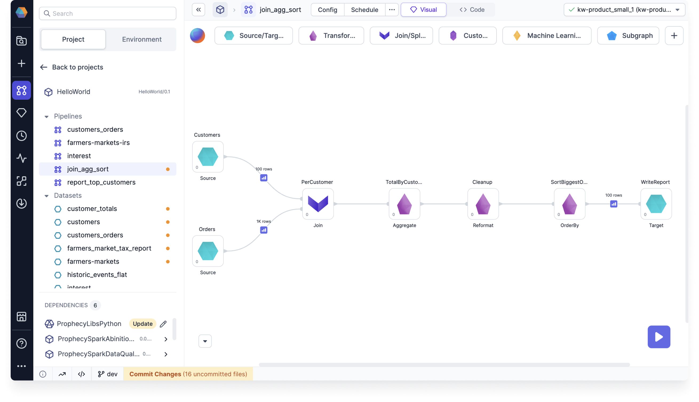
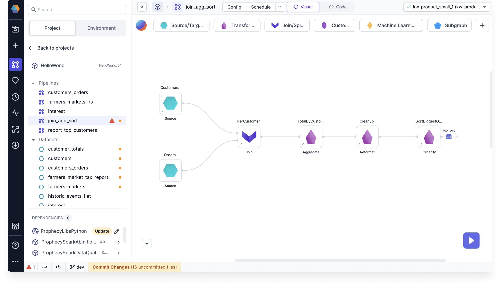

You can choose different **data sampling settings** to control how Prophecy generates data samples during interactive pipeline execution.

## Interactive run configuration

For each pipeline, you can enable, disable, or change interactive data sampling and job data sampling modes. To quickly update the interactive execution settings:

1. Hover the large **play** button.
1. Click on the **ellipses** that appears on hover.
1. Change your data sampling settings. This will update your [pipeline settings](docs/Spark/pipelines/pipeline-settings.md#run-settings).

## Data sampling modes

Prophecy provides the following data sampling modes.

### All (default)

All gems (excluding Target gems) generate data samples.

### Selective (recommended)

When you choose selective data sampling, you gain the ability to enable or disable data samples for individual gems. To do so, use the **Data Preview** checkbox in the gem [action menu](docs/Spark/gems/gems.md). Selectively-generated samples load up to 10,000 rows by default.

If the **Data Preview** option is not selected for a gem, you'll see a pale-color gem output after running the data pipeline. This means that no data sample was generated. To generate it, open the pale interim and it will load the data. After it loads, the data sample will display the normal bold color.

:::note
Normally on Databricks UC shared clusters, data samples are only generated on edge nodes. With selective interims, you can select to generate samples from any gem.
:::

### Sources

Only Source gems generate data samples.

### Targets

Only gems before Target gems generate data samples.

### IO

Data samples are only generated after Source gems or before Target gems (not between intermediate gems).

### Vanilla

This Databricks-specific setting generates data samples on the last node(s) of a pipeline. If the pipeline branch ends with a Target gem, the data sample appears before the Target gem (like the Target mode).

## Cached interims

If you change your data samplings settings and re-run your pipeline, you might see some grayed-out data samples. These are the cached data samples from previous runs. They might be outdated.

## Fabric settings

In a fabric, you can enable or disable data sampling and override pipeline-level settings when a pipeline runs on that fabric. This option is available in the **Advanced** tab of a fabric. A common use case is preventing sample data generation in **production** pipelines.

By default, only team admins can access the Advanced tab in a fabric. However, there are two flags you can set in your deployment to change this behavior:

- `ALLOW_FABRIC_ACCESS_CLUSTER_ADMIN`: Grants cluster admins full access to fabrics, even if they are not team admins.
- `DISALLOW_FABRIC_CODEDEPS_UPDATE_TEAM_ADMIN`: Prevents team admins from modifying the data sampling settings within a fabric.
