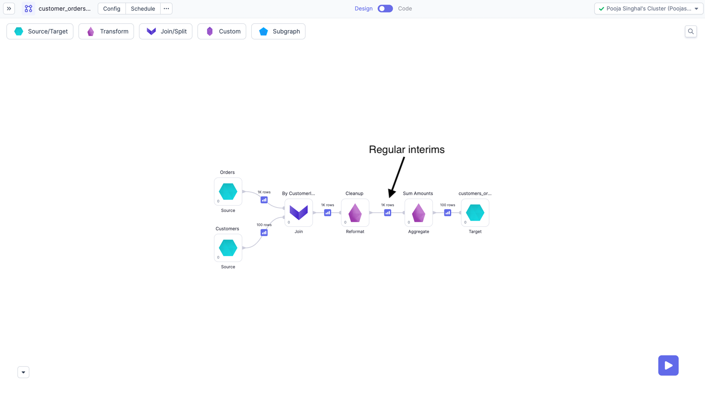
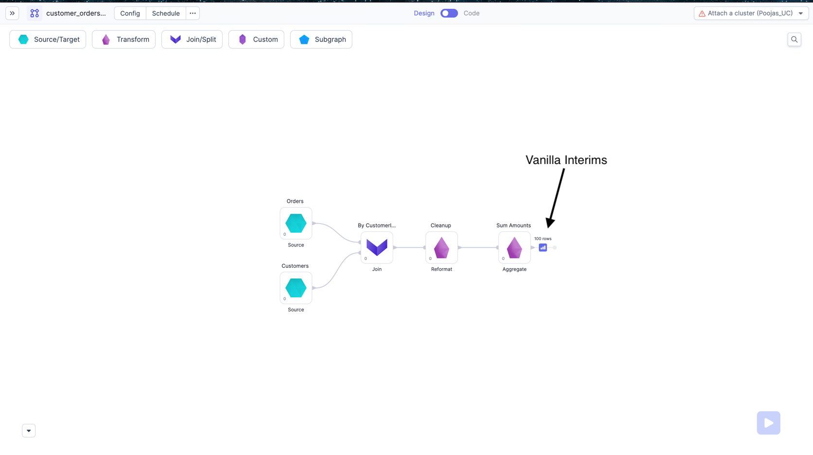
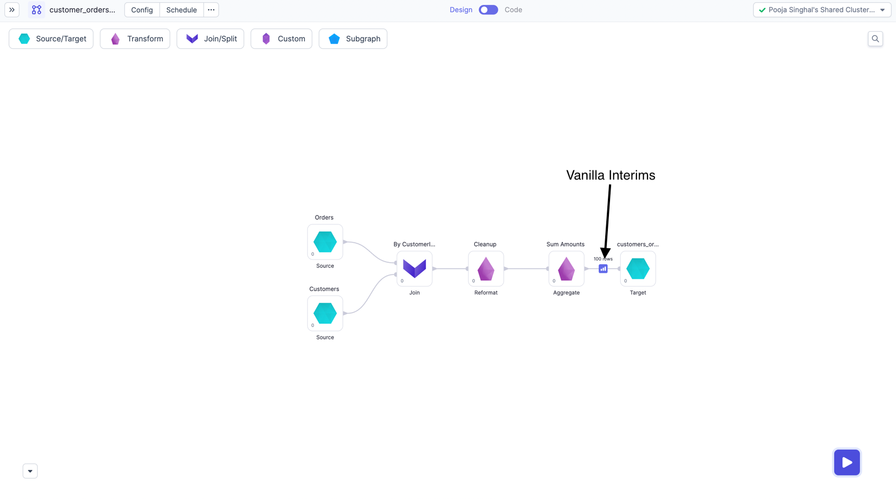
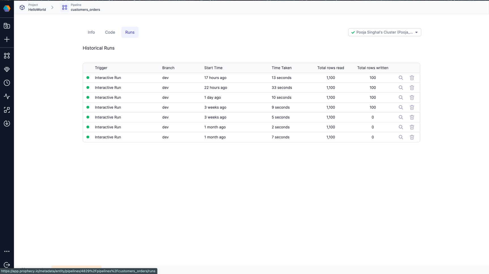
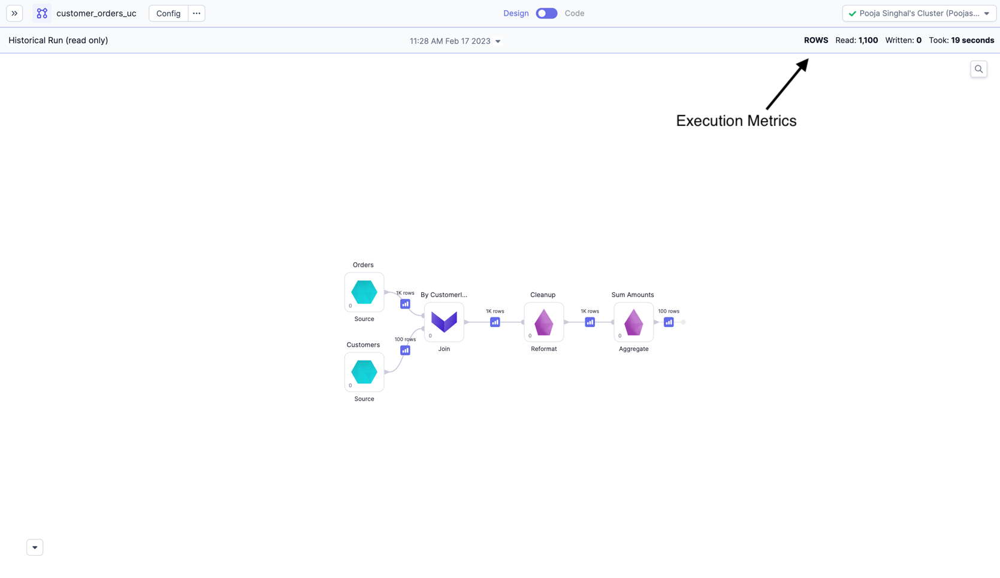
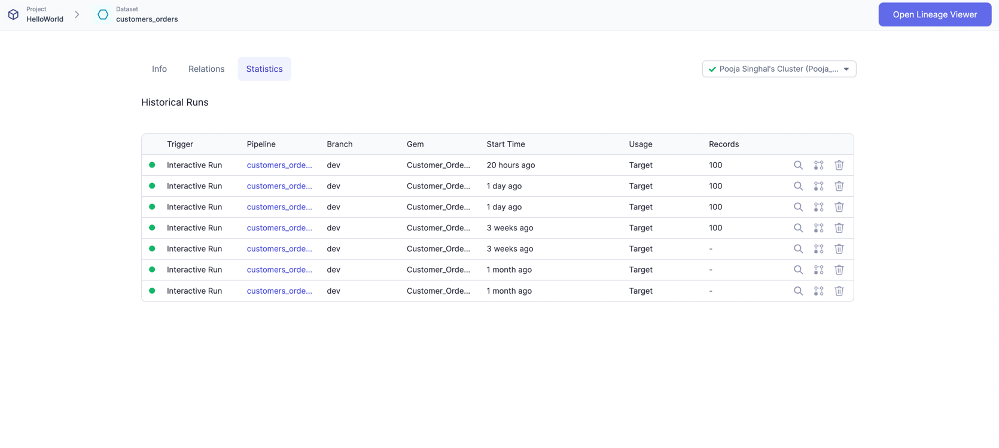
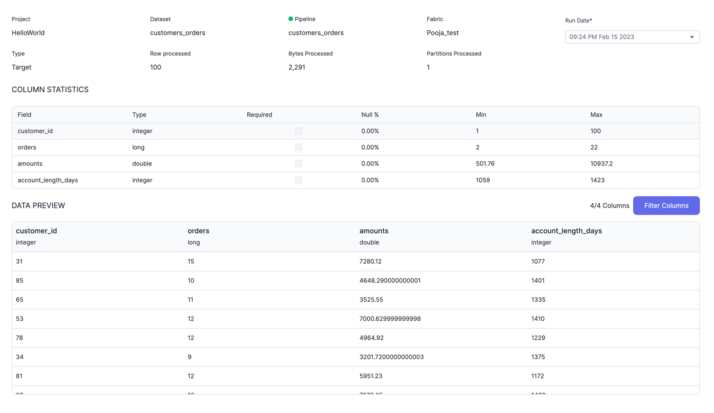

## Cluster Types

Databricks clusters comes with various [Access Modes](https://docs.databricks.com/clusters/create-cluster.html#what-is-cluster-access-mode).

For [Interims](https://docs.prophecy.io/Spark/execution/interactive-execution#interims) and [Execution Metrics](./execution-metrics) to work, Prophecy has written some libraries in Python and Scala, which needs to be installed on the cluster. Hence, because of below restrictions, interims behaviour will be different for different clusters.

| Access mode dropdown      | Library Installations Allowed?          | Language supported | Interims             | Execution Metrics |
| ------------------------- | --------------------------------------- | ------------------ | -------------------- | ----------------- |
| Single User               | Yes                                     | Python, Scala      | Regular Interims     | Yes               |
| Shared                    | Yes, but interim nodes cant be attached | Python             | **Vanilla Interims** | **No**            |
| No isolation shared       | Yes                                     | Python, Scala      | Regular Interims     | Yes               |
| Unity Catalog Single User | Yes                                     | Python, Scala      | Regular Interims     | Yes               |
| Unity Catalog Shared      | No                                      | Python             | **Vanilla Interims** | **No**            |

:::note

As denoted in the Cluter Types table, some feature behaviors are different for different clusters. When using `Shared Mode` or `Unity Catalog Shared` access mode, the following features aren't supported:

- Lookups
- Regular Interims (beyond Vanilla)
- Execution Metrics
- Run history
- Job progress
- Interactive Job runs on pre-existing clusters

When using Databricks with a `Shared` access mode, you must also connect to `Shared Mode` clusters.

:::

## Interims

During development, often the user will want to see their data to make more sense of it and to check whether the expected output is getting
generated or not after the transformation. Prophecy generates these data samples as `Interims`, which are temporarily cached previews of data after each Gem.
To check more about interims, please refer [here](https://docs.prophecy.io/Spark/execution/interactive-execution#interims).

Depending on the type of clusters, we have two modes of Interims

### Regular Interims

For `Single User` clusters, and `No isolation Shared` clusters, we have interims available after each Gem of Pipeline. These are available on both Unity and Non Unity catalog workspaces.

### Vanilla Interims

For `Shared mode` clusters, we have added interims on all Tail nodes of the Pipeline.
These interims will come Just before Target Gems, and if there is no Target Gem, then as a dangling edge after last Gem. See below images for the same.

## Execution Metrics

When running Pipelines and Jobs, you may be interested to know few metrics related to execution like records
read/written, bytes read/written, total time taken and Data samples b/w components. These Dataset, Pipeline-run and
Job-run related metrics are accumulated and stored on your data plane and can be viewed later from Prophecy UI. For more details, refer [here](./execution-metrics).

:::caution
These metrics are **not available** for `Shared mode` clusters (both normal workspaces and Unity catalog workspaces). You should see a proper error when trying to get historical runs of Pipelines/Jobs executed on `Shared mode` clusters.

:::

Refer below images for Execution Metrics on Pipelines page.

Each row here is one run of the Pipeline. You can click and go to a particular run and see the interims for that run or metrics like Rows read/written, time taken, etc.

You can also see Execution Metrics for each Dataset in the Pipeline.

Each row here is one run where this Dataset was used. You can click and go to a particular run and see more detailed insights on your data along with preview.

:::info

When using `High Concurrency` or `Shared Mode` Databricks Clusters you may notice a delay when running the first command, or when your cluster is scaling up to meet demand. This delay is due to Prophecy and Pipeline dependencies (Maven or Python packages) being installed. For the best performance, it is recommended that you cache packages in an Artifactory or on DBFS. Please [contact us](https://help.prophecy.io/support/tickets/new) to learn more about this.

:::
