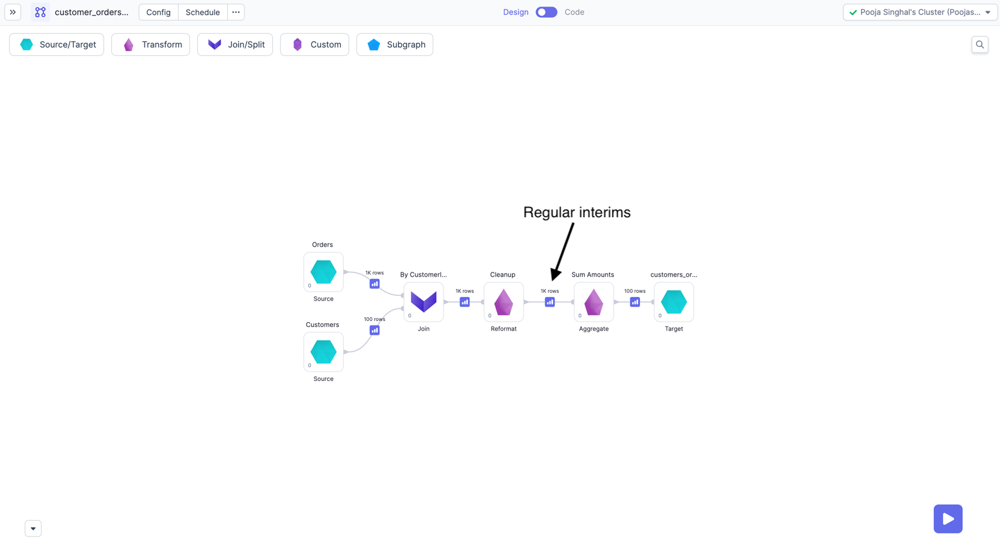
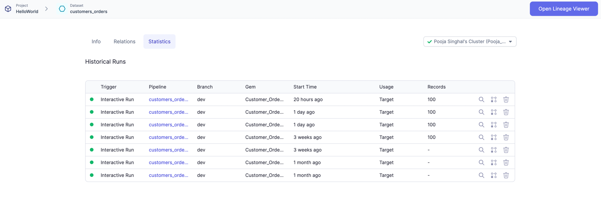

During development, you can interactively execute pipelines and see sample outputs from each of your gems. Prophecy generates these data samples as [interims](docs/Spark/execution/interactive-execution.md#interims), which are temporarily cached previews of data after each gem.

If you want to know more about pipeline runs, you can view their execution metrics.

## Execution Metrics on Livy

When running pipelines and jobs, you may be interested to know few metrics related to execution like records
read/written, bytes read/written, total time taken and Data samples b/w components. These dataset, pipeline-run and
Job-run related metrics are accumulated and stored on your data plane and can be viewed later from Prophecy UI.

Execution metrics are supported for all types of clusters with Livy and Hive metastore (HMS). Execution metrics must be enabled at the team-level in the [Execution Metrics settings](./execution-metrics#team-level-access-control) page. When enabled, Prophecy **automatically populates** execution metric settings, but you can also define your own. This can be useful if you want to use **external tables** or change the default storage format to a format like Parquet.

You can access execution metrics by:

- Opening historical pipeline runs

  

  

- Opening dataset metadata

  

  
