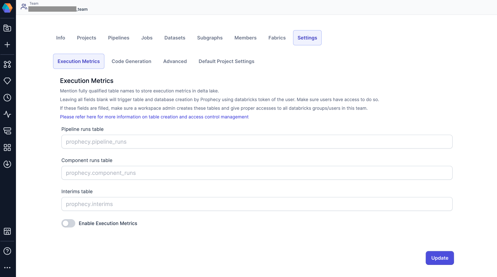

When running pipelines and jobs, you may want to review metrics related to execution like records read/written, bytes read/written, total time taken, and data samples generated between components. These dataset, pipeline-run, and job-run related metrics are accumulated and stored on your data plane and can be viewed later from the Prophecy user interface.

## Data storage behavior

Depending on flags settings, the storage behavior for execution metrics changes. For example, certain data may be written depending on whether a pipeline flag is turned on or off. See the following table to learn how the behavior changes.

|                             | On                                                                                                                                                                        | Off                                                                                                                                                              |
| --------------------------- | ------------------------------------------------------------------------------------------------------------------------------------------------------------------------- | ---------------------------------------------------------------------------------------------------------------------------------------------------------------- |
| Execution metrics flag      | Available data will be stored.                                                                                                                                            | Nothing will be stored. Interactive runs will show data depending on what other flags were enabled.                                                              |
| Pipeline data sampling flag | Available data will be stored based on the execution metrics flag. Interims for interactive run will be visible in the UI and stored based on the execution metrics flag. | Available data will be stored based on the execution metrics flag. Interims from interactive run will neither be visible in the UI nor will they be stored.      |
| Job data sampling flag      | Available data will be stored based on the execution metrics flag. Interims for job run will get generated but stored based on the execution metrics flag.                | Available data will be stored based on the execution metrics flag. Interims from job run will neither be visible in the (historical) UI nor will they be stored. |
| Pipeline monitoring flag    | Available data will be stored based on the execution metrics flag. Individual Gem level data will be visible in the UI but stored based on the execution metrics flag.    | Available data with be stored based on the execution metrics flag. Individual Gem level data will neither be visible in the UI nor will it be stored.            |

## Team level access-control

For clusters with table ACL enabled, you may have limited access on catalogs, schemas, and tables. Here we advise
you to setup the execution metrics tables beforehand. Data is stored in the workspace storage itself, and you can choose
the tables from Team view in the Prophecy UI.

There are three execution metrics tables that store data for pipelines, individual components, and the generated data samples, also known as interims. You have the option to choose the following at the time of team creation:

- **Pipeline runs table**: The pipeline metrics table that contains metrics and code for pipeline runs
- **Component runs table**: The component (dataset) metrics table that contains metrics for individual component runs
- **Interims table**: The interims table that contains samples of data, depending on the interim mode selected



## Prerequisites

As a Workspace / Catalog Admin, you must create tables and grant appropriate permissions to your users for them to choose
to mention tables of their choice. It's recommended that this should be done at the time of team creation itself, to ensure the best experience for your users.

You can store these tables using any format like Avro, Parquet, ORC, or Delta.

DDLs and Grant accesses are in the following sections.

## Create tables using Delta (for Databricks)

The following are sample Create table commands for tables using Delta. These are suitable for Databricks or if your metastore supports Delta tables.

- **Pipeline metrics table**

```sql
  CREATE TABLE IF NOT EXISTS <database>.<pipeline_runs_table_name>
  (
      uid STRING NOT NULL COMMENT 'Unique identifier for the pipeline run',
      pipeline_uri STRING NOT NULL COMMENT 'URI of the pipeline',
      job_uri STRING COMMENT 'URI of the job associated with the pipeline run',
      job_run_uid STRING COMMENT 'Unique identifier for the job run',
      task_run_uid STRING COMMENT 'Unique identifier for the task run',
      status STRING COMMENT 'Status of the pipeline run',
      fabric_uid STRING NOT NULL COMMENT 'Unique identifier for the fabric',
      time_taken LONG COMMENT 'Time taken for the pipeline run',
      rows_read LONG COMMENT 'Number of rows read during the pipeline run',
      rows_written LONG COMMENT 'Number of rows written during the pipeline run',
      created_at TIMESTAMP COMMENT 'Timestamp when the pipeline run was created',
      created_by STRING NOT NULL COMMENT 'Prophecy user ID who created the pipeline run',
      run_type STRING COMMENT 'Type of the run - Interactive, Adhoc, or Scheduled',
      input_datasets ARRAY<STRING> COMMENT 'List of input datasets',
      output_datasets ARRAY<STRING> COMMENT 'List of output datasets',
      workflow_code MAP<STRING, STRING> COMMENT 'Workflow code associated with the pipeline run',
      expired BOOLEAN COMMENT 'Indicates if the pipeline run has expired',
      branch STRING COMMENT 'Git entity information for the pipeline run. Can be branch name or release tag',
      pipeline_config STRING COMMENT 'Pipeline configuration details',
      user_config STRING COMMENT 'User configuration details',
      expected_interims INT COMMENT 'Expected number of interims',
      actual_interims INT COMMENT 'Actual number of interims',
      logs STRING COMMENT 'Logs for the pipeline run'
  )
  USING DELTA
  PARTITIONED BY (fabric_uid, pipeline_uri, created_by)
  LOCATION '<table_path>'
  TBLPROPERTIES (delta.autoOptimize.optimizeWrite = true, delta.autoOptimize.autoCompact = true)
```

- **Component metrics table**

```sql
  CREATE TABLE IF NOT EXISTS <database>.<component_runs_table_name>
  (
      uid STRING NOT NULL COMMENT 'Unique identifier for the component run',
      component_uri STRING NOT NULL COMMENT 'URI of the component',
      pipeline_uri STRING COMMENT 'URI of the pipeline associated with the component run',
      pipeline_run_uid STRING NOT NULL COMMENT 'Unique identifier for the pipeline run',
      fabric_uid STRING NOT NULL COMMENT 'Unique identifier for the fabric',
      component_name STRING COMMENT 'Name of the component',
      interim_component_name STRING COMMENT 'Name of the component holding interim for this component. Targets are supplied interims by the upstream component',
      component_type STRING COMMENT 'Type of the component - Source, Reformat, Target, etc.',
      interim_subgraph_name STRING COMMENT 'Name of the graph where interim component resides',
      interim_process_id STRING COMMENT 'Identifier for the interim process',
      interim_out_port STRING COMMENT 'Output port for the interim component',
      created_at TIMESTAMP COMMENT 'Timestamp when the component run was created',
      created_by STRING NOT NULL COMMENT 'Identifier of the user who created the component run',
      records LONG COMMENT 'Number of records processed by the component. Represents the aggregated amount of all rows read through this component. Rows can be re-read if there were multiple downstream components or if Spark ran the same plan multiple times',
      bytes LONG COMMENT 'Number of bytes processed by the component',
      partitions LONG COMMENT 'Number of partitions of the data processed by the component',
      expired BOOLEAN COMMENT 'Indicates if the component run has expired',
      run_type STRING COMMENT 'Type of the run',
      job_uri STRING COMMENT 'URI of the job associated with the component run',
      branch STRING COMMENT 'Branch information for the component run',
      gem_name STRING COMMENT 'Hierarchical component name',
      process_id STRING COMMENT 'Process identifier of the gem',
      gem_type STRING COMMENT 'Type of the gem',
      input_gems ARRAY<STRUCT<gem_name: STRING, from_port: STRING, to_port: STRING, num_rows: LONG>> COMMENT 'List of input gems with details',
      output_gems ARRAY<STRUCT<gem_name: STRING, from_port: STRING, to_port: STRING, num_rows: LONG>> COMMENT 'List of output gems with details',
      in_ports ARRAY<STRING> COMMENT 'List of input ports',
      out_ports ARRAY<STRING> COMMENT 'List of output ports',
      num_rows_output LONG COMMENT 'Number of rows output by the component. Represents the maximum number of rows read through this component across Spark plans and possible re-runs',
      stdout ARRAY<STRUCT<content: STRING, time: LONG>> COMMENT 'Standard output logs',
      stderr ARRAY<STRUCT<content: STRING, time: LONG>> COMMENT 'Standard error logs',
      start_time LONG COMMENT 'Start time of the component run',
      end_time LONG COMMENT 'End time of the component run',
      state STRING COMMENT 'State of the component run',
      exception STRUCT<exception_type: STRING, msg: STRING, cause_msg: STRING, stack_trace: STRING, time: LONG> COMMENT 'Exception details if any occurred during the component run'
  )
  USING DELTA
  PARTITIONED BY (fabric_uid, component_uri, created_by)
  LOCATION '<table_path>'
  TBLPROPERTIES (delta.autoOptimize.optimizeWrite = true, delta.autoOptimize.autoCompact = true)
```

- **Interims table**

```sql
  CREATE TABLE IF NOT EXISTS <database>.<interims_table_name>
  (
      uid STRING NOT NULL COMMENT 'Unique identifier for the interim',
      interim STRING COMMENT 'Interim data or information',
      created_by STRING COMMENT 'Identifier of the user who created the interim',
      created_at TIMESTAMP COMMENT 'Timestamp when the interim was created',
      fabric_uid STRING COMMENT 'Unique identifier for the fabric'
  )
  USING DELTA
  PARTITIONED BY (created_by, fabric_uid)
  LOCATION '<table_path>'
  TBLPROPERTIES (delta.autoOptimize.optimizeWrite = true, delta.autoOptimize.autoCompact = true)
```

### Grant permissions

```sql
  GRANT USAGE ON SCHEMA <database> TO group1;
  GRANT USAGE ON SCHEMA <database> TO group2;

  GRANT SELECT ON <database.component-runs-table> TO group1;
  GRANT SELECT ON <database.component-runs-table> TO group2;
  GRANT MODIFY ON <database.component-runs-table> TO group1;
  GRANT MODIFY ON <database.component-runs-table> TO group2;

  GRANT SELECT ON <database.pipeline-runs-table> TO group1;
  GRANT SELECT ON <database.pipeline-runs-table> TO group2;
  GRANT MODIFY ON <database.pipeline-runs-table> TO group1;
  GRANT MODIFY ON <database.pipeline-runs-table> TO group2;

  GRANT SELECT ON <database.interims-table> TO group1;
  GRANT SELECT ON <database.interims-table> TO group2;
  GRANT MODIFY ON <database.interims-table> TO group1;
  GRANT MODIFY ON <database.interims-table> TO group2;
```

### Restrictions

- Reading execution metrics from High-Concurrency Clusters with Table-ACL enabled is supported in Databricks
  Runtimes 11.0 or below.
- Shared Access mode in Unity Catalog enabled workspaces is not supported.

## Creating Tables using Parquet (for Livy)

The following are sample Create table commands for tables using Parquet. These are suitable for Livy or for your Hive metastore in Hadoop setups.

- **Pipeline metrics table**

```sql
  CREATE TABLE IF NOT EXISTS <database>.<pipeline_runs_table_name>
  (
      uid STRING NOT NULL COMMENT 'Unique identifier for the pipeline run',
      pipeline_uri STRING NOT NULL COMMENT 'URI of the pipeline',
      job_uri STRING COMMENT 'URI of the job associated with the pipeline run',
      job_run_uid STRING COMMENT 'Unique identifier for the job run',
      task_run_uid STRING COMMENT 'Unique identifier for the task run',
      status STRING COMMENT 'Status of the pipeline run',
      fabric_uid STRING NOT NULL COMMENT 'Unique identifier for the fabric',
      time_taken LONG COMMENT 'Time taken for the pipeline run',
      rows_read LONG COMMENT 'Number of rows read during the pipeline run',
      rows_written LONG COMMENT 'Number of rows written during the pipeline run',
      created_at TIMESTAMP COMMENT 'Timestamp when the pipeline run was created',
      created_by STRING NOT NULL COMMENT 'Prophecy user ID who created the pipeline run',
      run_type STRING COMMENT 'Type of the run - Interactive, Adhoc, or Scheduled',
      input_datasets ARRAY<STRING> COMMENT 'List of input datasets',
      output_datasets ARRAY<STRING> COMMENT 'List of output datasets',
      workflow_code MAP<STRING, STRING> COMMENT 'Workflow code associated with the pipeline run',
      expired BOOLEAN COMMENT 'Indicates if the pipeline run has expired',
      branch STRING COMMENT 'Git entity information for the pipeline run. Can be branch name or release tag',
      pipeline_config STRING COMMENT 'Pipeline configuration details',
      user_config STRING COMMENT 'User configuration details',
      expected_interims INT COMMENT 'Expected number of interims',
      actual_interims INT COMMENT 'Actual number of interims',
      logs STRING COMMENT 'Logs for the pipeline run'
  ) stored as parquet
  PARTITIONED BY (fabric_uid, pipeline_uri, created_by)
```

- **Component metrics table**

```sql
  CREATE TABLE IF NOT EXISTS <database>.<component_runs_table_name>
  (
      uid STRING NOT NULL COMMENT 'Unique identifier for the component run',
    component_uri STRING NOT NULL COMMENT 'URI of the component',
    pipeline_uri STRING COMMENT 'URI of the pipeline associated with the component run',
    pipeline_run_uid STRING NOT NULL COMMENT 'Unique identifier for the pipeline run',
    fabric_uid STRING NOT NULL COMMENT 'Unique identifier for the fabric',
    component_name STRING COMMENT 'Name of the component',
    interim_component_name STRING COMMENT 'Name of the component holding interim for this component. Targets are supplied interims by the upstream component',
    component_type STRING COMMENT 'Type of the component - Source, Reformat, Target, etc.',
    interim_subgraph_name STRING COMMENT 'Name of the graph where interim component resides',
    interim_process_id STRING COMMENT 'Identifier for the interim process',
    interim_out_port STRING COMMENT 'Output port for the interim component',
    created_at TIMESTAMP COMMENT 'Timestamp when the component run was created',
    created_by STRING NOT NULL COMMENT 'Identifier of the user who created the component run',
    records LONG COMMENT 'Number of records processed by the component. Represents the aggregated amount of all rows read through this component. Rows can be re-read if there were multiple downstream components or if Spark ran the same plan multiple times',
    bytes LONG COMMENT 'Number of bytes processed by the component',
    partitions LONG COMMENT 'Number of partitions of the data processed by the component',
    expired BOOLEAN COMMENT 'Indicates if the component run has expired',
    run_type STRING COMMENT 'Type of the run',
    job_uri STRING COMMENT 'URI of the job associated with the component run',
    branch STRING COMMENT 'Branch information for the component run',
    gem_name STRING COMMENT 'Hierarchical component name',
    process_id STRING COMMENT 'Process identifier of the gem',
    gem_type STRING COMMENT 'Type of the gem',
    input_gems ARRAY<STRUCT<gem_name: STRING, from_port: STRING, to_port: STRING, num_rows: LONG>> COMMENT 'List of input gems with details',
    output_gems ARRAY<STRUCT<gem_name: STRING, from_port: STRING, to_port: STRING, num_rows: LONG>> COMMENT 'List of output gems with details',
    in_ports ARRAY<STRING> COMMENT 'List of input ports',
    out_ports ARRAY<STRING> COMMENT 'List of output ports',
    num_rows_output LONG COMMENT 'Number of rows output by the component. Represents the maximum number of rows read through this component across Spark plans and possible re-runs',
    stdout ARRAY<STRUCT<content: STRING, time: LONG>> COMMENT 'Standard output logs',
    stderr ARRAY<STRUCT<content: STRING, time: LONG>> COMMENT 'Standard error logs',
    start_time LONG COMMENT 'Start time of the component run',
    end_time LONG COMMENT 'End time of the component run',
    state STRING COMMENT 'State of the component run',
    exception STRUCT<exception_type: STRING, msg: STRING, cause_msg: STRING, stack_trace: STRING, time: LONG> COMMENT 'Exception details if any occurred during the component run'
  ) stored as parquet
  PARTITIONED BY (fabric_uid, component_uri, created_by)
```

- **Interims table**

```sql
  CREATE TABLE IF NOT EXISTS <database>.<interims_table_name>
  (
      uid STRING NOT NULL COMMENT 'Unique identifier for the interim',
      interim STRING COMMENT 'Interim data or information',
      created_by STRING COMMENT 'Identifier of the user who created the interim',
      created_at TIMESTAMP COMMENT 'Timestamp when the interim was created',
      fabric_uid STRING COMMENT 'Unique identifier for the fabric'
  ) stored as parquet
  PARTITIONED BY (created_by, fabric_uid)
```
