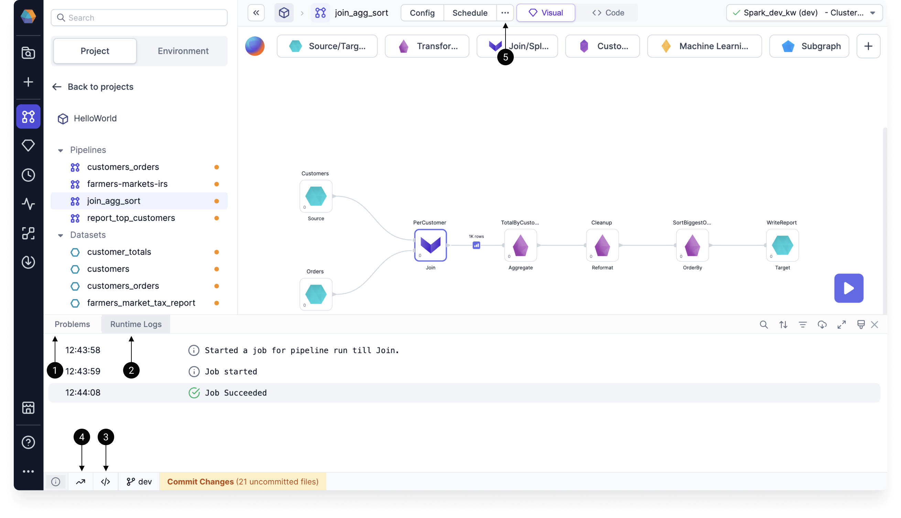

Prophecy executes pipelines based on the type of Spark cluster and the operation being performed. You can run pipelines interactively, schedule them, or execute them using the built-in Spark shell. Each execution provides information through logs and metrics to help you manage and monitor data transformations.

## Interactive execution

When you run a pipeline in the pipeline canvas, Prophecy generates interim **data samples** that let you preview the output of your data transformations. There are two ways to run a pipeline interactively:

- Run the entire pipeline using the **play** button on the pipeline canvas.
- Execute the pipeline up to and including a particular gem using the **play** button on that gem. This is also know as a **partial run**.

After you run your pipeline, data samples will appear between gems. These previews are temporarily cached. Learn about how these [data samples](docs/Spark/execution/data-sampling.md) are generated or discover the [Data Explorer](docs/Spark/data-explorer/data-explorer.md).

## Scheduled execution

When you create [jobs](docs/Orchestration/Orchestration.md) in Prophecy, you schedule when certain pipelines will run. Prophecy executes pipelines based on the [fabric](docs/getting-started/concepts/fabrics.md) defined in the pipeline's job settings. Prophecy will automatically run jobs once relevant projects are released and deployed.

## Shell execution

Prophecy comes with an built-in interactive Spark shell that supports both Python and Scala. The shell is an easy way to quickly analyze data or test Spark commands. The Spark context and session are available within the shell as variables `sc` and `spark` respectively.

## Execution information

Once you run a pipeline, there are several ways for you to better understand the execution.

| Callout | Information                                                    | Description                                                                                                             |
| ------- | -------------------------------------------------------------- | ----------------------------------------------------------------------------------------------------------------------- |
| **1**   | Problems                                                       | Errors from your pipeline execution that will be shown in a dialog window, as well as in the canvas footer.             |
| **2**   | Runtime logs                                                   | The progress with timestamps of your pipeline runs and any errors.                                                      |
| **3**   | Execution code                                                 | The code Prophecy runs to execute your pipeline. You can copy and paste this code elsewhere for debugging.              |
| **4**   | Runtime metrics                                                | Various Spark metrics collected during runtime.                                                                         |
| **5**   | [Execution metrics](docs/Spark/execution/execution-metrics.md) | Metrics that can be found in the **Metadata** of a pipeline, or from the **Run History** button under the **...** menu. |

Use the image below to help you find the relevant information.

## Execution on Databricks

Databricks clusters come with various [Access Modes](https://docs.databricks.com/clusters/create-cluster.html#what-is-cluster-access-mode). To use Unity Catalog Shared clusters, check for feature support [here](docs/administration/Spark-fabrics/databricks/UCShared.md).

:::info
When using `High Concurrency` or `Shared Mode` Databricks Clusters you may notice a delay when running the first command, or when your cluster is scaling up to meet demand. This delay is due to Prophecy and pipeline dependencies (Maven or Python packages) being installed. For the best performance, it is recommended that you cache packages in an Artifactory or on DBFS. Please [contact us](https://help.prophecy.io/support/tickets/new) to learn more about this.
:::
