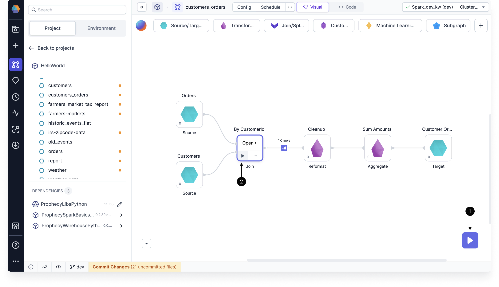
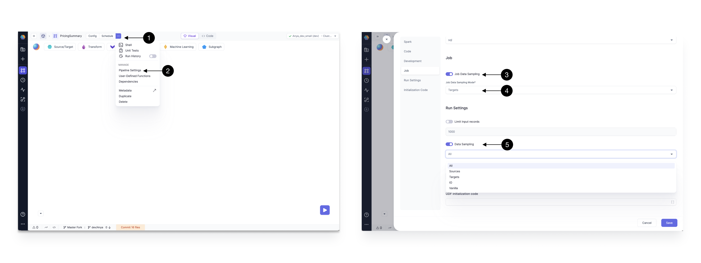
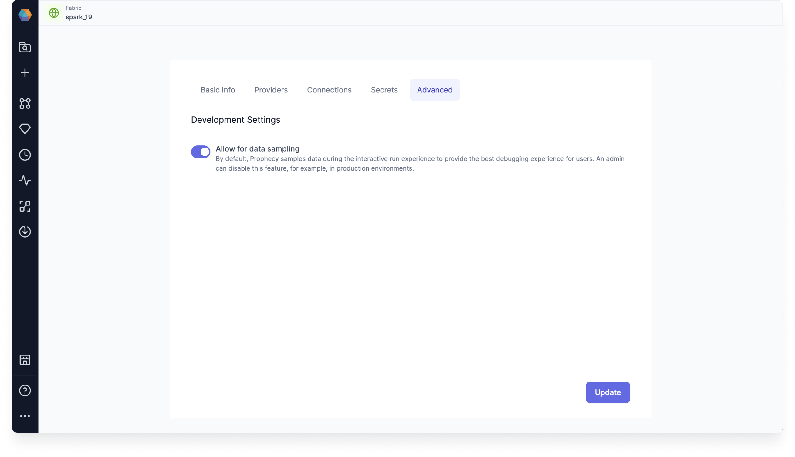
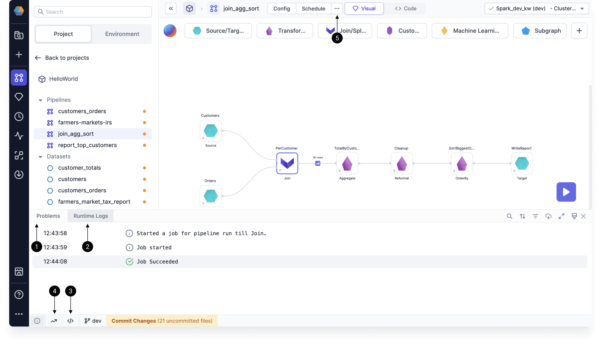
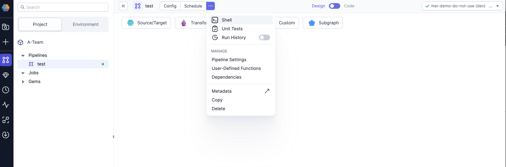

When developing pipelines in Prophecy, you can run the pipeline interactively in the pipeline canvas. In other words, you can preview the output of your data transformations at every step in your pipeline.

## Interim data samples {#interims}

When you run a pipeline in the pipeline canvas, Prophecy generates **interim** data samples that let you preview the output of your data transformations.

There are two ways to run a pipeline interactively:

- Click the **play** button on the pipeline canvas to run the entire pipeline.
- Click the **play** button on a particular gem to execute the flow of the pipeline **up to and including that gem**. This is useful for testing and debugging when you don't want to run the entire pipeline.

After you run your pipeline, you will see the interims appear between gems. These previews are temporarily cached. Learn more about how to navigate the interim data samples in [Data Explorer](docs/Spark/execution/data-explorer.md).

## Enable data sampling

Data sampling is enabled by default for interactive execution. To change data sampling settings:

1. Select the **...** (ellipses) dropdown.
2. Open the **Pipeline Settings**.
3. Toggle **Job Sampling** to enable or disable generating interim samples for scheduled jobs. For job sampling, interim metrics are stored in the compute cluster (such as a Databricks workspace) and are visible in [execution metrics](#execution-metrics).
4. Select **Sampling Mode** to chose the level of data sampling.
5. Toggle **Data Sampling** to enable or disable generating interim samples during interactive runs.

:::note
[Vanilla](docs/Spark/execution/databricks-clusters-behaviors.md#vanilla-interims) is an interim sampling mode reserved for Shared Databricks clusters.
:::

### Advanced settings

There is also a global-level **Development Settings** flag admins can use to disable data sampling for a given [fabric](docs/getting-started/concepts/fabrics.md). This flag overrides pipeline-level data sampling settings. You can find these settings in the **Advanced** tab of a fabric.

## Execution information

Once you run a pipeline, there are several ways for you to better understand the execution.

| Callout | Information                                                    | Description                                                                                                             |
| ------- | -------------------------------------------------------------- | ----------------------------------------------------------------------------------------------------------------------- |
| **1**   | Problems                                                       | Errors from your pipeline execution that will be shown in a dialog window, as well as in the canvas footer.             |
| **2**   | Runtime logs                                                   | The progress with timestamps of your pipeline runs and any errors.                                                      |
| **3**   | Execution code                                                 | The code Prophecy runs to execute your pipeline. You can copy and paste this code elsewhere for debugging.              |
| **4**   | Runtime metrics                                                | Various Spark metrics collected during runtime.                                                                         |
| **5**   | [Execution metrics](docs/Spark/execution/execution-metrics.md) | Metrics that can be found in the **Metadata** of a pipeline, or from the **Run History** button under the **...** menu. |

Use the image below to help you find the relevant information.

## Shell

Prophecy comes with an built-in interactive Spark shell that supports both Python and Scala. The shell is an easy way to quickly analyze data or test Spark commands.

:::info
`Spark context` and `session` are available within the shell as variables `sc` and `spark` respectively.
:::
