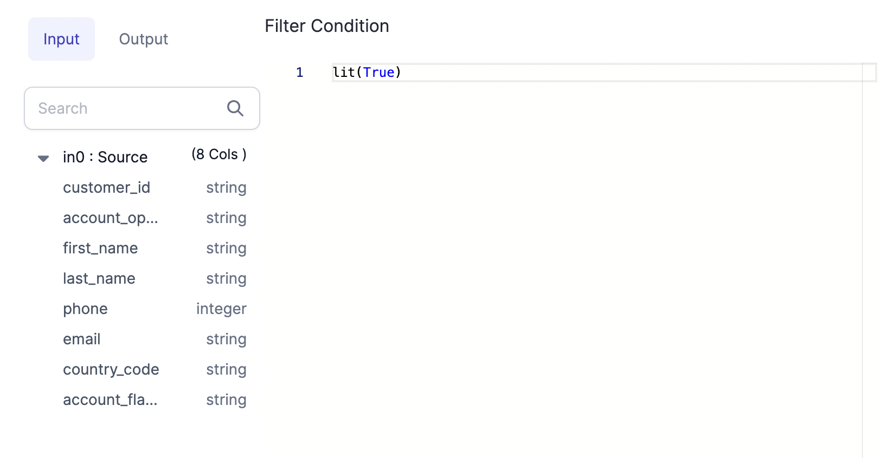

how to use some of our optimization functions in gembuilder

## test

### Dialog

The `dialog` function contains code specific to how the Gem UI should look to the user.

````mdx-code-block
<Tabs>

<TabItem value="py" label="Python">

```py
def dialog(self) -> Dialog:
        return Dialog("Filter").addElement(
            ColumnsLayout(height="100%")
                .addColumn(PortSchemaTabs(selectedFieldsProperty=("columnsSelector")).importSchema(), "2fr")
                .addColumn(StackLayout(height=("100%"))
                .addElement(TitleElement("Filter Condition"))
                .addElement(
                Editor(height=("100%")).withSchemaSuggestions().bindProperty("condition.expression")
            ), "5fr"))
```
</TabItem>
<TabItem value="scala" label="Scala">

```scala
def dialog: Dialog = Dialog("Filter")
    .addElement(
      ColumnsLayout(height = Some("100%"))
        .addColumn(
          PortSchemaTabs(selectedFieldsProperty = Some("columnsSelector")).importSchema(),
          "2fr"
        )
        .addColumn(
          StackLayout(height = Some("100%"))
            .addElement(TitleElement("Filter Condition"))
            .addElement(
              Editor(height = Some("100%"))
                .withSchemaSuggestions()
                .bindProperty("condition.expression")
            ),
          "5fr"
        )
    )
```
</TabItem>
</Tabs>

````

The above Dialog code in the filter is rendered on UI like this:



There are various UI components that can be defined for custom Gems such as scroll boxes, tabs, buttons, and more! These UI components can be grouped together in various types of panels to create a custom user experience when using the Gem.

After the Dialog object is defined, it's serialized as JSON, sent to the UI, and rendered there.

Depending on what kind of Gem is being created, either a `Dialog` or a `DatasetDialog` needs to be defined.

- The **Transformation Dialog**: The Dialog for Transformation Gems (any Gem that is not a Dataset Gem) is created using the `dialog` method, which must return a Dialog object.

- The **Dataset Dialog**: The Dialog for a [Source/Target](../gems/source-target/) Gem is a `DatasetDialog` object. You will need to have `source` and `target` methods defined.

Column Selector: This is a special property that you should add if you want to select the columns from UI and then highlight the used columns using the `onChange` function.
It is recommended to try out this dialogue code in Gem builder UI and see how each of these elements looks in UI.

### Validation

The `validate` method performs validation checks so that in the case where there's any issue with any inputs provided for the user an Error can be displayed. In our example case if the Filter condition is empty. Similarly, you can add any validation on your properties.

````mdx-code-block
<Tabs>

<TabItem value="py" label="Python">

```py
def validate(self, component: Component[FilterProperties]) -> List[Diagnostic]:
        return validateSColumn(component.properties.condition, "condition", component)

```
</TabItem>
<TabItem value="scala" label="Scala">

```scala
def validate(component: Component)(implicit context: WorkflowContext): List[Diagnostic] = {
    val diagnostics =
      validateSColumn(component.properties.condition, "condition", component)
    diagnostics.toList
  }
```
</TabItem>
</Tabs>

````

### State Changes

The `onChange` method is given for the UI State transformations. You are given both the previous and the new incoming state and can merge or modify the state as needed. The properties of the Gem are also accessible to this function, so functions like selecting columns, etc. are possible to add from here.

````mdx-code-block
<Tabs>

<TabItem value="py" label="Python">

```py
def onChange(self, oldState: Component[FilterProperties], newState: Component[FilterProperties]) -> Component[
        FilterProperties]:
        newProps = newState.properties
        usedColExps = getColumnsToHighlight2([newProps.condition], newState)
        return newState.bindProperties(replace(newProps, columnsSelector=usedColExps))

```
</TabItem>
<TabItem value="scala" label="Scala">

```scala
def onChange(oldState: Component, newState: Component)(implicit context: WorkflowContext): Component = {
    val newProps = newState.properties
    val portId = newState.ports.inputs.head.id

    val expressions = getColumnsToHighlight(List(newProps.condition), newState)

    newState.copy(properties = newProps.copy(columnsSelector = expressions))
  }
```
</TabItem>
</Tabs>

````

### Component Code

The last class used here is `FilterCode` which is inherited from `ComponentCode` class. This class contains the actual Spark code that needs to run on your Spark cluster. Here the above User Defined properties are accessible using `self.props.{property}`. The Spark code for the Gem logic is defined in the apply function. Input/Output of apply method can only be DataFrame or list of DataFrames or empty.
For example, we are calling the `.filter()` method in this example in the apply function.

````mdx-code-block
<Tabs>

<TabItem value="py" label="Python">

```py
class FilterCode(ComponentCode):
def __init__(self, newProps):
self.props: Filter.FilterProperties = newProps

    def apply(self, spark: SparkSession, in0: DataFrame) -> DataFrame:
            return in0.filter(self.props.condition.column())
```
</TabItem>
<TabItem value="scala" label="Scala">

```scala
class FilterCode(props: PropertiesType)(implicit context: WorkflowContext) extends ComponentCode {

    def apply(spark: SparkSession, in: DataFrame): DataFrame = {
      val out = in.filter(props.condition.column)
      out
    }

  }
```
</TabItem>
</Tabs>

````

You can go ahead and preview the component in the Gem Builder now to see how it looks. You can modify the properties and then save it to preview the generated Spark code which will eventually run on your cluster.
