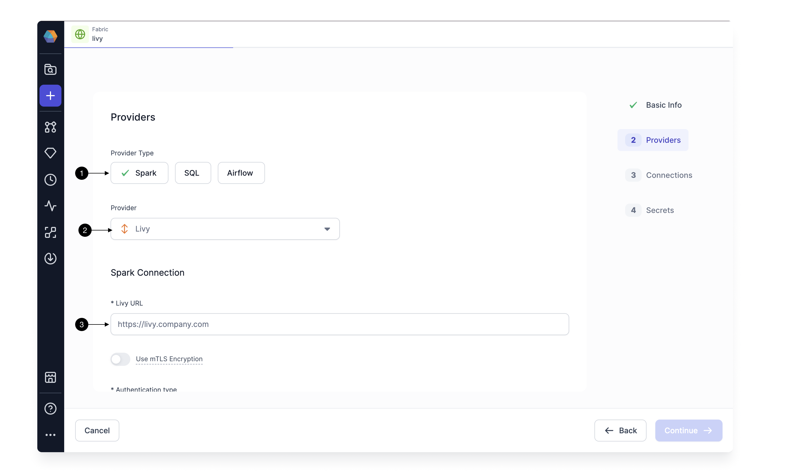

[Apache Livy](https://livy.apache.org/) is a service that enables easy interaction with a Spark cluster over a REST interface. If you're running Hadoop, most Hadoop distributions (CDP/MapR) come with Livy bundled; you just need to enable it. For Spark-on-k8s, you can put a Livy in the K8s cluster, which exposes Spark over a REST API.
You can create a generic Livy Fabric to connect Prophecy to any Spark cluster accessible via Apache Livy.

## Creating Livy Fabric

To create a new Livy Fabric, click on the **(1) Create Entity** button and click on **(2) Fabric**. This opens up the Fabric Create Form.

### Basic Info

The Fabric creation comprises four steps: Basic Info, Provider setup, Connections and Secrets.
On the Basic Info screen, enter a **(1) Fabric Name**, **(2) Fabric Description**, and choose the **(3) Team** that's going to own the Fabric.

Once ready, click **(4) Continue**.

### Providers

Since we're setting up a Fabric connected to Livy, choose **Spark** as the **(1) Provider Type** and **Livy** as the **(2) Provider**.
To connect to Livy, you must provide the **(3)Livy URL** and authentication settings for your Livy Server.

If your Livy is secured behind mTLS authentication, you can configure mTLS encryption in Prophecy. Enable the **(1)Use mTLS Encryption** option and provide the **Client Certificate** and **Client Key** required for mTLS.

Prophecy supports **three** Authentication modes for Livy.

- **None** -
  Use Authentication Mode None for setups where Livy and Prophecy are on the same private network or when Prophecy can securely communicate with Livy through IP whitelisting.
  You can create different Fabrics for different livy URLs in other teams to control who can access livy clusters through Prophecy.
  

- **Bearer Token** -
  Prophecy authenticates with Livy using a pre-configured bearer token in this authentication. This mode is useful when you want to authenticate using a secure token-based system, making it more secure than no authentication for public environments. All team users would use the same token configured by a Team admin in **(2) Bearer Token** to authenticate to Livy.

  

- **Kerberos** -
  For Kerberos authentication, Prophecy authenticates with Livy via Kerberos as a service.
  This is used when you have Kerebrised Hadoop set up. Prophecy will use the key tabs configured for this Livy URL by an Admin User in [Admin Settings](../../architecture/authentication/admin-settings#keytabs-for-kerberos-authentication).
  To enable user-level authorization in Kerberized Hadoop, you can enable Impersonation. When **Impersonation using proxy-user** is enabled, Prophecy will use the Proxy User obtained from LDAP/AAD as per [proxy-user setting](../../architecture/authentication/admin-settings#proxy-user-settings-per-user) by an Admin user when talking to Livy.

Click on **(1) Test Connection**.

This will validate the Livy URL and authentication. Once the test connection is successful, you can configure the other Provider settings as below.

- **Job sizes** -
  By default, you will see a small Job size that has been pre-created. You can edit or add more Job sizes. A Job size consists of:

  - Size of the Driver: Driver Core and Memory
  - Size of the Executor: Core and Memory for each executor
  - Total number of Executors

- **Prophecy Library** -
  Here, you will provide the Spark and Scala versions. The Spark and Scala versions are used when a user tries to attach a cluster using this Fabric.
  You can also provide details about Prophecy Libraries. These are Scala and Python libraries written by Prophecy to offer additional functionalities on top of Spark. These would get automatically installed in your Spark execution environment when you attach to a cluster/create a new cluster. These libraries are also publicly available on Maven Central and Pypi, respectively.

- **Advance Settings** -
  You can provide advanced options like Yarn queue, Extra jars, and Spark configs here. Spark configs are additional [Spark Properties](https://spark.apache.org/docs/latest/configuration.html#available-properties), which you can set, which would be applied at Spark session initialization. For example, if your Spark installation is configured to enable dynamic allocation, you can disable it for sessions created through Prophecy.

Once ready, click **Continue**.

### Connections

:::info
Connections still need to be supported for Livy Fabrics.
:::

Click **Continue**.

### Secrets

Here, you can configure any Secret Provider and secrets for your Livy Fabric. Read more about Secret Management [here](/docs/Spark/secret-management/secret-management.md)

Click on **Complete** to complete the Fabric setup.

### Settings

## Execution on Livy

[Execution on Livy](/docs/Spark/execution/execution-metrics-on-livy.md)
