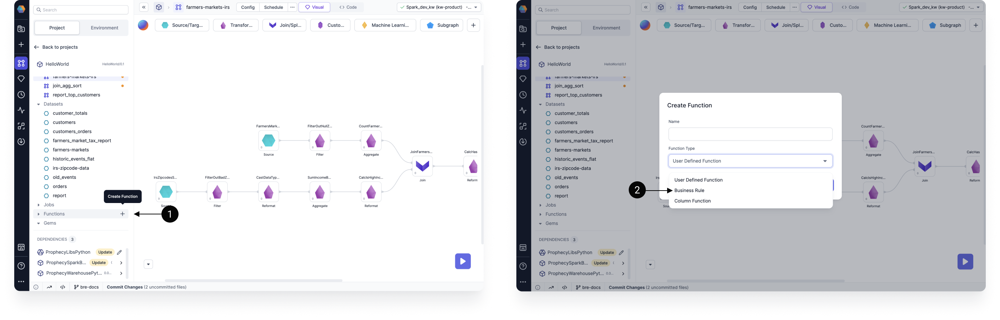
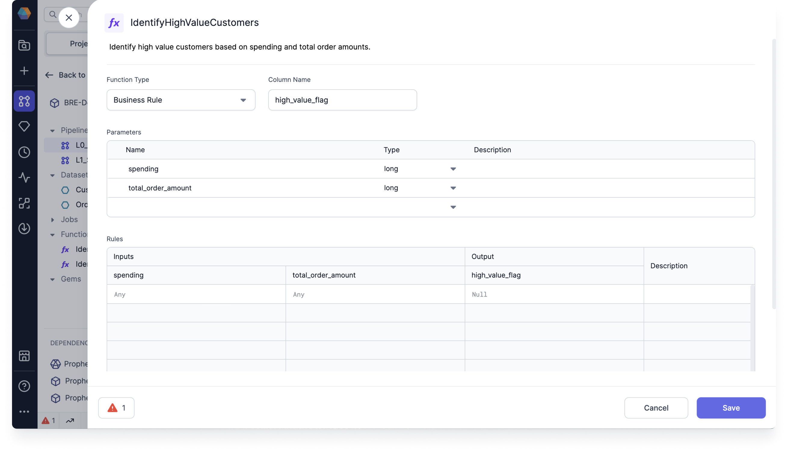
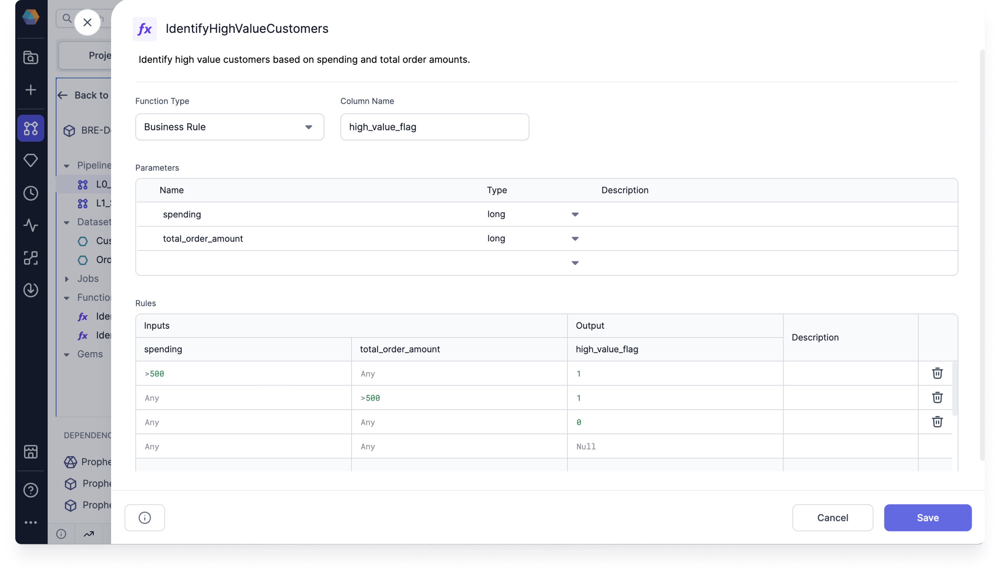
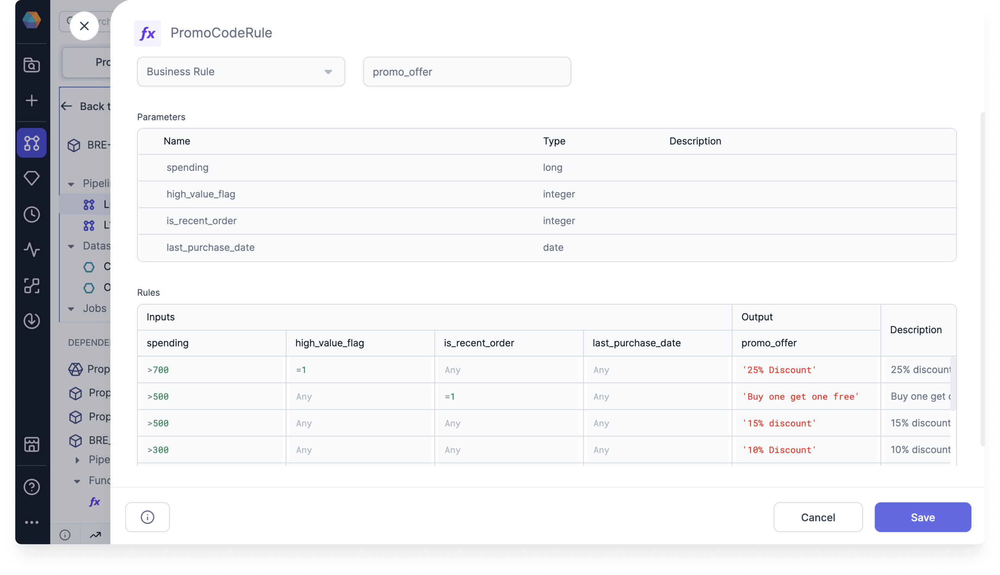
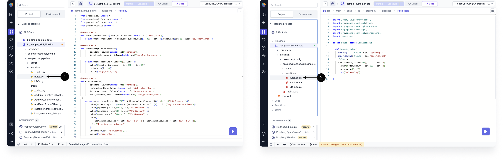

Business rules can be created in Spark Projects as functions. They can also be grouped and released via [Packages](docs/extensibility/package-hub/package-hub.md).

## Configuration

| Field       | Description                                                                                                          |
| ----------- | -------------------------------------------------------------------------------------------------------------------- |
| Column Name | The name of the output column that the business rule will calculate.                                                 |
| Parameters  | The columns you would like to use in your business rule condition(s). Each column must have a Name and Type defined. |
| Rules       | The set(s) of conditions that define the business rule.                                                              |

## Create a business rule

To create a new business rule:

1. In the Project browser, click the **plus** icon next to **Functions**.
1. Name the Rule and choose **Business Rule** as the **Function Type**. Then, click **OK**.

Next, you need to define the rule parameters.

1. Fill in the **Column Name**. This will be the name of your output column.
1. Define columns in the **Parameters** table using a Name, Type, and (optionally) Description.
1. Each column in the **Parameters** table will automatically be added to the **Rules** table under **Inputs**.

Each row in the Rules table corresponds to one rule condition. To add a rule condition:

1. Add conditions under the corresponding inputs in SQL expression format. Note that each expression must be true in a row (logical `AND`) for the rule condition to be met.
1. Add an output value for your condition. This can be a hard-coded value, or you can write in SQL expression format. The default output value is `Null`.
1. Optionally, you can add a description of the rule.

### Example: IdentifyHighSpendingCustomer

Take a look at the business rule in the following image.

In this example, we created an **IdentifyHighSpendingCustomer** business rule. This rule represents the following statement:

> If a customer's spending is more than $500, or their total order amount is more than $500, then they are a high spending customer. Otherwise, they are not a high spending customer.

As you can see, we needed to use multiple rule conditions to achieve this outcome. Additionally, you can see that the output is either `1` or `0`.
This is because we decided to represent whether a customer was a high spender or not with a binary flag.

## Use a business rule in your Pipeline

To use a business rule in your Pipeline, you can use the [SchemaTransform Gem](docs/Spark/gems/transform/schema-transform.md).

1. Add a SchemaTransform Gem to the Pipeline.
1. Open the Gem and add the appropriate input.
1. Click **Add Transformation**.
1. In the **Operation** dropdown, choose **Add Rule**.
1. Choose the appropriate rule in the **Rule** field. This will populate the **New Column** field. If an input column has the same name as the new column, then its data will be overwritten—no new column will be appended.

After completing these steps, you will see the required inputs for the business rule. Prophecy will automatically check if each the required input columns are present in the Gem input. Prophecy will also check to see if the column types match. Any error messages can be found in the Diagnostics of the Gem.

:::note
You can add multiple business rules to the SchemaTransform Gem at a time. You can also use the output column of one rule as an input column for a subsequent rule.
:::

## Managing business rules in Packages

You can also import business rules into Projects via Packages. Imported rules are read-only and can only be edited from their source Project.

This can be useful if:

- You want to group rules by their function or use case.
- You only want specific users to create and edit rules.
- You want to reuse rules in multiple projects.

### Example: PromoCodeRule

Let's say you want to create a PromoCodeRule that will be used in various other Projects.

1. Start by creating a Project where you will define the business rule.
1. Add the business rule to the Project.
1. Commit your changes to the Project.
1. Merge the changes to the main branch.
1. [Release and deploy](docs/ci-cd/deployment/deployment.md##how-to-release-a-project) the Project.

Then, you must give other users access to your Project.

1. In your Project metadata, open the **Access** tab.
1. Toggle-on the option to **Publish to Package Hub**. This will make the Package available to others.

When someone adds the Package as a [dependency](docs/extensibility/dependencies/spark-dependencies.md) in their Project, they will be able to see the rule definition. However, they will not be able to edit the fields.

This example rule includes a set of conditions to determine the type of promotions that a customer is eligible for.

## Viewing the business rules in code

Prophecy automatically compiles visually-developed business rules into code.

Business rules are stored in the **functions** folder of your Pipeline's code. This is true for both Python and Scala Projects. Note that you can also see the imported business rules in the code view.

