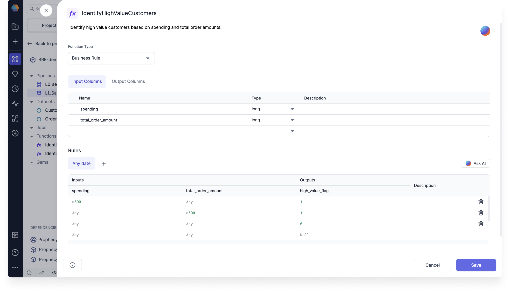
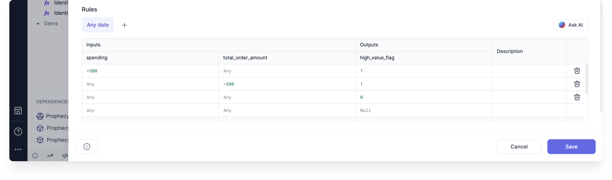

Business rules empower organizations to model, manage, and automate repeatable business decisions throughout the enterprise.

## Overview

The business rules engine in Prophecy lets you incorporate business logic in your Pipelines. Often, different users will interact with business rules at various stages of Pipeline development. One common workflow is as follows:

1. Business users create business rules using predefined enterprise logic.
1. These business rules are deployed and become available as [dependencies](docs/extensibility/dependencies/spark-dependencies.md) in the [Package Hub](/engineers/package-hub).
1. Data engineers and others working on Pipelines can incorporate these rules using the [SchemaTransform gem](/engineers/schema-transform).

These stages are explained in more detail below.

## Business rule parameters

Business rules require the following parameters.

| Field          | Description                                                                                                                                       |
| -------------- | ------------------------------------------------------------------------------------------------------------------------------------------------- |
| Input Columns  | The columns you would like to use in your business rule conditions. Each column must have a Name and Type defined.                                |
| Output Columns | The names of the output columns that the business rule will calculate.                                                                            |
| Rules          | The set of conditions that define the business rule. These can be grouped by date ranges, such that they only apply during a certain time period. |

## Create business rules

To create a new business rule:

1. In the project browser, click the **plus** icon next to **Functions**.
1. Name the Rule and choose **Business Rule** as the **Function Type**. Then, click **OK**.

Next, you need to define the rule parameters.

1. Define columns in the **Input Columns** table using a name, type, and (optionally) description.
1. Define columns in the **Output Columns** table with an optional description.
1. Each column in these tables will automatically be added to the **Rules** table.

Each row in the Rules table corresponds to one rule condition. To add a rule condition:

1. Add conditions under the corresponding inputs in SQL expression format. Note that each expression must be true in a row (logical `AND`) for the rule condition to be met.
1. Add an output value for your condition. This can be a hard-coded value, or you can write in SQL expression format. The default output value is `Null`.
1. Optionally, you can add a description of the rule.

:::note

Prophecy will generate an error if there is conflicting logic in your conditions.

:::

### Example: IdentifyHighSpendingCustomer

Take a look at the business rule in the following image.

In this example, we created an **IdentifyHighSpendingCustomer** business rule. This rule represents the following statement:

> If a customer's spending is more than $500, or their total order amount is more than $500, then they are a high spending customer. Otherwise, they are not a high spending customer.

As you can see, we needed to use multiple rule conditions to achieve this outcome. Additionally, you can see that the output is either `1` or `0`.
This is because we decided to represent whether a customer was a high spender or not with a binary flag.

## Share business rules

You can also import business rules into projects via Packages. Imported rules are read-only and can only be edited from their source project.

This can be useful if:

- You want to group rules by their function or use case.
- You only want specific users to create and edit rules.
- You want to reuse rules in multiple projects.

### Example: PromoCodeRule

Let's say you want to create a PromoCodeRule that will be used in various other projects.

1. Start by creating a project where you will define the business rule.
1. Add the business rule to the project.
1. Commit your changes to the project.
1. Merge the changes to the main branch.
1. [Release and deploy](/engineers/deployment) the project.

Then, you must give other users access to your project.

1. In your project metadata, open the **Access** tab.
1. Toggle-on the option to **Publish to Package Hub**. This will make the Package available to others.

When someone adds the Package as a [dependency](docs/extensibility/dependencies/spark-dependencies.md) in their project, they will be able to see the rule definition. However, they will not be able to edit the fields.

This example rule includes a set of conditions to determine the type of promotions that a customer is eligible for.

## Use business rules in your Pipeline

To use a business rule in your Pipeline, you can use the [SchemaTransform gem](/engineers/schema-transform).

1. Add a SchemaTransform gem to the Pipeline.
1. Open the gem and add the appropriate input.
1. Click **Add Transformation**.
1. In the **Operation** dropdown, choose **Add Rule**.
1. Choose the appropriate rule in the **Rule** field. This will populate the **New Column** field. If an input column has the same name as the new column, then its data will be overwritten—no new column will be appended.

After adding a business rule, Prophecy will automatically perform a few checks to verify that:

- Each rule input column exists in the gem input.
- The type of each rule input column matches that of the gem input.

Error messages can be found in the Diagnostics of the gem.

:::note
You can add multiple business rules to the SchemaTransform gem at a time. You can also use the output column of one rule as an input column for a subsequent rule.
:::

## View the business rules in code

Prophecy automatically compiles visually-developed business rules into code.

Business rules are stored in the **functions** folder of your pipeline's code. This is true for both Python and Scala projects. Note that you can also see the imported business rules in the code view.

