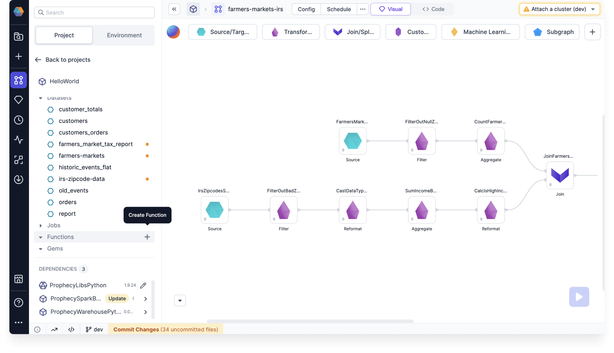
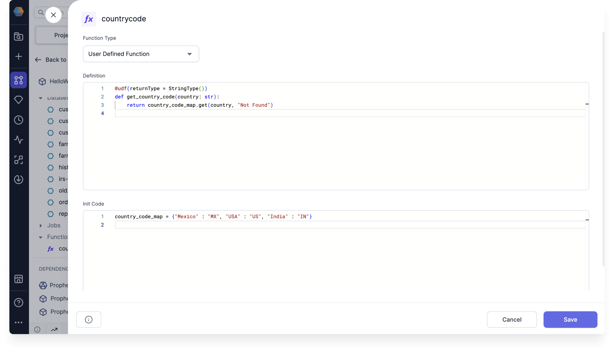
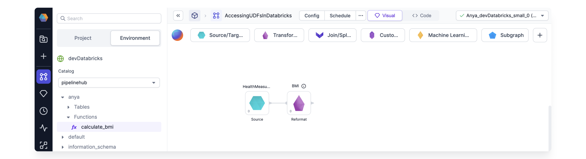
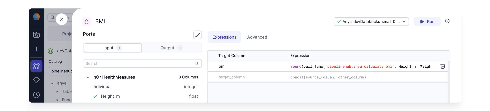

Prophecy lets you [create](#create-udfs) or [import](#import-udfs) user-defined functions (UDFs) which can be used anywhere in the pipeline. Prophecy supports creating UDFs written in Python/Scala, and importing UDFs written in SQL.

| Project Type | Create UDFs   | Import UDFs   |
| :----------- | :------------ | :------------ |
| Python       | Python/Scala  | SQL           |
| Scala        | Python/Scala  | Not supported |
| SQL          | Not supported | Not supported |

## Create UDFs

Prophecy supports creating UDFs written in Python or Scala.

### Parameters

| Parameter               | Description                                                                                                                                 | Required |
| :---------------------- | :------------------------------------------------------------------------------------------------------------------------------------------ | :------- |
| Function name           | The name of the function as it appears in your project.                                                                                     | True     |
| UDF Name                | The name of the UDF that will register it. All calls to the UDF will use this name.                                                         | True     |
| Definition              | Definition of the UDF function. <br/> For example, `udf((value:Int)=>value*value)`                                                          | True     |
| UDF initialization code | Code block that contains initialization of entities used by UDFs. This could, for example, contain any static mapping that a UDF might use. | False    |

### How to Create UDFs

1. Create a new function. You can find the **Functions** section in the left sidebar of a project page.



2. Define the function.



3. Call the function.


````mdx-code-block
import Tabs from '@theme/Tabs';
import TabItem from '@theme/TabItem';

<Tabs>

<TabItem value="py" label="Python">

```py
country_code_map = {"Mexico" : "MX", "USA" : "US", "India" : "IN"}

def registerUDFs(spark: SparkSession):
    spark.udf.register("get_country_code", get_country_code)

@udf(returnType = StringType())
def get_country_code(country: str):
    return country_code_map.get(country, "Not Found")
```

</TabItem>
<TabItem value="scala" label="Scala">

```scala
object UDFs extends Serializable {
  val country_code_map = Map("Mexico" -> "MX", "USA" -> "US", "India" -> "IN")

  def registerUDFs(spark: SparkSession) =
    spark.udf.register("get_country_code", get_country_code)

  def get_country_code =
    udf { (country: String) =>
      country_code_map.getOrElse(country, "Not Found")
    }

}
```

</TabItem>
</Tabs>


````

## Import UDFs

SQL UDFs stored in Databricks Unity Catalog can be imported to Python projects and reused within any Gem.

### How to Import UDFs

1. From a Python Project, attach to a Databricks Spark cluster using a Fabric. Be sure the Fabric credentials allow access to the Databricks Catalog containing the desired SQL function(s).

2. Open the Environment tab, and select the appropriate Catalog and Schema. The list of SQL functions appears in the Environment tab.
   

3. Call the SQL UDF from any Gem in the Project.
   

4. If the Fabric is updated, click the list of functions inside the Environment tab. This will refresh to reflect the functions available according to the new Fabric's credentials.
