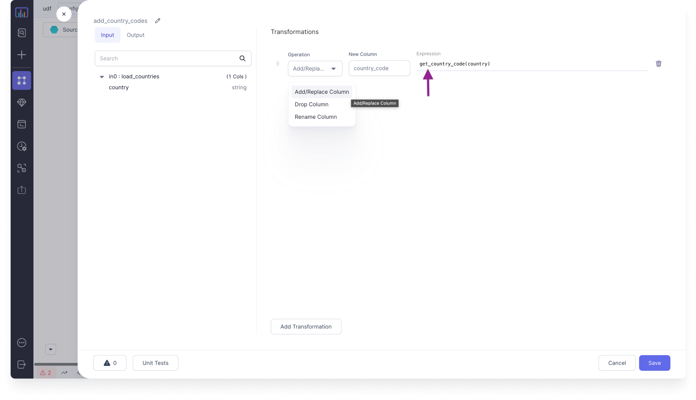

Prophecy lets you create user-defined functions (UDFs) which can be used anywhere in the Pipeline.

## Parameters

| Parameter               | Description                                                                                                                                 | Required |
| :---------------------- | :------------------------------------------------------------------------------------------------------------------------------------------ | :------- |
| Function name           | The name of the function as it appears in your project.                                                                                     | True     |
| UDF Name                | The name of the UDF that will register it. All calls to the UDF will use this name.                                                         | True     |
| Definition              | Definition of the UDF function. <br/> For example, `udf((value:Int)=>value*value)`                                                          | True     |
| UDF initialization code | Code block that contains initialization of entities used by UDFs. This could, for example, contain any static mapping that a UDF might use. | False    |

## Steps

There are a few steps to take to create and use a new UDF.

1. Create a new function. You can find the **Functions** section in the left sidebar of a project page.


2. Define the function.


3. Call the function.



````mdx-code-block
import Tabs from '@theme/Tabs';
import TabItem from '@theme/TabItem';

<Tabs>

<TabItem value="py" label="Python">

```py
country_code_map = {"Mexico" : "MX", "USA" : "US", "India" : "IN"}

def registerUDFs(spark: SparkSession):
    spark.udf.register("get_country_code", get_country_code)

@udf(returnType = StringType())
def get_country_code(country: str):
    return country_code_map.get(country, "Not Found")
```

</TabItem>
<TabItem value="scala" label="Scala">

```scala
object UDFs extends Serializable {
  val country_code_map = Map("Mexico" -> "MX", "USA" -> "US", "India" -> "IN")

  def registerUDFs(spark: SparkSession) =
    spark.udf.register("get_country_code", get_country_code)

  def get_country_code =
    udf { (country: String) =>
      country_code_map.getOrElse(country, "Not Found")
    }

}
```

</TabItem>
</Tabs>


````
