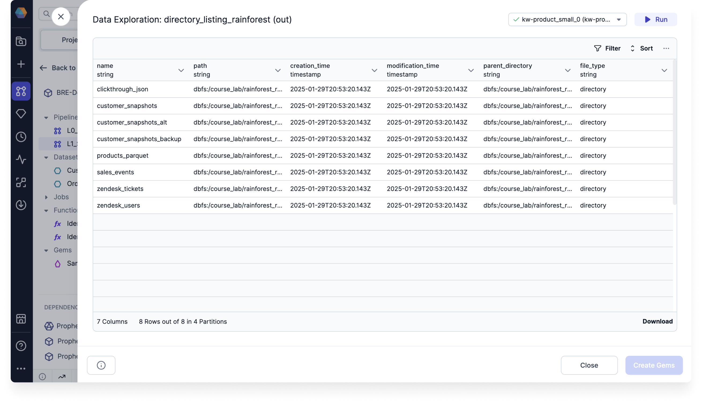

import Requirements from '@site/src/components/gem-requirements';

<Requirements
  python_package_name="ProphecySparkBasicsPython"
  python_package_version="0.2.27+"
  scala_package_name=""
  scala_package_version=""
  scala_lib="8.2.1+"
  python_lib="1.9.16+"
  uc_single="14.3+"
  uc_shared="Not Supported"
  livy="Not Supported"
/>

The Directory gem returns a listing of all the files in a specified directory including file metadata such as file creation time, type, size, path, and more.

## Parameters

| Parameters             | Description                                                                           |
| ---------------------- | ------------------------------------------------------------------------------------- |
| Location               | The location of the directory that you want to return                                 |
| Include Subdirectories | A checkbox you can enable to return all of the subdirectories in the defined location |
| File Specification     | A regex filter to help you find your files in the file browser                        |

## Sample output

Below is an example output of a Directory gem. It includes seven columns:

- name
- path
- size
- creation_time
- modification_time
- parent_directory
- file_type

