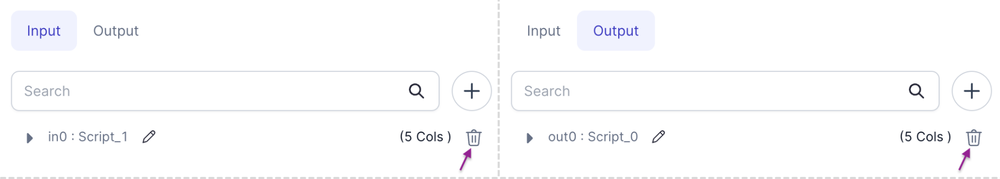
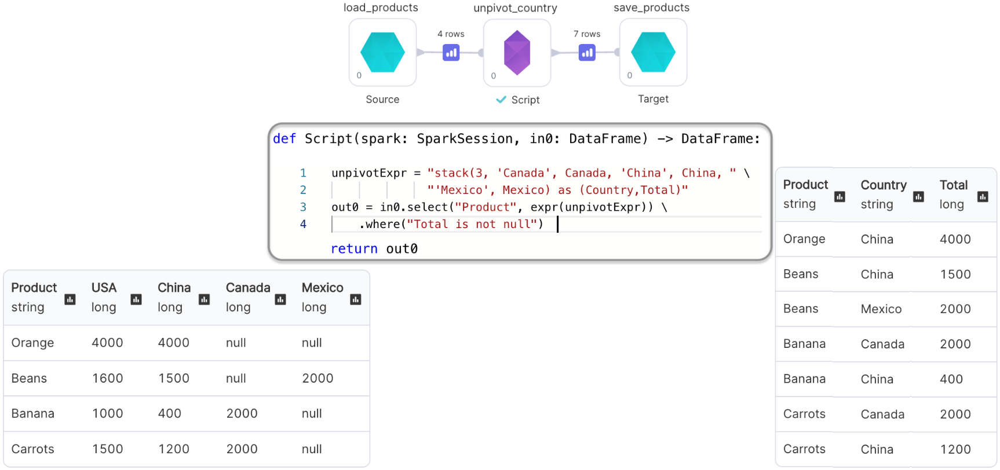
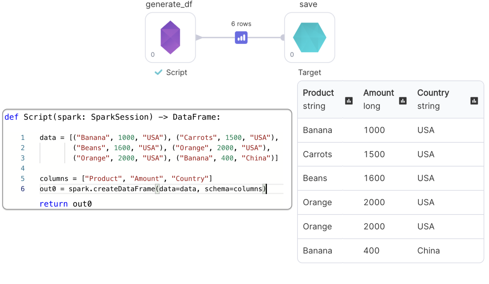

<h3>Spark Gem</h3>

Provides a `SparkSession` and allows you to run custom code.

## Parameters

| Parameter           | Meaning                    | Required |
| :------------------ | :------------------------- | :------- |
| Input DataFrame(s)  | Input DataFrame(s)         | False    |
| Output DataFrame(s) | Output DataFrame(s)        | False    |
| Code                | Custom code to be executed | True     |

:::info
To remove input/output DataFrame(s), simply click <svg width="24" height="24" viewBox="0 0 24 24" xmlns="http://www.w3.org/2000/svg" color="#667085" class="sc-jrAFXE hhLaQQ ui-icon undefined"><path d="M11.9999 2C10.2458 2 8.78514 3.31072 8.53998 5H5.11908C5.0765 4.99271 5.03337 4.98912 4.99017 4.98926C4.95285 4.99006 4.91564 4.99365 4.87885 5H3.24994C3.15056 4.99859 3.05188 5.01696 2.95966 5.05402C2.86743 5.09108 2.78349 5.1461 2.71271 5.21588C2.64194 5.28566 2.58573 5.36882 2.54737 5.46051C2.50901 5.5522 2.48926 5.65061 2.48926 5.75C2.48926 5.84939 2.50901 5.9478 2.54737 6.03949C2.58573 6.13118 2.64194 6.21434 2.71271 6.28412C2.78349 6.3539 2.86743 6.40892 2.95966 6.44598C3.05188 6.48304 3.15056 6.50141 3.24994 6.5H4.31928L5.57806 19.5146C5.7136 20.918 6.90583 22 8.31537 22H15.6835C17.0931 22 18.2854 20.9181 18.4208 19.5146L19.6806 6.5H20.7499C20.8493 6.50141 20.948 6.48304 21.0402 6.44598C21.1324 6.40892 21.2164 6.3539 21.2872 6.28412C21.3579 6.21434 21.4141 6.13118 21.4525 6.03949C21.4909 5.9478 21.5106 5.84939 21.5106 5.75C21.5106 5.65061 21.4909 5.5522 21.4525 5.46051C21.4141 5.36882 21.3579 5.28566 21.2872 5.21588C21.2164 5.1461 21.1324 5.09108 21.0402 5.05402C20.948 5.01696 20.8493 4.99859 20.7499 5H19.122C19.0425 4.98709 18.9613 4.98709 18.8818 5H15.4599C15.2147 3.31072 13.7541 2 11.9999 2ZM11.9999 3.5C12.9395 3.5 13.7103 4.13408 13.9306 5H10.0693C10.2896 4.13408 11.0604 3.5 11.9999 3.5ZM5.82513 6.5H18.1738L16.9277 19.3701C16.8652 20.0177 16.3339 20.5 15.6835 20.5H8.31537C7.66591 20.5 7.13369 20.0168 7.07123 19.3701L5.82513 6.5ZM10.2382 8.98926C10.0395 8.99236 9.8501 9.07423 9.71167 9.21686C9.57324 9.3595 9.49709 9.55125 9.49994 9.75V17.25C9.49853 17.3494 9.5169 17.4481 9.55396 17.5403C9.59102 17.6325 9.64604 17.7164 9.71582 17.7872C9.7856 17.858 9.86876 17.9142 9.96045 17.9526C10.0521 17.9909 10.1505 18.0107 10.2499 18.0107C10.3493 18.0107 10.4477 17.9909 10.5394 17.9526C10.6311 17.9142 10.7143 17.858 10.7841 17.7872C10.8538 17.7164 10.9089 17.6325 10.9459 17.5403C10.983 17.4481 11.0013 17.3494 10.9999 17.25V9.75C11.0014 9.64962 10.9827 9.54997 10.9449 9.45695C10.9071 9.36394 10.851 9.27946 10.78 9.20852C10.709 9.13757 10.6244 9.08161 10.5313 9.04395C10.4383 9.00629 10.3386 8.98769 10.2382 8.98926V8.98926ZM13.7382 8.98926C13.5395 8.99236 13.3501 9.07423 13.2117 9.21686C13.0732 9.3595 12.9971 9.55125 12.9999 9.75V17.25C12.9985 17.3494 13.0169 17.4481 13.054 17.5403C13.091 17.6325 13.146 17.7164 13.2158 17.7872C13.2856 17.858 13.3688 17.9142 13.4605 17.9526C13.5521 17.9909 13.6505 18.0107 13.7499 18.0107C13.8493 18.0107 13.9477 17.9909 14.0394 17.9526C14.1311 17.9142 14.2143 17.858 14.2841 17.7872C14.3538 17.7164 14.4089 17.6325 14.4459 17.5403C14.483 17.4481 14.5013 17.3494 14.4999 17.25V9.75C14.5014 9.64962 14.4827 9.54997 14.4449 9.45695C14.4071 9.36394 14.351 9.27946 14.28 9.20852C14.209 9.13757 14.1244 9.08161 14.0313 9.04395C13.9383 9.00629 13.8386 8.98769 13.7382 8.98926V8.98926Z"></path></svg> icon on the left sidebar

:::

## Schema

When executing a custom script Gem, the output schema is not known by Prophecy so it must be inferred from a sample computation result. Click the `Custom Schema` button and `Infer from cluster` as shown in the **Gems --> Outputs** description [here.](/docs/concepts/project/gems.md#inputs-outputs) The schema will be inferred according to the script and the Spark version running on the connected cluster.

## Examples

---

### Script Gem with Input and Output: Un-pivoting a DataFrame

We'll perform the `unpivot` operation using our custom code

---

### Script Gem with only Output: Generating a DataFrame

We'll use the provided `SparkSession` to create and return a DataFrame

:::note
Since we removed the input port, we don't see input DataFrame in the method signature
:::

