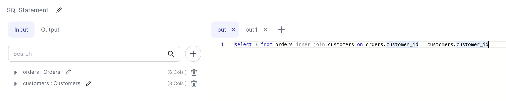

<h3><span class="badge">Spark Gem</span></h3>

Create one or more DataFrame(s) based on provided SQL queries to run against one or more input DataFrames.

### Parameters

| Parameter    | Meaning                       | Required |
| :----------- | :---------------------------- | :------- |
| DataFrame(s) | Input DataFrame(s)            | True     |
| SQL Queries  | SQL Query for each output tab | True     |

### Example



:::info
Number of inputs and outputs can be changed as needed by clicking the `+` button on the respective tab.
:::

### Generated Code

````mdx-code-block
import Tabs from '@theme/Tabs';
import TabItem from '@theme/TabItem';

<Tabs>

<TabItem value="py" label="Python">

```py
def SQLStatement(spark: SparkSession, orders: DataFrame, customers: DataFrame) -> (DataFrame, DataFrame):
    orders.createOrReplaceTempView("orders")
    customers.createOrReplaceTempView("customers")
    df1 = spark.sql("select * from orders inner join customers on orders.customer_id = customers.customer_id")
    df2 = spark.sql("select distinct customer_id from orders")

    return df1, df2

```

</TabItem>
<TabItem value="scala" label="Scala">

```scala
object SQLStatement {

  def apply(
      spark: SparkSession,
      orders: DataFrame,
      customers: DataFrame
  ): (DataFrame, DataFrame) = {
    orders.createOrReplaceTempView("orders")
    customers.createOrReplaceTempView("customers")
    (
      spark.sql(
        """select * from orders inner join customers on orders.customer_id = customers.customer_id"""
      ),
      spark.sql(
        """select distinct customer_id from orders"""
      )
    )
  }

}

```

</TabItem>
</Tabs>

````
