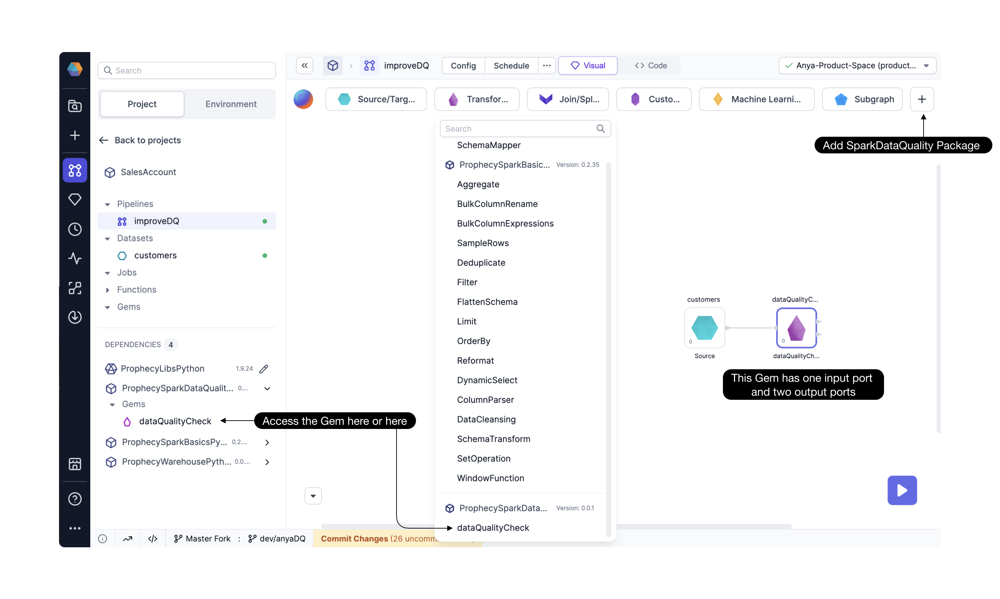

## Cluster requirements

The Pydeequ Gem is supported for Spark 3.3 or later, and the cluster must have the Python and Scala libraries installed.
This particular library installation is a one-time step that must be completed outside Prophecy. Open the Spark cluster UI, for example in Databricks.

1. Set the Spark version by creating a new Environment variable `SPARK_VERSION=3.3` or later.
2. Open the **Libraries** tab.  
   2a. Click **Install new**. Select PyPy as the Library Source, and enter the [package](https://pypi.org/project/pydeequ/#:~:text=1.8%2B%2C%20we%20now%20officially%20support%20Spark3%20!) `pydeequ==1.4.0` or later.  
   2b. Click **Install new**. Select Maven as the Library Source, and search for the [package](https://mvnrepository.com/artifact/com.amazon.deequ/deequ) `deequ` with Group ID `com.amazon.deequ`. Select the relevant Spark version.
3. Confirm and restart the Spark cluster if required.

## Prophecy requirements

1. The Pydeequ Gem is supported in Prophecy version 3.3.10 or later.
2. The Pydeequ Gem is available in the **SparkDataQuality** package. Add the **SparkDataQuality** Package to your Project. For more on using dependencies, click [here](/docs/package-hub/package-hub.md#use-a-package).
3. Once the package is added as a dependency, the **dataQualityCheck** Gem is available to drag into the canvas.

## Configure the Gem

1. Connect a Dataset or Gem of interest as input to the **dataQualityCheck** Gem.
2. Add a check to apply to the input Dataset's column(s). [These](./checks.md) are the types of checks available.
3. What should happen if a data check fails? Define the **Post Action** based on the number of checks allowed to fail.

:::caution
This message appears until the Gem is configured:

> Error occurred while doing Schema Analysis: No module named 'pydeequ'

Please proceed to configure the Gem.
:::

## Gem output

There are two outputs from the dataQualityCheck Gem.

### Data passthrough

This Gem passes the original input DataFrame without modification.

### Data Quality Check Results

A DataFrame containing the following columns

- check_type - Check Type
- column - Column name on which check was applied
- constraint_status - Status of check for that column Failed/Success
- constraint_message - Auto generated or Custom failure message
