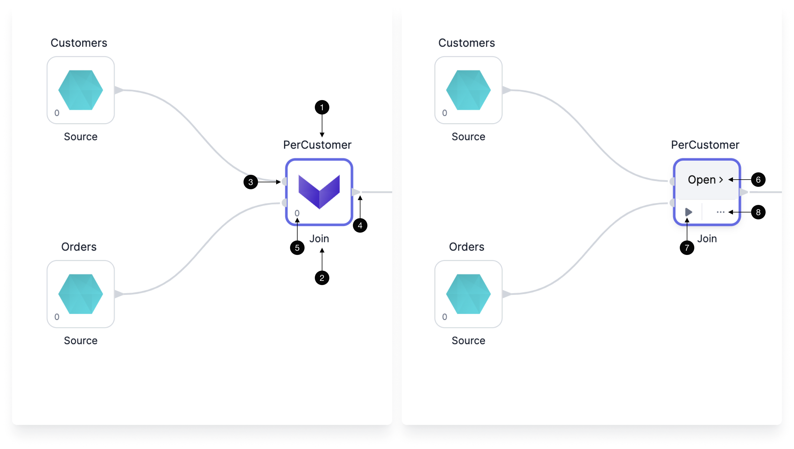
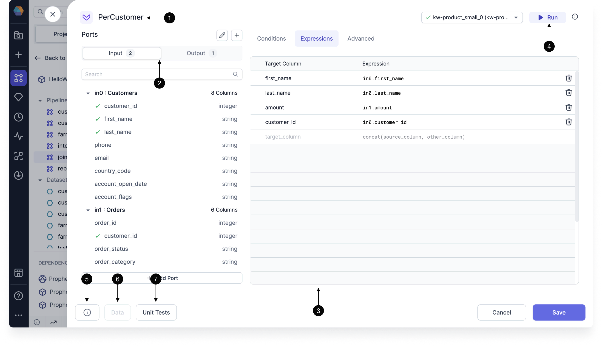
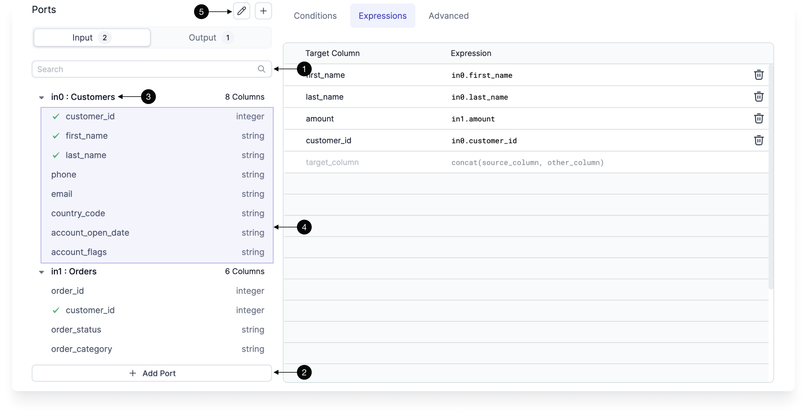
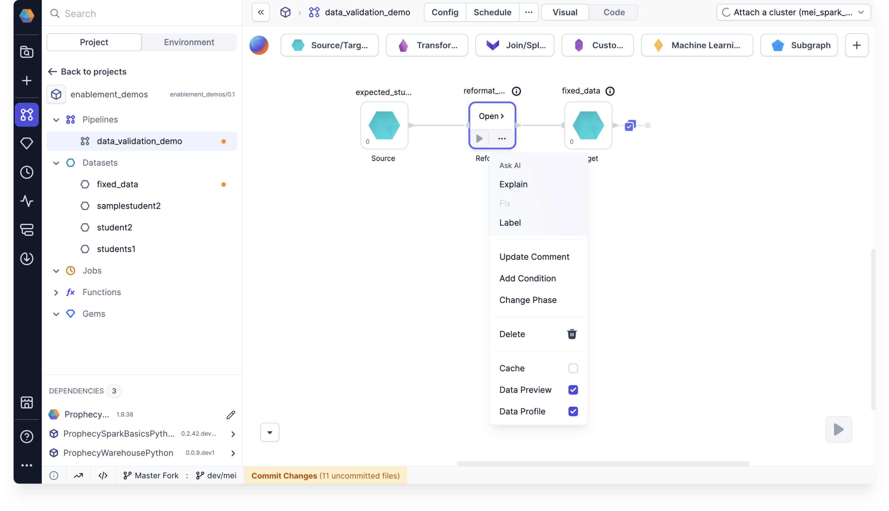

[Gems](/docs/getting-started/concepts/gems.md) are functional units in a [pipeline](/engineers/pipelines) that perform tasks such as reading, transforming, writing, or handling other data operations.

## Categories

The table below outlines the different Spark gem categories.

| Category                                             | Description                                                                                                 |
| ---------------------------------------------------- | ----------------------------------------------------------------------------------------------------------- |
| [**Source and Target**](/engineers/source-target)    | The set of gems that help with loading and saving data.                                                     |
| [**Transform**](/engineers/transform)                | The set of gems that help with transforming data.                                                           |
| [**Join and Split**](/engineers/join-split)          | The set of gems that help with the process of merging or splitting DataFrame(s) to create new DataFrame(s). |
| [**Custom**](/engineers/custom/)                     | The set of gems that our creative teams build using Expression Builder to extend the Prophecy capabilities. |
| [**Machine Learning**](/engineers/machine-learning/) | The set of gems that prepare data or use data for Machine Learning.                                         |
| [**Subgraph**](/engineers/subgraph)                  | A gem that can contain many other gems within it.                                                           |

## Gem instance

When you click on a gem from the gem drawer, an instance of that gem gets added to your pipeline canvas. Use the image and the table below to understand the UI of a gem.



| Callout | UI element    | Description                                                                                                 |
| :-----: | ------------- | ----------------------------------------------------------------------------------------------------------- |
|    1    | Gem label     | The name of this particular gem instance. It must be unique within a given pipeline.                        |
|    2    | Gem type name | The type of gem.                                                                                            |
|    3    | Input ports   | One or more ports that accept connections from upstream gems.                                               |
|    4    | Output ports  | One or more ports that connect to downstream gems.                                                          |
|    5    | Gem phase     | The [phase](#gem-phase) for this gem instance, which defines the order in which gem instances are executed. |
|    6    | Open          | The button that lets you open the gem configuration.                                                        |
|    7    | Run button    | A button that runs the pipeline up to and including the gem.                                                |
|    8    | Action menu   | A menu that includes options to change the phase of the gem, add run conditions, delete the gem, and more.  |

:::tip
If you select one or more gems, you can copy and paste them within the same pipeline or across pipelines. However, you cannot paste across projects that use different languages (for example, from SQL to Scala).
:::

## Gem configuration

When you open a gem, you can configure how the gem will work.



|     | UI element         | Description                                                                                                                      |
| :-: | ------------------ | -------------------------------------------------------------------------------------------------------------------------------- |
|  1  | Gem instance name  | The name of this particular gem instance.                                                                                        |
|  2  | Inputs and outputs | The inputs and outputs for this gem instance.                                                                                    |
|  3  | Gem configuration  | The configuration for this instance. Each gem will be different. See the documentation for individual gems for more information. |
|  4  | Run button         | A button that runs the pipeline up to and including the gem.                                                                     |
|  5  | Diagnostics        | A diagnostics window that will show a list of configuration errors if they exist.                                                |
|  6  | Data               | A preview of the output table that is available if you run the gem.                                                              |
|  7  | Unit tests         | A set of unit tests. See [here](/engineers/unit-tests) for more details.                                                         |

## Input ports

The Input tab defines the incoming connections accepted by the gem. Most gem types only accept one connection, but some (such as [Join](/engineers/join)) allow for multiple inputs.



|     | UI element  | Description                                                                                                   |
| :-: | ----------- | ------------------------------------------------------------------------------------------------------------- |
|  1  | Search      | A field that will filter your input columns.                                                                  |
|  2  | Add Input   | If the gem supports multiple inputs, you can click this button to add more input ports to this instance.      |
|  3  | Input       | The name of the input port and the name of the input gem instance.                                            |
|  4  | Port schema | The schema of the port (columns and column types). The schema will only appear when an input port is present. |
|  5  | Edit ports  | A button that lets you edit or delete ports.                                                                  |

## Output ports

The Output tab defines the outgoing schemas that will be available to downstream gems. In some cases, the Prophecy compiler can't infer the output schema automatically, so you have the option to infer the schema using your connected fabric or specify it manually.

|     | UI element         | Description                                                                                                     |
| :-: | ------------------ | --------------------------------------------------------------------------------------------------------------- |
|  1  | Output schema      | Output schema for this gem instance. This will be the schema of the data that downstream gem instances will use |
|  2  | Custom schema      | Toggle this to enable custom output schema editing                                                              |
|  3  | Infer from cluster | Run the gem code on the connected cluster and infer the schema from the result                                  |
|  4  | Edit schema        | Edit the output schema manually                                                                                 |

## Action menu

The action menu gives you more granular control over individual gems. When you expand the action menu, you see the following options:

| **Action**        | **Description**                                                                                                                                                                                                               |
| ----------------- | ----------------------------------------------------------------------------------------------------------------------------------------------------------------------------------------------------------------------------- |
| **Explain**       | Copilot adds a comment to the gem that explains what it does.                                                                                                                                                                 |
| **Fix**           | Copilot resolves an error in the gem configuration.                                                                                                                                                                           |
| **Label**         | Copilot renames the gem.                                                                                                                                                                                                      |
| **Add Comment**   | Manually write a comment that explains the gem.                                                                                                                                                                               |
| **Add Condition** | Write a [condition](docs/Spark/execution/conditional-execution.md) that will restrict gem execution during pipeline runs.                                                                                                     |
| **Change Phase**  | Change the [phase](#gem-phase) of the gem.                                                                                                                                                                                    |
| **Delete**        | Remove the gem from the pipeline.                                                                                                                                                                                             |
| **Cache**         | Cache the entire gem output dataset. This is useful if you have multiple pipeline branches from one gem. If you cache the dataset from that gem, Spark will not have to compute upstream gems multiple times for each branch. |
| **Data Preview**  | When [selective data sampling](docs/Spark/execution/data-sampling.md) is enabled, use this checkbox to enable or disable the generation of the data sample for the gem.                                                       |
| **Data Diff**     | When [Data Diff](/engineers/data-diff) is configured for a Target gem, use this checkbox to enable or disable the data diff output.                                                                                           |



### Gem phase

In a data pipeline, the phase of a gem determines the sequence in which it runs. This sequencing is managed by adjusting the order of the generated pipeline code.

```scala
def apply(spark: SparkSession): Unit = {
  val df_my_orders     = my_orders(spark).cache()
  val df_Repartition_1 = Repartition_1(spark, df_my_orders)
  Write_CSV(spark, df_Repartition_1)
  val df_SchemaTransform_1 = SchemaTransform_1(spark, df_my_orders)
}
```

Here’s how it works:

- Gems are assigned a numerical phase (e.g., `0`, `1`, `-1`), where lower values run first. For example, a gem with phase `0` will execute before a gem with phase `1`.
- When a gem runs, all its upstream gems must also run. This means that if a downstream gem has phase `0` and an upstream gem has phase `1`, the upstream gem will be grouped into phase `0` to ensure proper execution.
- Because of this dependency, the phase assigned to the last gem in a branch determines the phase of the entire branch. This means that when configuring gem phases, you only need to focus on the _leaf nodes_—the final gems in each branch of the pipeline.
