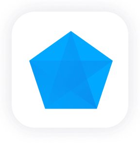

[Gems](/docs/concepts/project/gems.md) are functional units in a [pipeline](/docs/concepts/project/pipelines.md) that perform tasks such as reading, transforming, writing, or handling other data operations.

The table below outlines the different Spark Gem categories.

<div class="gems-table">

| <div style={{'width':'100px'}}>Gem</div>            | Category                                              | Description                                                                                                 |
| --------------------------------------------------- | ----------------------------------------------------- | ----------------------------------------------------------------------------------------------------------- |
|  | [**Source and Target**](/Spark/gems/source-target/)   | The set of gems that help with loading and saving data.                                                     |
|                      | [**Transform**](/Spark/gems/transform/)               | The set of gems that help with transforming data.                                                           |
|        | [**Join and Split**](/Spark/gems/join-split/)         | The set of gems that help with the process of merging or splitting DataFrame(s) to create new DataFrame(s). |
|                            | [**Custom**](/Spark/gems/custom/)                     | The set of gems that our creative teams build using Expression Builder to extend the Propehcy capabilities. |
|                  | [**Machine Learning**](/Spark/gems/machine-learning/) | The set of gems that prepare data or use data for Machine Learning.                                         |
|                        | [**Subgraph**](/Spark/gems/subgraph/)                 | A gem that can contain many other gems within it.                                                           |

</div>

## What's next

To learn more Spark gems, see the following pages:

```mdx-code-block
import DocCardList from '@theme/DocCardList';
import {useCurrentSidebarCategory} from '@docusaurus/theme-common';

<DocCardList items={useCurrentSidebarCategory().items}/>
```
