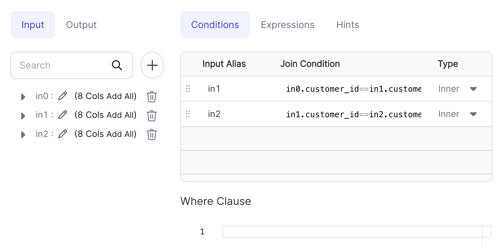
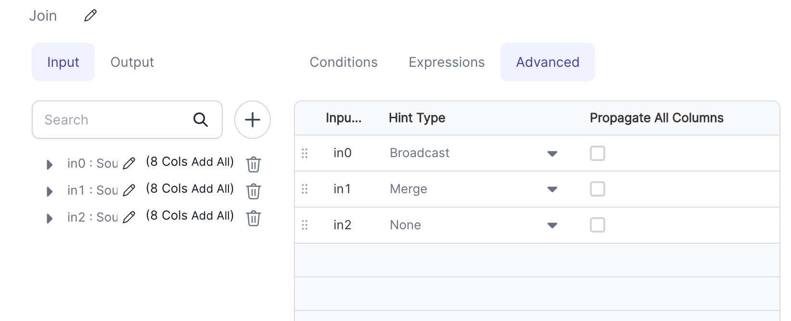

import Requirements from '@site/src/components/gem-requirements';

<Requirements
  python_package_name="ProphecySparkBasicsPython"
  python_package_version="0.0.1+"
  scala_package_name="ProphecySparkBasicsScala"
  scala_package_version="0.0.1+"
  scala_lib=""
  python_lib=""
  uc_single="14.3+"
  uc_shared="14.3+"
  livy="3.0.1+"
/>

Joins 2 or more DataFrames based on the given configuration.

## Parameters

| Parameter                        | Description                                                                                                                                                                                                     | Required |
| :------------------------------- | :-------------------------------------------------------------------------------------------------------------------------------------------------------------------------------------------------------------- | :------- |
| DataFrame 1                      | First input DataFrame                                                                                                                                                                                           | True     |
| DataFrame 2                      | Second input DataFrame                                                                                                                                                                                          | True     |
| DataFrame N                      | Nth input DataFrame                                                                                                                                                                                             | False    |
| Join Condition (Conditions tab)  | The join condition specifies how the rows will be combined.                                                                                                                                                     | True     |
| Type (Conditions tab)            | The type of JOIN `(Inner, Full Outer, Left , Right , Left Semi, Left Anti)`                                                                                                                                     | True     |
| Where Clause (Conditions tab)    | `Filter` applied after the Join operation                                                                                                                                                                       | False    |
| Target column (Expressions)      | Output column name                                                                                                                                                                                              | False    |
| Expression (Expressions)         | Expression to compute target column. If no expression is given, then all columns from all DataFrames would reflect in output.                                                                                   | False    |
| Hint Type (Advanced)             | The type of Join Hint (`Broadcast`, `Merge`, `Shuffle Hash`, `Shuffle Replicate NL` or `None`). To read more about join hints [click here](https://developpaper.com/analysis-of-five-join-strategies-of-spark/) | False    |
| Propagate All Columns (Advanced) | If `true`, all columns from that DataFrame would be propagated to output DataFrame. Equivalent to selecting `df.*` for the selected DataFrame.                                                                  | False    |

## Adding a new input

1. Click on the **+** icon to add a new input.
2. Then add your condition expression for the newly added input.
   

## Examples

### Example 1 - Join with three DataFrame inputs



````mdx-code-block
import Tabs from '@theme/Tabs';
import TabItem from '@theme/TabItem';

<Tabs>
<TabItem value="py" label="Python">

```py
def Join_1(spark: SparkSession, in0: DataFrame) -> DataFrame:
        return in0\
        .alias("in0")\
        .join(in1.alias("in1"), (col("in0.customer_id") == col("in1.customer_id")), "inner")\
        .join(in2.alias("in2"), (col("in1.customer_id") == col("in2.customer_id")), "inner")
```

</TabItem>

<TabItem value="scala" label="Scala">

```scala
object Join_1 {
   def apply(spark: SparkSession, in0: DataFrame, in1: DataFrame, in2: DataFrame): DataFrame =
    in0
      .as("in0")
      .join(in1.as("in1"), col("in0.customer_id") === col("in1.customer_id"), "inner")
      .join(in2.as("in2"), col("in1.customer_id") === col("in2.customer_id"), "inner")
}
```

</TabItem>
</Tabs>

````

### Example 2 - Join with Hints

Join hints allow users to suggest the join strategy that Spark should use. For a quick overview, see Spark's Join Hints [documentation](https://spark.apache.org/docs/3.0.0/sql-ref-syntax-qry-select-hints.html#join-hints).



````mdx-code-block
<Tabs>
<TabItem value="py" label="Python">

```py
def Join_1(spark: SparkSession, in0: DataFrame, in1: DataFrame, in2: DataFrame) -> DataFrame:
    df1 = in1.hint("merge")

    return in0\
        .alias("in0")\
        .hint("broadcast")\
        .join(df1.alias("in1"), col("in0.customer_id") == col("in1.customer_id"), "inner")\
        .join(in2.alias("in2"), col("in0.customer_id") == col("in1.customer_id"), "inner")
```

</TabItem>

<TabItem value="scala" label="Scala">

```scala
object Join_1 {
   def apply(spark: SparkSession, in0: DataFrame, in1: DataFrame, in2: DataFrame): DataFrame =
    in0
      .as("in0")
      .hint("broadcast")
      .join(in1.as("in1").hint("merge"), col("in0.customer_id") === col("in1.customer_id"), "inner")
      .join(in2.as("in2"),               col("in1.customer_id") === col("in2.customer_id"), "inner")
}
```

</TabItem>
</Tabs>

````

### Example 3 - Join with Propagate Columns

```mdx-code-block
import App from '@site/src/components/slider';

export const ImageData = [
  {
    "image":"/img/join/join-eg3-conditions.png",
    "description":<h3 style={{padding:'10px'}}>Step 1 - Specify join condition</h3>,
  },
  {
    "image":"/img/join/join-eg3-expressions.png",
    "description":<h3 style={{padding:'10px'}}>Step 2 - Choose required columns from dataframe</h3>,
  },
  {
    "image":"/img/join/join-eg3-advanced.png",
    "description":<h3 style={{padding:'10px'}}>Step 3 - Select Propagate all columns from in0</h3>,
  },
  {
    "image":"/img/join/join-eg3-output.png",
    "description":<h3 style={{padding:'10px'}}>Output - Output with all columns from in0 and selected columns from in1</h3>
  },
];

<App ImageData={ImageData}></App>
```

````mdx-code-block
<Tabs>
<TabItem value="py" label="Python">

```py
def Join_1(spark: SparkSession, in0: DataFrame, in1: DataFrame, ) -> DataFrame:
    return in0\
        .alias("in0")\
        .join(in1.alias("in1"), (col("in0.customer_id") == col("in1.customer_id")), "inner")\
        .select(*[col("in1.email").alias("email"), col("in1.phone").alias("phone")], col("in0.*"))
```

</TabItem>

<TabItem value="scala" label="Scala">

```scala
object Join_1 {

  def apply(spark: SparkSession, in0: DataFrame, in1: DataFrame): DataFrame =
    in0
      .as("in0")
      .join(in1.as("in1"), col("in0.customer_id") === col("in1.customer_id"), "inner")
      .select(col("in1.phone").as("phone"), col("in1.email").as("email"), col("in0.*"))

}
```

</TabItem>
</Tabs>

````

## Types of Join

Suppose there are 2 tables TableA and TableB with only 2 columns (Ref, Data) and following contents:

### Table A

| Ref | Data     |
| :-- | :------- |
| 1   | Data_A11 |
| 1   | Data_A12 |
| 1   | Data_A13 |
| 2   | Data_A21 |
| 3   | Data_A31 |

### Table B

| Ref | Data     |
| :-- | :------- |
| 1   | Data_B11 |
| 2   | Data_B21 |
| 2   | Data_B22 |
| 2   | Data_B23 |
| 4   | Data_B41 |

### INNER JOIN

Inner Join on column Ref will return columns from both the tables and only the matching records as long as the condition is satisfied:

| Ref | Data     | Ref | Data     |
| :-- | :------- | :-- | :------- |
| 1   | Data_A11 | 1   | Data_B11 |
| 1   | Data_A12 | 1   | Data_B11 |
| 1   | Data_A13 | 1   | Data_B11 |
| 2   | Data_A21 | 2   | Data_B21 |
| 2   | Data_A21 | 2   | Data_B22 |
| 2   | Data_A21 | 2   | Data_B23 |

### LEFT JOIN

Left Join (or Left Outer join) on column Ref will return columns from both the tables and match records with records from the left table. The result-set will contain null for the rows for which there is no matching row on the right side.

| Ref | Data     | Ref  | Data     |
| :-- | :------- | :--- | :------- |
| 1   | Data_A11 | 1    | Data_B11 |
| 1   | Data_A12 | 1    | Data_B11 |
| 1   | Data_A13 | 1    | Data_B11 |
| 2   | Data_A21 | 2    | Data_B21 |
| 2   | Data_A21 | 2    | Data_B22 |
| 2   | Data_A21 | 2    | Data_B23 |
| 3   | Data_A31 | NULL | NULL     |

### RIGHT JOIN

Right Join (or Right Outer join) on column Ref will return columns from both the tables and match records with records from the right table. The result-set will contain null for the rows for which there is no matching row on the left side.

| Ref  | Data     | Ref | Data     |
| :--- | :------- | :-- | :------- |
| 1    | Data_A11 | 1   | Data_B11 |
| 1    | Data_A12 | 1   | Data_B11 |
| 1    | Data_A13 | 1   | Data_B11 |
| 2    | Data_A21 | 2   | Data_B21 |
| 2    | Data_A21 | 2   | Data_B22 |
| 2    | Data_A21 | 2   | Data_B23 |
| NULL | NULL     | 4   | Data_B41 |

### FULL OUTER JOIN

Full Outer Join on column Ref will return columns from both the tables and matching records with records from the left table and records from the right table . The result-set will contain NULL values for the rows for which there is no matching.

| Ref  | Data     | Ref  | Data     |
| :--- | :------- | :--- | :------- |
| 1    | Data_A11 | 1    | Data_B11 |
| 1    | Data_A12 | 1    | Data_B11 |
| 1    | Data_A13 | 1    | Data_B11 |
| 2    | Data_A21 | 2    | Data_B21 |
| 2    | Data_A21 | 2    | Data_B22 |
| 2    | Data_A21 | 2    | Data_B23 |
| 3    | Data_A31 | NULL | NULL     |
| NULL | NULL     | 4    | Data_B41 |

### LEFT SEMI JOIN

Left Semi Join on column Ref will return columns only from left table and matching records only from left table.

| Ref | Data     |
| :-- | :------- |
| 1   | Data_B11 |
| 1   | Data_B21 |
| 1   | Data_B22 |
| 2   | Data_B23 |
| 3   | Data_B41 |

### LEFT ANTI JOIN

Left anti join on column Ref will return columns from the left for non-matched records :

| Ref | Data     | Ref  | Data |
| :-- | :------- | :--- | :--- |
| 3   | Data_A31 | NULL | NULL |
