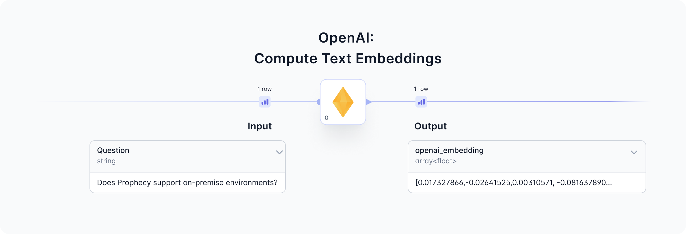
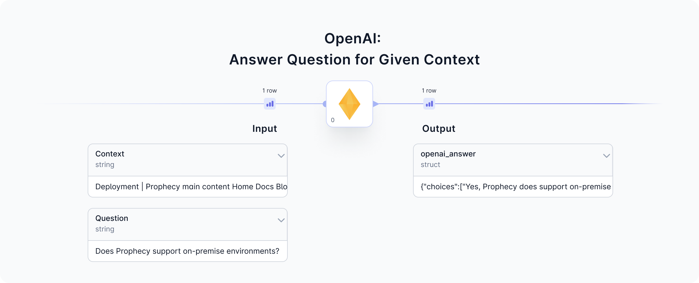

<h3><span class="badge">Spark Gem</span></h3>

The OpenAI Gem allows the Prophecy user to interact with the OpenAI API using two different requests:

1. Compute text embeddings
2. Answer a question, where the user has the option to provide context

Follow along to learn how to interact with the OpenAI API using Prophecy's easy-to-use interface. For an example set of Pipelines that use these Gems to create a Generative AI Chatbot, see this [guide.](docs/tutorials/end-to-end/genaichatbot.md)

:::caution
As with all applications that interface with Large Language Models (LLMs), the OpenAI Gem can generate results that are incorrect and/or misleading. The OpenAI Gem is subject to the same [limitations and risks](https://platform.openai.com/docs/guides/embeddings/limitations-risks) as those posed by OpenAI itself.
:::

<br />

<div class="wistia_responsive_padding" style={{padding:'56.25% 0 0 0', position:'relative'}}>
<div class="wistia_responsive_wrapper" style={{height:'100%',left:0,position:'absolute',top:0,width:'100%'}}>
<iframe src="https://fast.wistia.net/embed/iframe/i1x7g14wn4?seo=false?videoFoam=true" title="Getting Started With SQL Video" allow="autoplay; fullscreen" allowtransparency="true" frameborder="0" scrolling="no" class="wistia_embed" name="wistia_embed" msallowfullscreen width="100%" height="100%"></iframe>
</div></div>
<script src="https://fast.wistia.net/assets/external/E-v1.js" async></script>

<br />

### 1. Compute text embeddings

Given a question input, the OpenAI Gem will return a text embedding by calling the OpenAI [ada-002 model](https://platform.openai.com/docs/guides/embeddings/how-to-get-embeddings). View the input and output from this Gem to understand the data formats and sample.



#### 1a. Configure

Follow the steps below to configure the OpenAI Gem to compute text embeddings.


Storing the OpenAI API token as a **(1) Databricks Secret** is highly recommended. For instructions click [here.](https://docs.databricks.com/en/security/secrets/index.html) Be sure to use the ** (2) Fabric connection** to the Databricks workspace which contains the Databricks scope and secrets configured in this Gem. Contact us to understand the integrations with other secret managers.

Select the Operation type from the dropdown menu. **(3) Compute text embeddings** operation will send the selected **(4) Texts column** to the OpenAI API. For each entry in the Texts column, OpenAI's ada-002 model will return a text embedding.

Instead of sending a single row to OpenAI's API, select the **(5) Group data** option. Group data is a window function, using a window of size 20, **(6) ordered by** the selected column. Using the Group data option influences model performance based on the column selected.

#### 1b. Input

| Column        | Description                                    | Required |
| ------------- | ---------------------------------------------- | -------- |
| Question/Text | string - a question or text string of interest | True     |

#### 1c. Output

| Column           | Description                                                                                                                                                                                                             |
| ---------------- | ----------------------------------------------------------------------------------------------------------------------------------------------------------------------------------------------------------------------- |
| openai_embedding | array(float) - The vector embedding returned from OpenAI corresponding to the input question/text. Each record is an array of `1536` floating point numbers, such as `[-0.0018493991, -0.0059955865, ... -0.02498541]`. |
| openai_error     | string - this column is provided to display any error message returned from the OpenAI API; helpful for troubleshooting.                                                                                                |

#### 1d. Generated code

All the visual designs are converted to code and committed to the Prophecy user's Git repository. See below for a sample of the code which calls the OpenAI API to compute text embeddings.

````mdx-code-block
import Tabs from '@theme/Tabs';
import TabItem from '@theme/TabItem';

<Tabs>

<TabItem value="py" label="Python">

```py
def vectorize(spark: SparkSession, question_seed: DataFrame) -> DataFrame:
    from spark_ai.llms.openai import OpenAiLLM
    from pyspark.dbutils import DBUtils
    OpenAiLLM(api_key = DBUtils(spark).secrets.get(scope = "<redacted>", key = "<redacted>"))\
        .register_udfs(spark = spark)

    return question_seed\
        .withColumn("_row_num", row_number().over(Window.partitionBy().orderBy(col("input"))))\
        .withColumn("_group_num", ceil(col("_row_num") / 20))\
        .withColumn("_data", struct(col("*")))\
        .groupBy(col("_group_num"))\
        .agg(collect_list(col("_data")).alias("_data"), collect_list(col("input")).alias("_texts"))\
        .withColumn("_embedded", expr(f"openai_embed_texts(_texts)"))\
        .select(
          col("_texts"),
          col("_embedded.embeddings").alias("_embeddings"),
          col("_embedded.error").alias("openai_error"),
          col("_data")
        )\
        .select(expr("explode_outer(arrays_zip(_embeddings, _data))").alias("_content"), col("openai_error"))\
        .select(col("_content._embeddings").alias("openai_embedding"), col("openai_error"), col("_content._data.*"))\
        .drop("_row_num")\
        .drop("_group_num")
```
</TabItem>
<TabItem value="scala" label="Scala">

```scala
[Not yet supported]
```
</TabItem>
</Tabs>

````

### 2. Answer a question with a given context

In addition to computing text embeddings, OpenAI's ada-002 model is also very good at answering questions. The Prophecy interface allows users to input a question (and optionally provide a context) as components of the `prompt` sent to OpenAI. In response, OpenAI's ada-002 model returns an answer(s) to the question. See the input and output data previews before and after the OpenAI Gem to understand the operation.



#### 2a. Configure

Follow the steps below to configure the OpenAI Gem to answer a question, and to understand how to provide a context if desired.


Storing the OpenAI API token as a **(1) Databricks Secret** is highly recommended. For instructions click [here.](https://docs.databricks.com/en/security/secrets/index.html) Be sure to use the ** (2) Fabric connection** to the Databricks workspace which contains the Databricks scope and secrets configured in this Gem.

Hardcoding the OpenAI credential is not recommended. Selecting this option could send credentials to be stored hardcoded in Git; use only for credentials that should be shared with the world. Contact us to understand the integrations with other secret managers. (contact.us@Prophecy.io)

Now it's time to craft a prompt to send to the OpenAI ada-002 model. Select the Operation type from the dropdown menu. The operation `Answer questions` will prompt OpenAI's ada-002 model to answer the provided question using the datasets the model was trained on, which have some [blindness.](https://platform.openai.com/docs/guides/embeddings/blindness-to-recent-events) For many users, you'll want to provide some context as part of your prompt. The operation **(3) Answer questions for given context** will likely generate answers more related to the context. Select the input column which has the question of interest as the **(4) Question text column**. To provide context in addition to the question, select **(5) Context text column**. For example, if the question is `Does Prophecy support on-premise environments?`, an appropriate context would be some section of Prophecy's documentation. The **(6) context** and **(7) question (query)** comprise the prompt sent to OpenAI.

#### 2b. Input

| Column   | Description                                                                                                                                                                                                                                                                                                                                                                               | Required |
| -------- | ----------------------------------------------------------------------------------------------------------------------------------------------------------------------------------------------------------------------------------------------------------------------------------------------------------------------------------------------------------------------------------------- | -------- |
| Question | string - a question of interest to include in the prompt sent to OpenAI. Example: `What is Prophecy's AI Assistant feature?`                                                                                                                                                                                                                                                              | True     |
| Context  | string - a text corpus related to the question of interest, also included in the prompt sent to OpenAI. Frequently the context column should undergo data transformations in the Gems preceding the OpenAI Gem. See [this guide](docs/tutorials/end-to-end/genaichatbot.md) for a great example of preparing the text corpus and transforming sufficiently to include in a useful prompt. | False    |

#### 2c. Output

Since OpenAI's models are probabalistic, they return at least one, and frequently more than one, answer. These responses are formatted as a json array of answer choices. The user would usually select the best answer from the choices; we recommend selecting the first answer if you wish to select one by default. This can be done in the Gem following the OpenAI Gem as in this [example](docs/tutorials/end-to-end/genaichatbot.md#3a-chatbot-live-pipeline).

| Column        | Description                                                                                                                                                                                                                                 |
| ------------- | ------------------------------------------------------------------------------------------------------------------------------------------------------------------------------------------------------------------------------------------- |
| openai_answer | struct - this column contains the response from OpenAI in as a json array. Example: `{"choices":["Prophecy's AI Assistant feature is called Data Copilot."]}` Select/filter from multiple answer choices in a Gem following the OpenAI Gem. |
| openai_error  | string - this column is provided to display any error message returned from the OpenAI API; helpful for troubleshooting.                                                                                                                    |

#### 2d. Generated code

See below for a sample of the code which calls the OpenAI API to answer a question provided some context.

````mdx-code-block
<Tabs>

<TabItem value="py" label="Python">

```py
def OpenAI_1(spark: SparkSession, collect_context: DataFrame) -> DataFrame:
    from spark_ai.llms.openai import OpenAiLLM
    from pyspark.dbutils import DBUtils
    OpenAiLLM(api_key = DBUtils(spark).secrets.get(scope = "[redacted]", key = "[redacted]"))\
        .register_udfs(spark = spark)

    return collect_context\
        .withColumn("_context", col("context"))\
        .withColumn("_query", col("input"))\
        .withColumn(
          "openai_answer",
          expr(
            "openai_answer_question(_context, _query, \" Answer the question based on the context below.\nContext:\n```\n{context}\n```\nQuestion: \n```\n{query}\n```\nAnswer:\n \")"
          )
        )\
        .drop("_context", "_query")
```

</TabItem>
<TabItem value="scala" label="Scala">

```scala
  [page under construction]
```

</TabItem>
</Tabs>

````

### FAQ

#### Troubleshooting

The output data sample following the OpenAI Gem also contains a column for any error message(s) returned from OpenAI. This handy column surfaces errors including invalid OpenAI credentials, invalid input questions, or problems with data formatting.

#### Can I choose other OpenAI models?

Currently we use ChatGPT 3.5 Turbo. Contact us for additional options: contact.us@Prophecy.io
