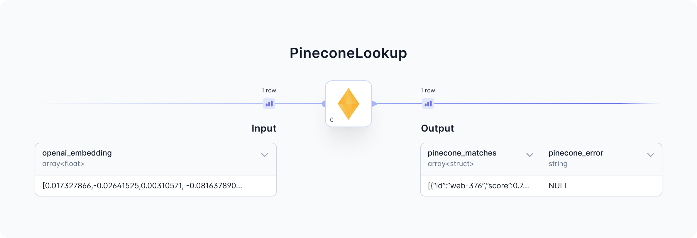
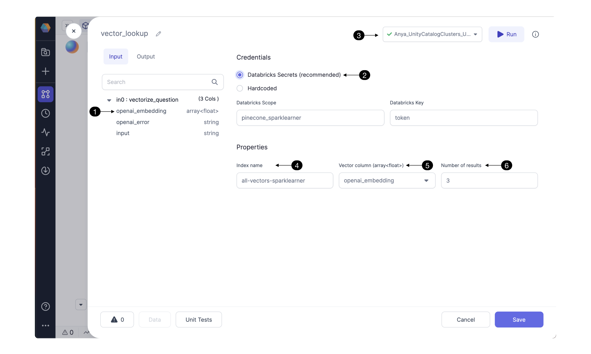

<h3><span class="badge">Spark Gem</span></h3>

The PineconeLookup Gem identifies content that is similar to a provided vector embedding. The Gem calls the Pinecone API and returns a set of IDs with highest similarity to the provided embedding.

- [**Parameters:**](https://docs.prophecy.io/Spark/gems/machine-learning/ml-pinecone-lookup#gem-parameters) Configure the parameters needed to call the Pinecone API.

- [**Input:**](https://docs.prophecy.io/Spark/gems/machine-learning/ml-pinecone-lookup#input) This Gem requires an embedding as input. The embedding is provided by a foundational model like [OpenAI](https://platform.openai.com/docs/introduction).

- [**Output:**](https://docs.prophecy.io/Spark/gems/machine-learning/ml-pinecone-lookup#output) This Gem outputs an array of IDs with corresponding similarity scores.



Now let’s understand the Gem Parameters, Input, and Output in detail.

<div class="wistia_responsive_padding" style={{padding:'56.25% 0 0 0', position:'relative'}}>
<div class="wistia_responsive_wrapper" style={{height:'100%',left:0,position:'absolute',top:0,width:'100%'}}>
<iframe src="https://fast.wistia.net/embed/iframe/nupkza0ir6?seo=false?videoFoam=true" title="Getting Started With SQL Video" allow="autoplay; fullscreen" allowtransparency="true" frameborder="0" scrolling="no" class="wistia_embed" name="wistia_embed" msallowfullscreen width="100%" height="100%"></iframe>
</div></div>
<script src="https://fast.wistia.net/assets/external/E-v1.js" async></script>

<br />

### Gem Parameters



Verify the **(1) input columns** contain a column with the embeddings. The structure of this column's entries must be compatible with the structure of the Pinecone index.

#### Credentials

Configure the Pinecone API credentials here. Storing the Pinecone API token as a **(2) Databricks Secret** is highly recommended. For instructions click [here.](https://docs.databricks.com/en/security/secrets/index.html) Be sure to use the **(3) Fabric connection** to the Databricks workspace which contains the Databricks scope and secrets configured in this Gem.

Hardcoding the Pinecone credential is not recommended. Selecting this option could send credentials to be stored hardcoded in Git; [reach out](https://www.prophecy.io/request-a-demo) to understand the integrations with other secret managers.

#### Properties

Pinecone DB uses indexing to map the vectors to a data structure that will enable faster searching. The PineconeLookup Gem searches through a Pinecone index to identify embeddings with similarity to the input embedding. Enter the Pinecone **[(4) Index name](https://docs.prophecy.io/Spark/gems/machine-learning/ml-pinecone-lookup#faq)** which you’d like to use for looking up embeddings.

Select one of the Gem’s input columns with vector embeddings as the **(5) Vector column** to send to Pinecone’s API. The column [must](https://docs.prophecy.io/Spark/gems/machine-learning/ml-pinecone-lookup#input) be compatible with the Pinecone Index. To change the column’s datatype and properties, [configure](https://docs.prophecy.io/Spark/gems/machine-learning/ml-pinecone-lookup#faq) the Gem(s) preceding the PineconeLookup Gem.

Pinecone’s API can return multiple results. Depending on the use case, select the desired **(6) Number of results** sorted by similarity score. The result with highest similarity to the user’s text question will be listed first.

### Input

PineconeLookup requires a model_embedding column as input. Use one of Prophecy's Machine Learning Gems to provide the model_embedding. For example, the OpenAI Gem can precede the PineconeLookup Gem in the Pipeline. The OpenAI Gem, configured to `Compute a text embedding`, will output an openai_embedding column. This is a suitable input for the PineconeLookup Gem.

| Column          | Description                                                                                                                                                                                                                                                                                                                                                                                                                  | Required |
| --------------- | ---------------------------------------------------------------------------------------------------------------------------------------------------------------------------------------------------------------------------------------------------------------------------------------------------------------------------------------------------------------------------------------------------------------------------- | -------- |
| model_embedding | array(float) - The format of this embedding is important. It must be an array of floating point numbers that matches the requirements of the Pinecone index. For example, we used a Pinecone index with `1536` dimensions, `Cosine` metric, and an `s1` pod type. So each record in the model_embedding column must be an array of `1536` floating point numbers, such as `[-0.0018493991, -0.0059955865, ... -0.02498541]`. | True     |

### Output

The output Dataset contains the pinecone_matches and pinecone_error columns. For each input content entry, this Gem adds an array to the pinecone_matches column. The output array will have [Number of Results](https://docs.prophecy.io/Spark/gems/machine-learning/ml-pinecone-lookup#properties) entries.

| Column           | Description                                                                                                                                                                          |
| ---------------- | ------------------------------------------------------------------------------------------------------------------------------------------------------------------------------------ |
| pinecone_matches | array - an array of several content IDs and their scores. Example: `[{"id":"web-223","score":0.8437653},{"id":"web-224","score":0.8403446}, ...{"id":"web-237","score":0.82916564}]` |
| pinecone_error   | string - this column is provided to show any error message returned from Pinecone’s API; helpful for troubleshooting errors related to the PineconeLookup Gem.                       |

Prophecy converts the visual design into Spark code available on the Prophecy user's Git repository. Find the Spark code for the PineconeLookup Gem below.

````mdx-code-block
import Tabs from '@theme/Tabs';
import TabItem from '@theme/TabItem';

<Tabs>

<TabItem value="py" label="Python">

```py
def vector_lookup(Spark: SparkSession, in0: DataFrame) -> DataFrame:
    from pySpark.sql.functions import expr, array, struct
    from Spark_ai.dbs.pinecone import PineconeDB, IdVector
    from pySpark.dbutils import DBUtils
    PineconeDB(DBUtils(Spark).secrets.get(scope = "< my_scope >", key = "< my_key >"), "us-east-1-aws")\
        .register_udfs(Spark)

    return in0\
        .withColumn("_vector", col("<model>_embedding"))\
        .withColumn("_response", expr(f"pinecone_query(\<index name>\", _vector, {3})"))\
        .withColumn("pinecone_matches", col("_response.matches"))\
        .withColumn("pinecone_error", col("_response.error"))\
        .drop("_vector", "_response")
```

</TabItem>
<TabItem value="scala" label="Scala">

```scala
  [Not yet supported]
```

</TabItem>
</Tabs>

````

### FAQ

#### Troubleshooting

To troubleshoot the Gem preceding PineconeLookup, open the data preview output from the previous Gem. For example if the embedding structure is incorrect then try adjusting the previous Gem, run, and view that Gem’s output data preview.

#### Creating a Pinecone Index

If you don’t have one yet, [create a Pinecone index](https://docs.pinecone.io/docs/quickstart). Click [here](https://docs.pinecone.io/docs/choosing-index-type-and-size) for pointers on choosing an index type and size. How to populate the index? For example, [this guide](https://docs.prophecy.io/getting-started/gen-ai-chatbot#step-2-build-a-knowledge-warehouse) shows how to ingest and vectorize web content data to store in a Pinecone Database index.
