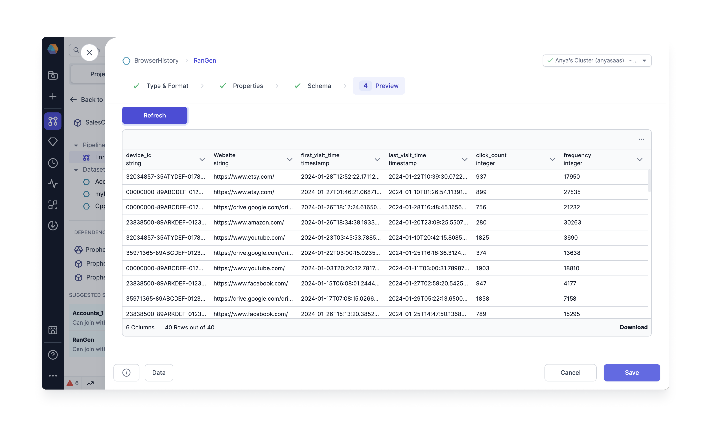
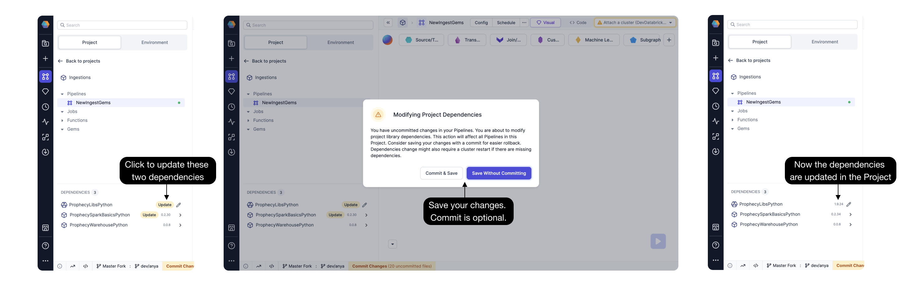
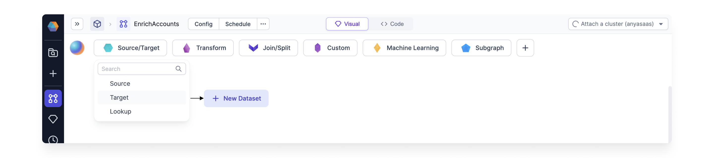

import Requirements from "../../\_gem-requirements.mdx";

<h3>Spark Gem</h3>

<Requirements
  packagename="ProphecySparkBasicsPython"
  packageversion="0.2.36"
  scalalib="8.5.0"
  pythonlib="1.9.24"
  packageversion122="Not Supported"
  packageversion143="Not Supported"
  packageversion154="Supported 0.2.36+"
/>

Generate synthetic data with this special kind of Source Gem.

Generating mock data is crucial when building data Pipelines to simulate real-world scenarios for testing, validating, and optimizing Pipeline performance before using actual production data. It helps ensure the Pipeline handles various data formats, structures, and edge cases effectively, minimizing potential issues in a live environment.

A wide range of synthetic data can be created using any column name and an array of data types. For example, generate browser history data as shown below.

Follow the steps below to generate your own mock data using the Data Generator Gem.

## Cluster requirements

Create a Fabric and configure the [Job Size](/docs/administration/spark-fabrics/databricks/databricks.md) as below, or log into an existing Spark cluster UI. Here we use Databricks as an example.

1. Verify the Databricks Runtime uses Python version >= 3.8.
   For example, [Databricks Runtime 12.2 LTS](https://docs.databricks.com/en/release-notes/runtime/12.2lts.html) uses Python 3.9.19. If you are using Databricks Runtime 12.2+, the Python version meets this requirement.
2. Create a new Environment variable called "SPARK_VERSION" with value 3.3
3. Confirm and restart the Spark cluster.
   

## Prophecy requirements

Open a Prophecy Project and upgrade the `ProphecySparkBasicsPython` Dependency to `0.2.34` or later. Connecting a Prophecy project to a Spark cluster with a different dependency version will prompt a cluster restart. Ideally this is a one-time restart, and you're ready to proceed!

:::caution Caution
Using two Prophecy projects with the same Spark cluster will cause cluster restarts (when each project attaches to the cluster) unless the `ProphecySparkBasicsPython` versions match across both Projects. The same caution applies to `ProphecyLibsPython` versions.

_The Fix:_ Do yourself a favor and upgrade all your Prophecy projects to the same `ProphecySparkBasicsPython` and `ProphecyLibsPython` versions or use separate Spark clusters.
:::

## Create the Gem

Create a new Dataset and select the Type as Data Generator. Note we are not specifying a storage location yet; we will [store the data](#store-the-data) in a separate Gem.  

### Properties: Specify Data Structure

What type of data do you need to generate? Specify the data structure using random data providers. Prophecy offers a selection of providers including integers, booleans, and elements from a list. If you prefer, provide the same information as a JSON schema.

Providers

## Providers

| Data Provider             | Description                                                                                                                                                                                                                                                 |
| ------------------------- | ----------------------------------------------------------------------------------------------------------------------------------------------------------------------------------------------------------------------------------------------------------- |
| Random Name               | Generates random names. Select Full Name, First Name, or Last Name as the sub-types.                                                                                                                                                                        |
| Random Address            | Generates random addresses.                                                                                                                                                                                                                                 |
| Random Email              | Generates random emails.                                                                                                                                                                                                                                    |
| Random Phone Number       | Generates random phone numbers based on specified or default pattern. Example: specify the pattern for a phone number as (###) ###-####.                                                                                                                    |
| Random String UUID        | Generates random UUIDs in string form.                                                                                                                                                                                                                      |
| Random Boolean Values     | Generates random boolean values (True/False).                                                                                                                                                                                                               |
| Random Integer Numbers    | Generates random integers within the range from Start Value to End Value.                                                                                                                                                                                   |
| Random Elements From List | Generates random values from the list of values. Just type into the `List Of Values` field.                                                                                                                                                                 |
| Random Date               | Generates random dates within the given range.                                                                                                                                                                                                              |
| Random DateTime           | Generates random datetime values within the given range.                                                                                                                                                                                                    |
| Random Foreign Key Values | Picks values randomly from specified foreign key column. Select another table to act as the reference table and provide the location, e.g., `catalog`.`database`.`table`. Select any column from the reference table to designate as Reference Column Name. |

## Common properties

| Name                       | Description                                                                           |
| -------------------------- | ------------------------------------------------------------------------------------- |
| Column Name                | Custom name for the output column.                                                    |
| Data Type                  | Data type of output column.                                                           |
| Null Percentage (Optional) | X percent of values will be populated as null in generated column based on Row Count. |

Generate column using a sequence of integers (left). Generate another column by referencing an existing catalog table (right). Randomly select elements of the foreign key from that table.  

### Infer the Schema

Changes to the columns in the Properties tab are incorporated by inferring the schema in the Schema tab.

### Preview the data

This Gem returns a DataFrame with randomly generated values. Preview the first few records to verify the schema is correct. Then save the Gem.

## Store the data

The newly generated data from the Data Generator Gem is not saved by default. Store the data (use your favorite file type!) using the Target Gem.

Create the target Gem.

Connect the Data Generator SOURCE Gem to the Target Gem.

Be sure to configure the write mode for the target Gem. This is **very important** because the Data Generator Gem is **not** idempotent. There is a **new random seed** each time the Gem is run.

:::caution
The Data Generator only generates the data. If you want to store the data just connect the output to a target Gem and configure the location, write properties etc. The data generated is new for each run (execution). The target write mode can be error, overwrite, append, or ignore as desired.
:::

:::info
Using Unity Catalog Shared Spark Clusters?
Check [here](docs/administration/spark-fabrics/databricks/UCShared.md) to see if this Gem is supported.
:::
