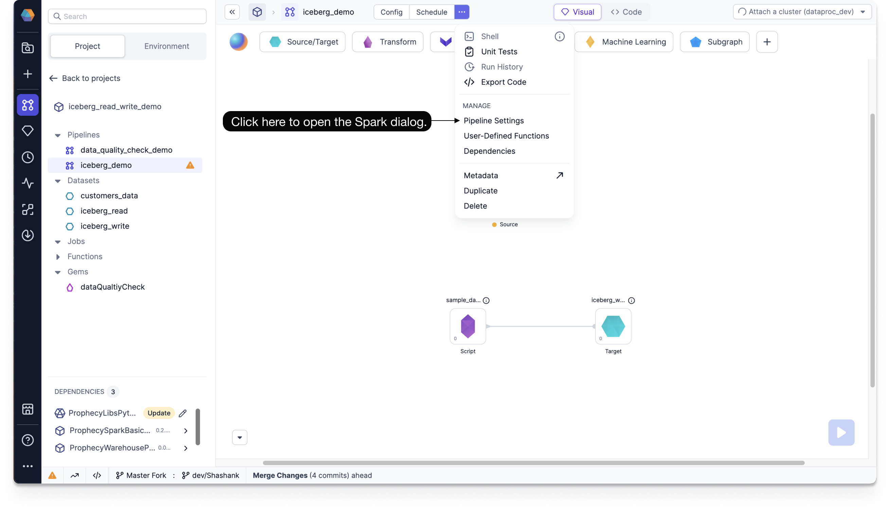
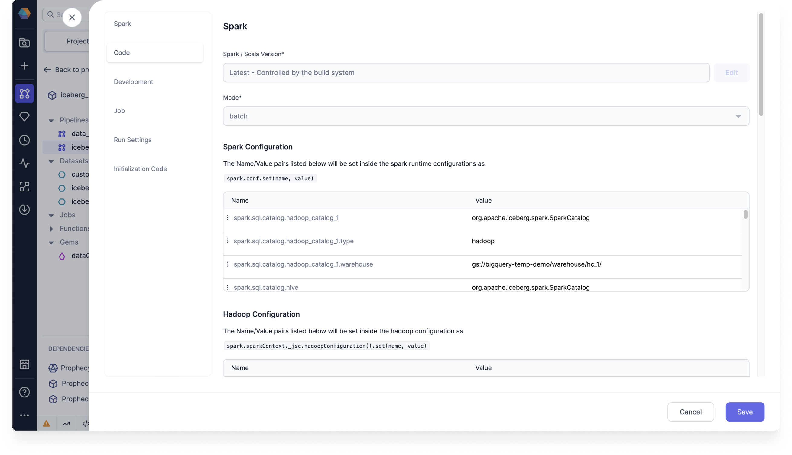

import Requirements from '@site/src/components/gem-requirements';

<Requirements
  python_package_name="ProphecySparkBasicsPython"
  python_package_version="0.2.15+"
  scala_package_name=""
  scala_package_version=""
  scala_lib=""
  python_lib=""
  uc_single="Not Supported"
  uc_shared="Not Supported"
  livy="Not Supported"
/>

Reads from and writes to Iceberg tables, including Iceberg merge operations and time travel.

## Required Settings

To use the Source gem with the Iceberg catalog table type, you must configure the following required settings at the environment, initialization, and runtime stages.

### Environment Setting

Configure the following Spark JAR dependency package in your fabric environment:

`https://repo1.maven.org/maven2/org/apache/iceberg/iceberg-spark-runtime-3.3_2.12/1.5.0/iceberg-spark-runtime-3.3_2.12-1.5.0.jar`

This dependency is available on your compute platform where you installed Spark, such as your Databricks cluster, EMR, or Dataproc.

### Initialization Settings

Configure the following Spark session property during the Spark session initialization.

- Key: `spark.sql.extensions`
- Value: `org.apache.iceberg.spark.extensions.IcebergSparkSessionExtensions`

:::tip
You can also do this during cluster bootstrap. For example, you can set `--properties "spark:spark.sql.extensions=org.apache.iceberg.spark.extensions.IcebergSparkSessionExtentions" \` with a create clusters command.
:::

### Runtime Settings

The following properties allow you to configure multiple catalogs and your respective metastores for Iceberg tables and data management.

To configure Spark conf properties:

1. Navigate to **Pipeline Settings**.

   a. Click **...** at the top of the Prophecy canvas.<br/>
   b. Under **Manage**, click **Pipeline Settings**.



2. In your **Spark** tab, under **Spark Configuration**, add your Spark conf properties.



To configure Hadoop as a catalog, add the following Spark conf properties:

- `spark.sql.catalog.<catalog_name>=org.apache.iceberg.spark.SparkCatalog`
- `spark.sql.catalog.<catalog_name>.type=hadoop`
- `spark.sql.catalog.<catalog_name>.warehouse=gs://<bucket>/<folder_1>/<folder_1>/`

To configure Hive as a catalog, add the following Spark conf properties:

- `spark.sql.catalog.<catalog_name>=org.apache.iceberg.spark.SparkCatalog`
- `spark.sql.catalog.<catalog_name>.type=hive`
- `spark.sql.catalog.<catalog_name>.warehouse=gs://<bucket>/<folder_1>/<folder_1>/`
- `spark.sql.catalog.<catalog_name>.uri=thrift://10.91.64.30:9083`

<br/>
 :::tip
 You can set the default catalog by using `spark.default.catalog=<catalog_name>`.
 :::

## Parameters

The Source and Target gems require the following parameters to read from and write to Iceberg:

| Parameter                   | Tab        | Description                                                                                                                                                                                     |
| --------------------------- | ---------- | ----------------------------------------------------------------------------------------------------------------------------------------------------------------------------------------------- |
| Use Catalog                 | Location   | Whether to use a configured Hadoop or Hive catalog name.                                                                                                                                        |
| Catalog Name                | Location   | Name of your catalog if you enable **Use Catalog**.                                                                                                                                             |
| Schema Name (Database Name) | Location   | Name of the database to connect to.                                                                                                                                                             |
| Table Name                  | Location   | Name of the table to connect to.                                                                                                                                                                |
| Catalog Type                | Location   | File path to write the Iceberg table in the Target gem. <br/>Possible values are: `hive`, `hadoop`, or `other`                                                                                  |
| File location               | Location   | Location of your file if you select `hive` or `other` for the **Catalog Type**.                                                                                                                 |
| Schema                      | Properties | Schema to apply on the loaded data.<br/>In the Source gem, you can define or edit the schema visually or in JSON code.<br/>In the Target gem, you can view the schema visually or as JSON code. |

## Source

The Source gem reads data from Iceberg and allows you to optionally specify the following additional properties.

### Source properties

| Properties     | Description                                                                                                                                                     | Default |
| -------------- | --------------------------------------------------------------------------------------------------------------------------------------------------------------- | ------- |
| Description    | Description of your dataset.                                                                                                                                    | None    |
| Read timestamp | Time travel in milliseconds to a specific timestamp. <br/>This value should be between the first commit timestamp and the latest commit timestamp in the table. | None    |
| Read snapshot  | Snapshot ID to time travel to a specific table version.                                                                                                         | None    |

:::note
You can only select `Read timestamp` or `Read snapshot`, not both.

If you don't use a time travel option, the Source gem fetches the most recent version of each row by default.
:::

To learn more about Iceberg time travel and its use cases, see [Apache Iceberg TIMETRAVEL](https://iceberg.apache.org/docs/nightly/hive/?h=time#timetravel).

### Example {#source-example}

<div class="wistia_responsive_padding" style={{padding:'56.25% 0 0 0', position:'relative'}}>
<div class="wistia_responsive_wrapper" style={{height:'100%',left:0,position:'absolute',top:0,width:'100%'}}>
<iframe src="https://fast.wistia.net/embed/iframe/b1vt6gv6bl?seo=false?videoFoam=true" title="Iceberg source example" allow="autoplay; fullscreen" allowtransparency="true" frameborder="0" scrolling="no" class="wistia_embed" name="wistia_embed" msallowfullscreen width="100%" height="100%"></iframe>
</div></div>
<script src="https://fast.wistia.net/assets/external/E-v1.js" async></script>

### Generated Code {#source-code}

:::tip
To see the generated source code of your project, [switch to the Code view](/engineers/project-lifecycle/#review-the-code) in the project header.
:::

````mdx-code-block
import Tabs from '@theme/Tabs';
import TabItem from '@theme/TabItem';

<Tabs>
<TabItem value="py" label="Python">

```py
def iceberg_read(spark: SparkSession) -> DataFrame:
    return spark.read.format("iceberg").load("`hadoop_catalog_1`.`prophecy_doc_demo`.`employees_test`")
```
</TabItem>
</Tabs>
````

---

## Target

The Target gem writes data to Iceberg and allows you to optionally specify the following additional properties.

### Target properties

| Property          | Description                                                                                                                                                               | Default |
| ----------------- | ------------------------------------------------------------------------------------------------------------------------------------------------------------------------- | ------- |
| Description       | Description of your dataset.                                                                                                                                              | None    |
| Write Mode        | How to handle existing data. For a list of the possible values, see [Supported write modes](#supported-write-modes).                                                      | None    |
| Merge schema      | Whether to automatically add columns present in the `DataFrame` but not in the Target table to the end of the schema as part of a write transaction.                      | false   |
| Partition Columns | List of columns to partition the Iceberg table by. <br/>Provide this during a `createOrReplace` write mode to leverage the`overwritePartitions` write mode in the future. | None    |

### Supported write modes

| Write Mode          | Description                                                                                             |
| ------------------- | ------------------------------------------------------------------------------------------------------- |
| createOrReplace     | Create or replace the Iceberg table.                                                                    |
| append              | If data already exists, append the contents of the DataFrame to the Iceberg table.                      |
| overwritePartitions | Dynamically overwrite partitions in the Iceberg table.                                                  |
| overwrite           | If data already exists, explicitly overwrite the partitions with the `Overwrite Condition` you specify. |

:::tip
Among these write modes, overwrite and append work the same way for parquet file writes.
:::

### Target Example

<div class="wistia_responsive_padding" style={{padding:'56.25% 0 0 0', position:'relative'}}>
<div class="wistia_responsive_wrapper" style={{height:'100%',left:0,position:'absolute',top:0,width:'100%'}}>
<iframe src="https://fast.wistia.net/embed/iframe/8j80hc4k1e?seo=false?videoFoam=true" title="Iceberg-target-example" allow="autoplay; fullscreen" allowtransparency="true" frameborder="0" scrolling="no" class="wistia_embed" name="wistia_embed" msallowfullscreen width="100%" height="100%"></iframe>
</div></div>
<script src="https://fast.wistia.net/assets/external/E-v1.js" async></script>

### Generated Code {#target-code}

:::tip
To see the generated source code of your project, [switch to the Code view](/engineers/project-lifecycle/#review-the-code) in the project header.
:::

````mdx-code-block

<Tabs>
<TabItem value="py" label="Python">

```py
def iceberg_write(spark: SparkSession, in0: DataFrame):
    df1 = in0.writeTo("`hadoop_catalog_1`.`prophecy_doc_demo`.`employees_test`")
    df2 = df1.using("iceberg")
    df3 = df2.partitionedBy("Department")
    df4 = df3.tableProperty("write.spark.accept-any-schema", "true")
    df4.createOrReplace()
```
</TabItem>
</Tabs>
````
