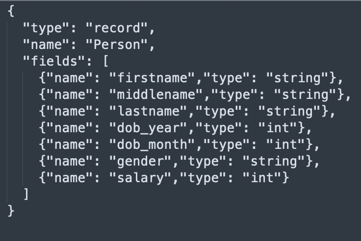

The Avro file type:

- Is a row-based, open-source data serialization system.
- Supports schema evolution, which allows schemas to evolve over time without breaking compatibility.
- Stores the data in a binary format, which makes the data compact and efficient.
- Usually appears in big data environments, data streaming applications, and scenarios where data serialization and storage are important.

## Parameters

| Parameter | Tab        | Description                                                                                                                                                                                     |
| --------- | ---------- | ----------------------------------------------------------------------------------------------------------------------------------------------------------------------------------------------- |
| Location  | Location   | File path to read from or write to the Avro file.                                                                                                                                               |
| Schema    | Properties | Schema to apply on the loaded data.<br/>In the Source gem, you can define or edit the schema visually or in JSON code.<br/>In the Target gem, you can view the schema visually or as JSON code. |

## Source

The Source gem reads data from Avro files and allows you to optionally specify the following additional properties.

### Source properties

| Property name                                      | Description                                                                                                                                                                                                                                  | Default |
| -------------------------------------------------- | -------------------------------------------------------------------------------------------------------------------------------------------------------------------------------------------------------------------------------------------- | ------- |
| Description                                        | Description of your dataset.                                                                                                                                                                                                                 | None    |
| Use user-defined schema                            | Whether to use the schema you define.                                                                                                                                                                                                        | false   |
| Ignore files without .avro extension while reading | **_DEPRECATED_**. Whether to load files without the `.avro` extension. <br/>**This parameter will be removed in a future release.** <br/>To filter file names, use the `Path Glob Filter` property.                                          | true    |
| Recursive File Lookup                              | Whether to recursively load files and disable partition inferring. If the data source explicitly specifies the `partitionSpec` when the`recursiveFileLookup` is `true`, the Source gem throws an exception.                                  | false   |
| Path Global Filter                                 | Glob pattern to only include files with paths matching the pattern. The syntax follows [GlobFilter](https://hadoop.apache.org/docs/stable/api/org/apache/hadoop/fs/GlobFilter.html) and does not change the behavior of partition discovery. | None    |
| Modified Before                                    | Timestamp to only include files with modification times occurring before the time you specify. The timestamp must be in the following format: `YYYY-MM-DDTHH:mm:ss` (e.g. 2020-06-01T13:00:00)                                               | None    |
| Modified After                                     | Timestamp to only include files with modification times occurring after the time you specify. The timestamp must be in the following format: `YYYY-MM-DDTHH:mm:ss` (e.g. 2020-06-01T13:00:00)                                                | None    |
| Avro Schema                                        | Additional schema a user provides in JSON format. To learn more, see [Schema evolution](#schema-evolution).                                                                                                                                  | None    |

#### Schema evolution

When reading an Avro file, you can set the `Avro Schema` parameter to a newer evolved schema, which is compatible but different from the schema written to storage. The resulting `DataFrame` follows the newer evolved schema.

For example, if you set an evolved schema to contain one additional column with a default value, the resulting `DataFrame` contains the new column too.

### Example {#source}

<div class="wistia_responsive_padding" style={{padding:'56.25% 0 0 0', position:'relative'}}>
<div class="wistia_responsive_wrapper" style={{height:'100%',left:0,position:'absolute',top:0,width:'100%'}}>
<iframe src="https://user-images.githubusercontent.com/103921419/174399585-40067429-953e-4157-a5db-d80e25713d24.mp4" title="Avro Source" allow="autoplay;fullscreen" allowtransparency="true" frameborder="0" scrolling="no" class="wistia_embed" name="wistia_embed" msallowfullscreen width="100%" height="100%"></iframe>
</div></div>

#### Schema used in example above



### Generated Code {#source-code}

:::tip
To see the generated source code, [switch to the Code view](/getting-started/tutorials/spark-with-databricks#review-the-code) at the top of the page.
:::

````mdx-code-block
import Tabs from '@theme/Tabs';
import TabItem from '@theme/TabItem';

<Tabs>
<TabItem value="py" label="Python">

```py
def read_avro(spark: SparkSession) -> DataFrame:
    return spark.read\
        .format("avro")\
        .option("ignoreExtension", True)\
        .option(
          "avroSchema",
          "{\"type\":\"record\",\"name\":\"Person\",\"fields\":[{\"name\":\"firstname\",\"type\":\"string\"},{\"name\":\"middlename\",\"type\":\"string\"},{\"name\":\"lastname\",\"type\":\"string\"},{\"name\":\"dob_year\",\"type\":\"int\"},{\"name\":\"dob_month\",\"type\":\"int\"},{\"name\":\"gender\",\"type\":\"string\"},{\"name\":\"salary\",\"type\":\"int\"}]}"
        )\
        .load("dbfs:/FileStore/Users/abhinav/avro/test.avro")
```
</TabItem>
<TabItem value="scala" label="Scala">

```scala
object read_avro {

  def apply(spark: SparkSession): DataFrame =
    spark.read
        .format("avro")
        .option("ignoreExtension", true)
        .option(
          "avroSchema",
          "{\"type\":\"record\",\"name\":\"Person\",\"fields\":[{\"name\":\"firstname\",\"type\":\"string\"},{\"name\":\"middlename\",\"type\":\"string\"},{\"name\":\"lastname\",\"type\":\"string\"},{\"name\":\"dob_year\",\"type\":\"int\"},{\"name\":\"dob_month\",\"type\":\"int\"},{\"name\":\"gender\",\"type\":\"string\"},{\"name\":\"salary\",\"type\":\"int\"}]}"
        )
        .load("dbfs:/FileStore/Users/abhinav/avro/test.avro")

}
```
</TabItem>
</Tabs>
````

---

## Target

The Target gem writes data to Avro files and allows you to optionally specify the following additional properties.

### Target properties

| Property name     | Description                                                                                                                                                                                                                                                                               | Default           |
| ----------------- | ----------------------------------------------------------------------------------------------------------------------------------------------------------------------------------------------------------------------------------------------------------------------------------------- | ----------------- |
| Description       | Description of your dataset.                                                                                                                                                                                                                                                              | None              |
| Avro Schema       | Additional schema a user provides in JSON format. You can set this parameter if the expected output Avro schema doesn't match the schema Spark converts. <br/>For example, the expected schema of a column is an `enum` type, instead of a `string` type in the default converted schema. | None              |
| Write Mode        | How to handle existing data. For a list of the possible values, see [Supported write modes](#supported-write-modes).                                                                                                                                                                      | `error`           |
| Compression       | Compression codec when writing to the Avro file. <br/>The Avro file supports the following codecs: `uncompressed`, `snappy`, `deflate`, `bzip2`, and `xz`. <br/>This defaults to the value of the `spark.sql.avro.compression.codec` parameter.                                           | `snappy`          |
| Partition Columns | List of columns to partition the Avro files by.                                                                                                                                                                                                                                           | None              |
| Record Name       | Top level record name in the result.                                                                                                                                                                                                                                                      | `topLevelRecord`  |
| Record Namespace  | Record namespace in the result.                                                                                                                                                                                                                                                           | "" (empty string) |

### Supported write modes

| Write mode | Description                                                                                                                                          |
| ---------- | ---------------------------------------------------------------------------------------------------------------------------------------------------- |
| error      | If the data already exists, throw an exception.                                                                                                      |
| overwrite  | If the data already exists, overwrite the data with the contents of the `DataFrame`.                                                                 |
| append     | If the data already exists, append the contents of the `DataFrame`.                                                                                  |
| ignore     | If the data already exists, do nothing with the contents of the `DataFrame`. <br/>This is similar to the `CREATE TABLE IF NOT EXISTS` clause in SQL. |

### Example {#target}

<div class="wistia_responsive_padding" style={{padding:'56.25% 0 0 0', position:'relative'}}>
<div class="wistia_responsive_wrapper" style={{height:'100%',left:0,position:'absolute',top:0,width:'100%'}}>
<iframe src="https://user-images.githubusercontent.com/103921419/174399603-07080a2f-a52b-4feb-a029-733f947fad6c.mp4" title="Avro Target" allow="autoplay;fullscreen" allowtransparency="true" frameborder="0" scrolling="no" class="wistia_embed" name="wistia_embed" msallowfullscreen width="100%" height="100%"></iframe>
</div></div>

### Generated Code {#target-code}

:::tip
To see the generated source code, [switch to the Code view](/getting-started/tutorials/spark-with-databricks#review-the-code) at the top of the page.
:::

````mdx-code-block

<Tabs>
<TabItem value="py" label="Python">

```py
def write_avro(spark: SparkSession, in0: DataFrame):
    in0.write\
        .format("avro")\
        .mode("overwrite")\
        .partitionBy("dob_year","dob_month")\
        .save("dbfs:/data/test_output.avro")
```
</TabItem>
<TabItem value="scala" label="Scala">

```scala
object write_avro {
  def apply(spark: SparkSession, in: DataFrame): Unit =
    in.write
        .format("avro")
        .mode("overwrite")
        .partitionBy("dob_year","dob_month")
        .save("dbfs:/data/test_output.avro")
}
```
</TabItem>
</Tabs>
````
