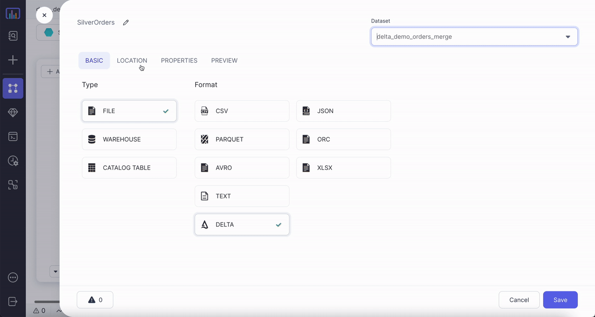

The Delta data format reads and writes Delta tables, including Delta Merge operations and Time travel.

## Source

### Source Parameters

| Parameter      | Description                                                                                                                                                                                                                                                          | Required |
| -------------- | -------------------------------------------------------------------------------------------------------------------------------------------------------------------------------------------------------------------------------------------------------------------- | -------- |
| Location       | File path for the Delta table.                                                                                                                                                                                                                                       | True     |
| Read Timestamp | Time travel to a specific timestamp. <\br>This value should be between the first commit timestamp and the latest commit timestamp in the table.                                                                                                                      | False    |
| Read Version   | Time travel to a specific version of table. <\br>This value must be an interger and it's value must be between the minimum and maximum version of the table. By default, Prophecy fetches the most recent version of each row if you don't use a time travel option. | False    |

:::note
You can only select `Read Timestamp` **_OR_** `Read Version`, not both.
:::

:::info
To learn more about Delta time travel and its use cases, see [Introducing Delta Time Travel for Large Scale Data Lakes](https://databricks.com/blog/2019/02/04/introducing-delta-time-travel-for-large-scale-data-lakes.html).
:::

### Example {#source-example}



### Generated Code {#source-code}

#### Without time travel

````mdx-code-block

<Tabs>

<TabItem value="py" label="Python">

```py
def ReadDelta(spark: SparkSession) -> DataFrame:
    return spark.read.format("delta").load("dbfs:/FileStore/data_engg/delta_demo/silver/orders")

```

</TabItem>
<TabItem value="scala" label="Scala">

```scala
object ReadDelta {

  def apply(spark: SparkSession): DataFrame = {
    spark.read.format("delta").load("dbfs:/FileStore/data_engg/delta_demo/silver/orders")
  }

}
```

</TabItem>
</Tabs>

````

#### Timestamp-based time travel

````mdx-code-block

<Tabs>

<TabItem value="py" label="Python">

```py
def ReadDelta(spark: SparkSession) -> DataFrame:
    return spark.read.format("delta").option("timestampAsOf", "2022-05-05")\
        .load("dbfs:/FileStore/data_engg/delta_demo/silver/orders")

```

</TabItem>
<TabItem value="scala" label="Scala">

```scala
object ReadDelta {

  def apply(spark: SparkSession): DataFrame = {
    spark.read.format("delta").option("timestampAsOf", "2022-05-05")
        .load("dbfs:/FileStore/data_engg/delta_demo/silver/orders")
  }

}
```

</TabItem>
</Tabs>

````

#### Version-based time travel

````mdx-code-block
import Tabs from '@theme/Tabs';
import TabItem from '@theme/TabItem';

<Tabs>

<TabItem value="py" label="Python">

```py
def readDelta(spark: SparkSession) -> DataFrame:
    return spark.read.format("delta").option("versionAsOf", "0")\
        .load("dbfs:/FileStore/data_engg/delta_demo/silver/orders")

```

</TabItem>
<TabItem value="scala" label="Scala">

```scala
object readDelta {

  def apply(spark: SparkSession): DataFrame = {
    spark.read.format("delta").option("versionAsOf", "0")
        .load("dbfs:/FileStore/data_engg/delta_demo/silver/orders")
  }

}
```

</TabItem>
</Tabs>

````

---

## Target

### Target Parameters

| Parameter                                  | Description                                                                                                                                                        | Required |
| ------------------------------------------ | ------------------------------------------------------------------------------------------------------------------------------------------------------------------ | -------- |
| Location                                   | File path to write the Delta table to.                                                                                                                             | True     |
| Write mode                                 | Write mode for the `DataFrame`. To see a list of possible values, see [the Supported Write Modes table](#supported-write-modes).                                   | True     |
| Optimize write                             | If `true`, Prophecy optimizes the Spark partition sizes based on the actual data.                                                                                  | False    |
| Overwrite table schema                     | If `true`, Prophecy overwrites the schema of the Delta table with the schema of the incoming `DataFrame`.                                                          | False    |
| Merge `DataFrame` schema into table schema | If `true`, Prophecy automatically adds any columns present in the `DataFrame` but not in the target table to the end of the schema as part of a write transaction. | False    |
| Partition Columns                          | List of columns to partition the Delta table by.                                                                                                                   | False    |
| Overwrite partition predicate              | If specified, Prophecy selectively overwrites the data that satisfies the given where clause expression.                                                           | False    |

#### Supported Write Modes

| Write Mode | Description                                                                                                                             |
| ---------- | --------------------------------------------------------------------------------------------------------------------------------------- |
| overwrite  | If data already exists, overwrite with the contents of the `DataFrame`.                                                                 |
| error      | If data already exists, throw an exception.                                                                                             |
| append     | If data already exists, append the contents of the `DataFrame`.                                                                         |
| ignore     | If data already exists, do nothing with the contents of the `DataFrame`. <br/>This is similar to a `CREATE TABLE IF NOT EXISTS` in SQL. |
| merge      | Use the Delta `merge` command to insert, delete and update data.                                                                        |
| scd2 merge | A Delta merge operation that stores and manages both current and historical data over time.                                             |

Among the overwrite, append, ignore and error write modes, they work the same way as the Parquet file writes.
The [Delta MERGE section](#delta-merge) section explain and show several examples of the merge write mode.

### Target Example


### Generated Code {#target-code}

````mdx-code-block

<Tabs>

<TabItem value="py" label="Python">

```py
def writeDelta(spark: SparkSession, in0: DataFrame):
    return in0.write\
            .format("delta")\
            .option("optimizeWrite", True)\
            .option("mergeSchema", True)\
            .option("replaceWhere", "order_dt > '2022-01-01'")\
            .option("overwriteSchema", True)\
            .mode("overwrite")\
            .partitionBy("order_dt")\
            .save("dbfs:/FileStore/data_engg/delta_demo/silver/orders")

```

</TabItem>
<TabItem value="scala" label="Scala">

```scala
object writeDelta {

  def apply(spark: SparkSession, in: DataFrame): Unit = {
    in0.write
        .format("delta")
        .option("optimizeWrite", True)
        .option("mergeSchema", True)
        .option("replaceWhere", "order_dt > '2022-01-01'")
        .option("overwriteSchema", True)
        .mode("overwrite")
        .partitionBy("order_dt")
        .save("dbfs:/FileStore/data_engg/delta_demo/silver/orders")
  }

}

```

</TabItem>
</Tabs>

````

## Delta MERGE

You can upsert data from a source `DataFrame` into a target Delta table by using the [MERGE](https://docs.delta.io/latest/delta-update.html#upsert-into-a-table-using-merge) operation. Delta MERGE supports `Insert`, `Update`, and `Delete` operations in a variety of use cases such as examining data with individual records that slowly change over time. Here, we consider the most common types of slowly changing dimension (SCD) cases: SCD1, SCD2, and SCD3.

Delta modifies records in one of the following ways:

- Delta does not retain history (SCD1).
- Delta retians history at the row level (SCD2).
- Delta retains history at the column level (SCD3).

### SCD1

The following illustrates an SCD1 MERGE condition.

#### Parameters {#upsert-parameters}

| Parameter                       | Description                                                                                                                                   | Required |
| ------------------------------- | --------------------------------------------------------------------------------------------------------------------------------------------- | -------- |
| Source alias                    | Alias to use for the source `DataFrame`,                                                                                                         | True     |
| Target alias                    | Alias to use for existing target Delta table                                                                                                  | True     |
| Merge Condition                 | Condition to merge data from source `DataFrame` to target table, which Delta can perform an update, delete, or insert action. | True     |
| When Matched Update Action      | Update the row from `Source` that already exists in `Target` (based on your `Merge Condition`).                                                     | False    |
| When Matched Update Condition   | Optional additional condition for updating a row. If you specify a condition, then it must evaluate to `true` for Prophecy to update the row.                         | False    |
| When Matched Update Expressions | Optional expressions for setting the values of columns that Prophecy needs to update.                                                               | False    |
| When Matched Delete Action      | Delete rows if `Merge Condition` and the optional additional condition evaluates to `true`                                                  | False    |
| When Matched Delete Condition   | Optional additional condition for deleting a row. If you specify a condition, then it must evaluate to `true` for Prophecy to delete the row.          | False    |
| When Not Matched Action         | Action to perform if the row from `Source` is not present in `Target` (based on `Merge Condition`).                                        | False    |
| When Not Matched Condition      | Optional condition for inserting a row. If you specify a condition, then it must evaluate to `true` for Prophecy to update the row.                    | False    |
| When Not Matched Expressions    | Optional expressions for setting the values of columns that Prophecy needs to update.                                                               | False    |

:::note

1. You must set at least one action out of update, delete or insert.
2. Delete removes the data from the latest version of the Delta table but does not remove it from the physical storage until the old versions are explicitly vacuumed. See [vacuum](https://docs.delta.io/latest/delta-utility.html#-delta-vacuum) for details.
3. A merge operation fails if multiple rows of the source `DataFrame` matches and the merge attempts to update the same rows of the target Delta table. You can place deduplicate gems before target if you expect duplicate rows at source.

:::tip
When possible, provide predicates on the partition columns for a partitioned Delta table because predicates can significantly speed up the operations.
:::

#### Example {#upsert-example}

The following is our initial customers table:


We want the following updates to the customers table:


The following shows our output and configurations for SCD1 merge:

<div class="wistia_responsive_padding" style={{padding:'56.25% 0 0 0', position:'relative'}}>
<div class="wistia_responsive_wrapper" style={{height:'100%',left:0,position:'absolute',top:0,width:'100%'}}>
<iframe src="https://user-images.githubusercontent.com/103921419/173252757-0a1165f0-68e2-41ca-b6eb-58da51cb76d1.mp4" title="SCD3" allow="autoplay;fullscreen" allowtransparency="true" frameborder="0" scrolling="no" class="wistia_embed" name="wistia_embed" msallowfullscreen width="100%" height="100%"></iframe>
</div></div>

#### Generated Code {#upsert-code}

````mdx-code-block

<Tabs>

<TabItem value="py" label="Python">

```py
def writeDeltaMerge(spark: SparkSession, in0: DataFrame):
    from delta.tables import DeltaTable, DeltaMergeBuilder

    if DeltaTable.isDeltaTable(spark, "dbfs:/FileStore/data_engg/delta_demo/silver/customers_scd1"):
        DeltaTable\
            .forPath(spark, "dbfs:/FileStore/data_engg/delta_demo/silver/customers_scd1")\
            .alias("target")\
            .merge(in0.alias("source"), (col("source.customer_id") == col("target.customer_id")))\
            .whenMatchedUpdateAll()\
            .whenNotMatchedInsertAll()\
            .execute()
    else:
        in0.write\
            .format("delta")\
            .mode("overwrite")\
            .save("dbfs:/FileStore/data_engg/delta_demo/silver/customers_scd1")

```

</TabItem>
<TabItem value="scala" label="Scala">

```scala
object writeDeltaMerge {

  def apply(spark: SparkSession, in: DataFrame): Unit = {
    import _root_.io.delta.tables._
    if (DeltaTable.isDeltaTable(spark, "dbfs:/FileStore/data_engg/delta_demo/silver/customers_scd1")) {
        DeltaTable
            .forPath(spark, "dbfs:/FileStore/data_engg/delta_demo/silver/customers_scd1")
            .as("target")
            .merge(in0.as("source"), (col("source.customer_id") === col("target.customer_id")))
            .whenMatched()
            .updateAll()
            .whenNotMatched()
            .insertAll()
            .execute()
    }
    else {
        in0.write
            .format("delta")
            .mode("overwrite")
            .save("dbfs:/FileStore/data_engg/delta_demo/silver/customers_scd1")
    }
  }

}

```

</TabItem>
</Tabs>

````

### SCD2

The following illustrates an SCD2 MERGE condition.

#### Parameters {#scd2-parameters}

| Parameter          | Description                                                                            | Required |
| :----------------- | :------------------------------------------------------------------------------------- | :------- |
| Key Columns        | List of key columns which remain constant.                                             | True     |
| Historic Columns   | List of columns which change over time, and we want to maintain its history.           | True     |
| From time column   | Time from which a particular row becomes valid.                                        | True     |
| To time column     | Time till which a particular row is no longer valid.                                   | True     |
| Min/old-value flag | Column placeholder to store the flag as `true` for the first entry of a particular key.| True     |
| Max/latest flag    | Column placeholder to store the flag as `true` for the last entry of a particular key. | True     |
| Flag values        | Option to choose the min or max flag to be `true/false`, or `0/1`.                     | True     |

#### Example {#scd2-example}

Continuing from [the prior example](#upsert-example), use the Delta log to capture the historical `customer_zip_code` at the row-level.
The following shows the output and configurations for an SCD2 merge:

<div class="wistia_responsive_padding" style={{padding:'56.25% 0 0 0', position:'relative'}}>
<div class="wistia_responsive_wrapper" style={{height:'100%',left:0,position:'absolute',top:0,width:'100%'}}>
<iframe src="https://user-images.githubusercontent.com/103921419/173252742-00930084-b3b3-4b8a-b5bb-59f39b74792b.mp4" title="SCD3" allow="autoplay;fullscreen" allowtransparency="true" frameborder="0" scrolling="no" class="wistia_embed" name="wistia_embed" msallowfullscreen width="100%" height="100%"></iframe>
</div></div>

#### Generated Code {#scd2-code}

````mdx-code-block

<Tabs>

<TabItem value="py" label="Python">

```py
def writeDeltaSCD2(spark: SparkSession, in0: DataFrame):
    from delta.tables import DeltaTable, DeltaMergeBuilder

    if DeltaTable.isDeltaTable(spark, "dbfs:/FileStore/data_engg/delta_demo/silver/customers_scd2"):
        existingTable = DeltaTable.forPath(
            spark, "dbfs:/FileStore/data_engg/delta_demo/silver/customers_scd2"
        )
        updatesDF = in0.withColumn("minFlag", lit("true")).withColumn(
            "maxFlag", lit("true")
        )
        existingDF = existingTable.toDF()
        updateColumns = updatesDF.columns
        stagedUpdatesDF = (
            updatesDF.join(existingDF, ["customer_id"])
            .where(
                (
                    (existingDF["maxFlag"] == lit("true"))
                    & (
                        (
                            (
                                existingDF["customer_zip_code"]
                                != updatesDF["customer_zip_code"]
                            )
                            | (
                                existingDF["customer_city"]
                                != updatesDF["customer_city"]
                            )
                        )
                        | (existingDF["customer_state"] != updatesDF["customer_state"])
                    )
                )
            )
            .select(*[updatesDF[val] for val in updateColumns])
            .withColumn("minFlag", lit("false"))
            .withColumn("mergeKey", lit(None))
            .union(updatesDF.withColumn("mergeKey", concat("customer_id")))
        )
        existingTable.alias("existingTable").merge(
            stagedUpdatesDF.alias("staged_updates"),
            concat(existingDF["customer_id"]) == stagedUpdatesDF["mergeKey"],
        ).whenMatchedUpdate(
            condition=(
                (existingDF["maxFlag"] == lit("true"))
                & (
                    (
                        (
                            existingDF["customer_zip_code"]
                            != stagedUpdatesDF["customer_zip_code"]
                        )
                        | (
                            existingDF["customer_city"]
                            != stagedUpdatesDF["customer_city"]
                        )
                    )
                    | (
                        existingDF["customer_state"]
                        != stagedUpdatesDF["customer_state"]
                    )
                )
            ),
            set={"maxFlag": "false", "end_date": "staged_updates.updated_dt"},
        )\
        .whenNotMatchedInsertAll()\
        .execute()
    else:
        in0.write\
            .format("delta")\
            .mode("overwrite")\
            .save("dbfs:/FileStore/data_engg/delta_demo/silver/customers_scd2")


```

</TabItem>
<TabItem value="scala" label="Scala">

```scala
object writeDeltaSCD2 {

  def apply(spark: SparkSession, in: DataFrame): Unit = {
    import _root_.io.delta.tables._
    if (
      DeltaTable.isDeltaTable(
        spark,
        "dbfs:/FileStore/data_engg/delta_demo/silver/customers_scd2"
      )
    ) {
      val updatesDF = in
        .withColumn("minFlag", lit("true"))
        .withColumn("maxFlag", lit("true"))
      val existingTable: DeltaTable = DeltaTable.forPath(
        spark,
        "dbfs:/FileStore/data_engg/delta_demo/silver/customers_scd2"
      )
      val existingDF: DataFrame = existingTable.toDF
      val stagedUpdatesDF = updatesDF
        .join(existingDF, List("customer_id"))
        .where(
          existingDF.col("maxFlag") === lit("true") && List(
            existingDF.col("customer_zip_code") =!= updatesDF
              .col("customer_zip_code"),
            existingDF.col("customer_city") =!= updatesDF
              .col("customer_city"),
            existingDF.col("customer_state") =!= updatesDF
              .col("customer_state")
          ).reduce((c1, c2) => c1 || c2)
        )
        .select(updatesDF.columns.map(x => updatesDF.col(x)): _*)
        .withColumn("minFlag", lit("false"))
        .withColumn("mergeKey", lit(null))
        .union(updatesDF.withColumn("mergeKey", concat(col("customer_id"))))
      existingTable
        .as("existingTable")
        .merge(
          stagedUpdatesDF.as("staged_updates"),
          concat(existingDF.col("customer_id")) === stagedUpdatesDF(
            "mergeKey"
          )
        )
        .whenMatched(
          existingDF.col("maxFlag") === lit("true") && List(
            existingDF.col("customer_zip_code") =!= stagedUpdatesDF
              .col("customer_zip_code"),
            existingDF.col("customer_city") =!= stagedUpdatesDF
              .col("customer_city"),
            existingDF.col("customer_state") =!= stagedUpdatesDF
              .col("customer_state")
          ).reduce((c1, c2) => c1 || c2)
        )
        .updateExpr(
          Map("maxFlag" → "false", "end_date" → "staged_updates.updated_dt")
        )
        .whenNotMatched()
        .insertAll()
        .execute()
    } else {
      in0.write
        .format("delta")
        .mode("overwrite")
        .save("dbfs:/FileStore/data_engg/delta_demo/silver/orders")
    }

  }

}


```

</TabItem>
</Tabs>

````

### SCD3

Continuing from [the prior example](#scd2-example), use the Delta log to capture the historical `customer_zip_code` at the column-level.
The following shows the output and configurations for an SCD3 merge:

<div class="wistia_responsive_padding" style={{padding:'56.25% 0 0 0', position:'relative'}}>
<div class="wistia_responsive_wrapper" style={{height:'100%',left:0,position:'absolute',top:0,width:'100%'}}>
<iframe src="https://user-images.githubusercontent.com/103921419/173252728-8924f0fb-6e81-44b7-9c39-17ba1d8f4d4c.mp4" title="SCD3" allow="autoplay;fullscreen" allowtransparency="true" frameborder="0" scrolling="no" class="wistia_embed" name="wistia_embed" msallowfullscreen width="100%" height="100%"></iframe>
</div></div>

---

:::info
To learn more about how Prophecy uses the Delta data type, see [Prophecy with Delta — making data lakehouses easier](https://www.prophecy.io/blog/prophecy-with-delta-making-data-lakehouse-easier).
:::
