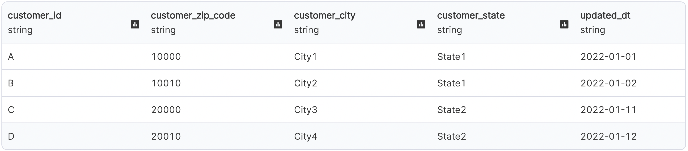

A Delta (Delta Lake) file type:

- Is an optimized storage layer that allows you to store data and tables in the Databricks lakehouse.
- Extends Parquet data files with a file-based transaction log for ACID transactions and scalable metadata handling.
- Is fully compatible with Apache Spark APIs.
- Has a tight integration with Structured Streaming, which allows you to use a single copy of data for both batch and streaming operations and provides incremental processing at scale.

## Parameters

| Parameter | Tab        | Description                                                                                                                                                                                                   |
| --------- | ---------- | ------------------------------------------------------------------------------------------------------------------------------------------------------------------------------------------------------------- |
| Location  | Location   | File path to read from or write to the Delta file.                                                                                                                                                            |
| Schema    | Properties | Schema to apply on the loaded data.  In the Source gem, you can define or edit the schema as a JSON or infer it with the `Infer Schema` button. In the Target gem, you can view the schema as a JSON. |

## Source

The Source gem reads data from Delta files and allows you to optionally specify additional properties.

### Source properties

| Property name  | Description                                                                                                                                                                                                                              | Default |
| -------------- | ---------------------------------------------------------------------------------------------------------------------------------------------------------------------------------------------------------------------------------------- | ------- |
| Description    | Description of your dataset.                                                                                                                                                                                                             | None    |
| Read timestamp | Time travel to a specific timestamp. <\br>This value is between the first commit timestamp and the latest commit timestamp in the table.                                                                                                 | None    |
| Read version   | Time travel to a specific version of table. <\br>This value is an interger between the minimum and maximum version of the table. By default, Prophecy fetches the most recent version of each row if you don't use a time travel option. | None    |

:::note
You can only select `Read Timestamp` **_OR_** `Read Version`, not both.
:::

### Example {#source-example}

:::tip
To see the generated source code, toggle to the **< > Code** view at the top of the page.
:::

## Target

The Target gem writes data to Delta files and allows you to optionally specify additional properties.

### Target properties

| Property name                              | Description                                                                                                                                              | Default |
| ------------------------------------------ | -------------------------------------------------------------------------------------------------------------------------------------------------------- | ------- |
| Description                                | Description of your dataset.                                                                                                                             | None    |
| Write Mode                                 | How to handle existing data. For a list of the possible values, see [Supported write modes](#supported-write-modes).                                     | `error` |
| Overwrite table schema                     | Whether to overwrite the schema of the Delta table with the schema of the incoming `DataFrame`.                                                          | false   |
| Merge `DataFrame` schema into table schema | Whether to automatically add any columns present in the `DataFrame` but not in the target table to the end of the schema as part of a write transaction. | false   |
| Partition Columns                          | List of columns to partition the Delta table by.                                                                                                         | None    |
| Overwrite partition predicate              | Selectively overwrite the data that satisfies the given where clause expression.                                                                         | None    |
| Optimize write                             | Whether to optimize the Spark partition sizes based on the actual data.                                                                                  | false   |

#### Supported Write Modes

| Write Mode | Description                                                                                                                             |
| ---------- | --------------------------------------------------------------------------------------------------------------------------------------- |
| overwrite  | If data already exists, overwrite with the contents of the `DataFrame`.                                                                 |
| error      | If data already exists, throw an exception.                                                                                             |
| append     | If data already exists, append the contents of the `DataFrame`.                                                                         |
| ignore     | If data already exists, do nothing with the contents of the `DataFrame`.  This is similar to a `CREATE TABLE IF NOT EXISTS` in SQL. |
| merge      | Use the Delta `merge` command to insert, delete and update data.                                                                        |
| scd2 merge | Delta merge operation that stores and manages both current and historical data over time.                                               |

Among the overwrite, append, ignore and error write modes, they work the same way as the Parquet file writes.
The [Delta MERGE section](#delta-merge) section explains and shows an example for each of the merge write modes.

### Target Example

:::tip
To see the generated source code, toggle to the **< > Code** view at the top of the page.
:::

## Delta MERGE

You can upsert data from a source `DataFrame` into a target Delta table by using the [MERGE](https://docs.delta.io/latest/delta-update.html#upsert-into-a-table-using-merge) operation. Delta MERGE supports `Insert`, `Update`, and `Delete` operations in a variety of use cases such as examining data with individual records that slowly change over time.

Delta modifies records of the most common slowly changing dimension (SCD) cases in one of the following ways:

- Delta does not retain history (SCD1).
- Delta retians history at the row level (SCD2).
- Delta retains history at the column level (SCD3).

### SCD1

The following illustrates an SCD1 MERGE condition.

#### Properties {#upsert-properties}

| Property name                   | Description                                                                                                                                                                                                                                                                                                                                                                                                | Default  |
| ------------------------------- | ---------------------------------------------------------------------------------------------------------------------------------------------------------------------------------------------------------------------------------------------------------------------------------------------------------------------------------------------------------------------------------------------------------- | -------- |
| Source Alias                    | Alias to use for the source `DataFrame`,                                                                                                                                                                                                                                                                                                                                                                   | `source` |
| Target Alias                    | Alias to use for existing target Delta table.                                                                                                                                                                                                                                                                                                                                                              | `taret`  |
| Merge condition                 | Condition to merge data from source `DataFrame` to target table.  Delta can perform an update, delete, or insert action.                                                                                                                                                                                                                                                                               | None     |
| When Matched Update Action      | Update the row from `Source` that already exists in `Target` (based on your `Merge Condition`).                                                                                                                                                                                                                                                                                                            | `update` |
| When Matched Update Condition   | Additional condition for updating a row. If you specify a condition, it must evaluate to `true` for the Target gem to update the row.                                                                                                                                                                                                                                                                      | None     |
| When Matched Update Expressions | Expressions for setting the values of columns that the Target gem needs to update.                                                                                                                                                                                                                                                                                                                         | None     |
| When Matched Delete Action      | Delete rows if `Merge Condition` and the optional additional condition evaluates to `true`.  Delete removes the data from the latest version of the Delta table but does not remove it from the physical storage until you explicitily vacuum the old versions. To learn more, see [Remove files no longer referenced by a Delta table](https://docs.delta.io/latest/delta-utility.html#-delta-vacuum) | `ignore` |
| When Matched Delete Condition   | Additional condition for deleting a row. If you specify a condition, it must evaluate to `true` for the Target gem to delete the row.                                                                                                                                                                                                                                                                      | False    |
| When Not Matched Action         | Action to perform if the row from `Source` is not present in `Target` (based on `Merge Condition`).                                                                                                                                                                                                                                                                                                        | `insert` |
| When Not Matched Condition      | Condition for inserting a row. If you specify a condition, it must evaluate to `true` for the Target gem to update the row.                                                                                                                                                                                                                                                                                | None     |
| When Not Matched Expressions    | Expressions for setting the values of columns that the Target gem needs to update.                                                                                                                                                                                                                                                                                                                         | None     |

:::note

1. You must set at least one action out of update, delete or insert.
1. A merge operation fails if multiple rows of the source `DataFrame` matches and the merge attempts to update the same rows of the target Delta table. You can place deduplicate gems before target if you expect duplicate rows at source.

:::tip
When possible, provide predicates on the partition columns for a partitioned Delta table because predicates can significantly speed up the operations.
:::

#### Example {#upsert-example}

Assume the following is the initial customers table:

We want to make the following updates to the table:

The following shows our output and configurations for SCD1 merge:

<iframe src="https://user-images.githubusercontent.com/103921419/173252757-0a1165f0-68e2-41ca-b6eb-58da51cb76d1.mp4" title="SCD3" allow="autoplay;fullscreen" allowtransparency="true" frameborder="0" scrolling="no" class="wistia_embed" name="wistia_embed" msallowfullscreen width="100%" height="100%"></iframe>

:::tip
To see the generated source code, toggle to the **< > Code** view at the top of the page.
:::

### SCD2

The following illustrates an SCD2 MERGE condition.

#### Parameters {#scd2-properties}

| Property name                                 | Description                                                                        | Required |
| :-------------------------------------------- | :--------------------------------------------------------------------------------- | :------- |
| Key Columns                                   | List of key columns to remain constant.                                            | True     |
| Historic Columns                              | List of columns to change over time and maintain its history.                      | True     |
| From time column                              | Time from which a particular row becomes valid.                                    | True     |
| To time column                                | Time till which a particular row is no longer valid.                               | True     |
| Name of the column used as min/old-value flag | Column to store the flag as `true` for the first entry of a particular key.        | True     |
| Name of the column used as max/latest flag    | Column to store the flag as `true` for the last entry of a particular key.         | True     |
| Flag values                                   | Format of the min and max flag.   Possible values are: `true/false`, or `0/1`. | True     |

#### Example {#scd2-example}

Continuing from [the prior example](#upsert-example), you can use the Delta log to capture the historical `customer_zip_code` at the row-level.
The following shows the output and configurations for an SCD2 merge:

<iframe src="https://user-images.githubusercontent.com/103921419/173252742-00930084-b3b3-4b8a-b5bb-59f39b74792b.mp4" title="SCD3" allow="autoplay;fullscreen" allowtransparency="true" frameborder="0" scrolling="no" class="wistia_embed" name="wistia_embed" msallowfullscreen width="100%" height="100%"></iframe>

:::tip
To see the generated source code, toggle to the **< > Code** view at the top of the page.
:::

### SCD3

Continuing from [the prior example](#scd2-example), you use the Delta log to capture the historical `customer_zip_code` at the column-level.
The following shows the output and configurations for an SCD3 merge:

<iframe src="https://user-images.githubusercontent.com/103921419/173252728-8924f0fb-6e81-44b7-9c39-17ba1d8f4d4c.mp4" title="SCD3" allow="autoplay;fullscreen" allowtransparency="true" frameborder="0" scrolling="no" class="wistia_embed" name="wistia_embed" msallowfullscreen width="100%" height="100%"></iframe>

:::tip
To see the generated source code, toggle to the **< > Code** view at the top of the page.
:::

:::info
To learn more about how Prophecy uses the Delta file type, see [Prophecy with Delta — making data lakehouses easier](https://www.prophecy.io/blog/prophecy-with-delta-making-data-lakehouse-easier).
:::
