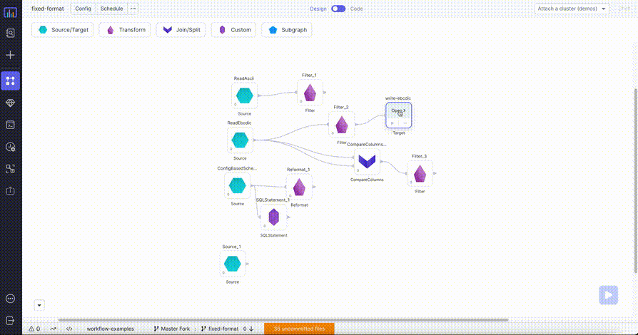

:::caution Enterprise Only
To learn more about our Enterprise offering, please [contact us](https://www.prophecy.io/request-a-demo).
:::

A Fixed Format (Fixed-Length Format) file type:

- Is a text file where each field or column occupies a predetermined, constant number of characters in each record.
- Can parse and process quickly because the software knows exactly where to find each field.
- Is often used in legacy systems, data exchange, and performance-critical applications.

## Parameters

| Parameter | Tab        | Description                                                                                                                                                                                                    |
| --------- | ---------- | -------------------------------------------------------------------------------------------------------------------------------------------------------------------------------------------------------------- |
| Location  | Location   | File path to read from or write to the Fixed Format file.                                                                                                                                                      |
| Schema    | Properties | Schema to apply on the loaded data. <br/>In the Source gem, you can define or edit the schema as a JSON, or infer it with the `Infer Schema` button.<br/>In the Target gem, you can view the schema as a JSON. |

## Source

The Source gem reads data from Fixed Format files and allows you to optionally specify the following additional properties.

### Source Properties

| Property name       | Description                                                                            | Default |
| ------------------- | -------------------------------------------------------------------------------------- | ------- |
| Description         | Description of your dataset.                                                           | None    |
| Skip header lines   | Number of lines to skip at the beginning of the file.                                  | None    |
| Skip footer lines   | Number of lines to skip at the end of the file.                                        | None    |
| Fixed Format Schema | Schema string for the fixed format file. <br/>Supports either EBCDIC or ASCII formats. | None    |

### Example {#source-example}


### Generated Code {#source-code}

:::tip
To see the generated source code, [switch to the Code view](/getting-started/tutorials/spark-with-databricks#review-the-code) at the top of the page.
:::

````mdx-code-block
import Tabs from '@theme/Tabs';
import TabItem from '@theme/TabItem';

<Tabs>
<TabItem value="py" label="Python">

```py
def read_ebcdic(spark: SparkSession) -> DataFrame:
    from prophecy.utils.transpiler import parse

    return spark.read\
        .option("schema", parse("ebcdic record\nstring(18) c_name;\ndecimal(10, 0) c_custkey ;\nend"))\
        .format("io.prophecy.libs.FixedFileFormat")\
        .load("/FileStore/tables/fixed_format/test/read_ebcdic")

```
</TabItem>
<TabItem value="scala" label="Scala">

```scala
object ReadEbcdic {

  def apply(spark: SparkSession): DataFrame = {
    import _root_.io.prophecy.abinitio.dml.DMLSchema.parse
    import _root_.io.prophecy.libs.{FFSchemaRecord, _}
    import play.api.libs.json.Json
    import _root_.io.prophecy.libs.FixedFormatSchemaImplicits._
    spark.read
      .option(
        "schema",
        Some("""ebcdic record
                string(6) service ;
                string(2) person ;
                decimal(2, 0) data ;
                string(1) format ;
                string(1) working ;
                end""").map(s => parse(s).asInstanceOf[FFSchemaRecord])
                          .map(s => Json.stringify(Json.toJson(s)))
                          .getOrElse("")
      )
      .format("io.prophecy.libs.FixedFileFormat")
      .load("/FileStore/tables/fixed_format/test/write_ebcdic")
      .cache()
  }

}
```
</TabItem>
</Tabs>
````

---

## Target

The Target gem writes data to Fixed Format files and allows you to optionally specify the following additional properties.

### Target Properties

| Property name       | Description                                                                                                          | Default |
| ------------------- | -------------------------------------------------------------------------------------------------------------------- | ------- |
| Write Mode          | How to handle existing data. For a list of the possible values, see [Supported write modes](#supported-write-modes). | `error` |
| Description         | Description of your dataset.                                                                                         | None    |
| Fixed Format Schema | Schema string for the fixed format file. <br/>Supports either EBCDIC or ASCII formats.                               | None    |

### Supported write modes

| Write mode | Description                                                                                                                                          |
| ---------- | ---------------------------------------------------------------------------------------------------------------------------------------------------- |
| error      | If the data already exists, throw an exception.                                                                                                      |
| overwrite  | If the data already exists, overwrite the data with the contents of the `DataFrame`.                                                                 |
| append     | If the data already exists, append the contents of the `DataFrame`.                                                                                  |
| ignore     | If the data already exists, do nothing with the contents of the `DataFrame`. <br/>This is similar to the `CREATE TABLE IF NOT EXISTS` clause in SQL. |

### Example {#target-example}



### Generated Code {#target-code}

:::tip
To see the generated source code, [switch to the Code view](/getting-started/tutorials/spark-with-databricks#review-the-code) at the top of the page.
:::

````mdx-code-block

<Tabs>
<TabItem value="py" label="Python">

```py
def write_ebcdic(spark: SparkSession, in0: DataFrame):
    from prophecy.utils.transpiler import parse
    in0.write\
        .mode("overwrite")\
        .option("schema", parse("ebcdic record\nstring(18) c_name ;\ndecimal(10, 0) c_custkey ;\nend"))\
        .format("io.prophecy.libs.FixedFileFormat")\
        .save("/FileStore/tables/fixed_format/test/write_ebcdic_alt")
```
</TabItem>
<TabItem value="scala" label="Scala">

```scala
object write_ebcdic {

  def apply(spark: SparkSession, in: DataFrame): Unit = {
    import _root_.io.prophecy.abinitio.dml.DMLSchema.parse
    import _root_.io.prophecy.libs.{FFSchemaRecord, _}
    import play.api.libs.json.Json
    import _root_.io.prophecy.libs.FixedFormatSchemaImplicits._
    val schema = Some("""ebcdic record
                            string(6) service ;
                            string(2) person ;
                            decimal(2, 0) data ;
                            string(1) format ;
                            string(1) working ;
                            end""").map(s => parse(s).asInstanceOf[FFSchemaRecord])
    var writer = in.write.format("io.prophecy.libs.FixedFileFormat")
    writer = writer.mode("overwrite")
    schema
      .map(s => Json.stringify(Json.toJson(s)))
      .foreach(schema => writer = writer.option("schema", schema))
    writer.save("/FileStore/tables/fixed_format/test/write_ebcdic_alt")
  }

}
```
</TabItem>
</Tabs>
````
