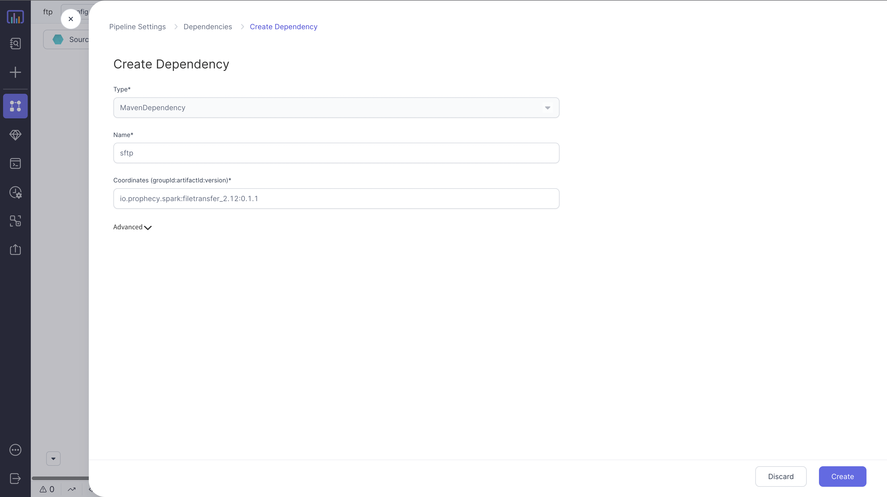

Allows you to read or write files (csv, text and binary) on a remote location.

### Source Parameters

| Parameter       | Description                                                                                                                                                        | Required                                                        |
| :-------------- | :----------------------------------------------------------------------------------------------------------------------------------------------------------------- | :-------------------------------------------------------------- |
| Dataset Name    | Name of the Dataset                                                                                                                                                | True                                                            |
| Credential Type | Credential Type: `Databricks Secrets` or `Username & Password`                                                                                                     | True                                                            |
| Credentials     | Databricks credential name, else username and password for the remote account                                                                                      | Required if `Databricks Secrets` is opted as `Credential Type`  |
| Username        | Login name for the remote user                                                                                                                                     | Required if `Username & Password` is opted as `Credential Type` |
| Password        | Password for the remote user                                                                                                                                       | Required if `Username & Password` is opted as `Credential Type` |
| Protocol        | Protocol to use for file transfer: `FTP` or `SFTP`                                                                                                                 | Required if `Username & Password` is opted as `Credential Type` |
| Host            | hostname for your remote account. <br/> E.g.: `prophecy.files.com`                                                                                                 | True                                                            |
| Path            | Path of the file(s) or folder to be loaded. Supports wildcard matching at the lowest level of the path. <br/> E.g.: `/folder`, `/folder/test.csv`, `/folder/*.csv` | True                                                            |
| File Format     | Format of the file to be loaded. <br/> Supported formats are `text`, `csv` and `binary`.                                                                           | True                                                            |

### Target Parameters

| Parameter       | Description                                                                                                                                                        | Required                                                        |
| :-------------- | :----------------------------------------------------------------------------------------------------------------------------------------------------------------- | :-------------------------------------------------------------- |
| Dataset Name    | Name of the Dataset                                                                                                                                                | True                                                            |
| Credential Type | Credential Type: `Databricks Secrets` or `Username & Password`                                                                                                     | True                                                            |
| Credentials     | Databricks credential name, else username and password for the remote account                                                                                      | Required if `Databricks Secrets` is opted as `Credential Type`  |
| Username        | Login name for the remote user                                                                                                                                     | Required if `Username & Password` is opted as `Credential Type` |
| Password        | Password for the remote user                                                                                                                                       | Required if `Username & Password` is opted as `Credential Type` |
| Protocol        | Protocol to use for file transfer: `FTP` or `SFTP`                                                                                                                 | Required if `Username & Password` is opted as `Credential Type` |
| Host            | hostname for your remote account. <br/> E.g.: `prophecy.files.com`                                                                                                 | True                                                            |
| Path            | Path of the file(s) or folder to be loaded. Supports wildcard matching at the lowest level of the path. <br/> E.g.: `/folder`, `/folder/test.csv`, `/folder/*.csv` | True                                                            |
| File Format     | Format of the file to be loaded. <br/> Supported formats are `text`, `csv` and `binary`.                                                                           | True                                                            |
| Write Mode      | How to handle existing data if present while writing. `Error` or `Overwrite`                                                                                       | True                                                            |

:::info
Based on the selected **File Format**, you can provide additional read/write options in the **Properties** tab.
For example, if the File Format is `CSV`, you can set CSV specific options like `header`, `separator`, etc.
:::

:::note
For **SFTP**, make sure you have the dependency `io.prophecy.spark:filetransfer_2.12:0.1.1` included in your Pipeline.
[**Read more**](docs/extensibility/dependencies/spark-dependencies.md) about how to manage dependencies.


:::

### Loading a CSV file from SFTP

```mdx-code-block
import App from '@site/src/components/slider';

export const ImageData = [
  {
    "image":"/img/ftp/load/1.png",
    "description":<h3 style={{padding:'10px'}}>Step 1 - Create Source Component</h3>,
  },
  {
    "image":"/img/ftp/load/2.png",
    "description":<h3 style={{padding:'10px'}}>Step 2 - Click 'Create Dataset'</h3>,
  },
  {
    "image":"/img/ftp/load/3.png",
    "description":<h3 style={{padding:'10px'}}> Step 3 - Enter 'Dataset Name' and select the FTP format</h3>
  },
  {
    "image":"/img/ftp/load/4.png",
    "description":<h3 style={{padding:'10px'}}>Step 4 - Enter connection and input file details</h3>,
  },
  {
    "image":"/img/ftp/load/5.png",
    "description":<h3 style={{padding:'10px'}}>Step 5 - Customize the properties as per your needs</h3>,
  },
  {
    "image":"/img/ftp/load/6.png",
    "description":<h3 style={{padding:'10px'}}>Step 6 - Hit 'Refresh' to preview data </h3>,
  },
];

<App ImageData={ImageData}></App>
```

````mdx-code-block
import Tabs from '@theme/Tabs';
import TabItem from '@theme/TabItem';

<Tabs>
<TabItem value="scala" label="Scala">

```scala
object load_csv {
  def apply(spark: SparkSession): DataFrame = {
    import com.databricks.dbutils_v1.DBUtilsHolder.dbutils
    locally {
      var reader = spark.read
        .format("io.prophecy.spark.filetransfer")
        .option("protocol",   "sftp")
        .option("host",       "prophecy.files.com")
        .option("port",       "22")
        .option("username",   "maciej@prophecy.io")
        .option("password",   "******")
        .option("fileFormat", "csv")
      reader = reader
        .option("header", Some(true).getOrElse(false))
        .option("sep",    Some(",").getOrElse(","))
      reader.load("/folder/*.csv")
    }
  }

}
```
</TabItem>
</Tabs>
````

---

### Writing a CSV file to SFTP

```mdx-code-block

export const ImageData2 = [
  {
    "image":"/img/ftp/write/1.png",
    "description":<h3 style={{padding:'10px'}}>Step 1 - Create Target Component</h3>,
  },
  {
    "image":"/img/ftp/write/2.png",
    "description":<h3 style={{padding:'10px'}}>Step 2 - Click 'Create Dataset'</h3>,
  },
  {
    "image":"/img/ftp/write/3.png",
    "description":<h3 style={{padding:'10px'}}> Step 3 - Enter 'Dataset Name' and select the FTP format</h3>
  },
  {
    "image":"/img/ftp/write/4.png",
    "description":<h3 style={{padding:'10px'}}>Step 4 - Enter connection and output file details</h3>,
  },
  {
    "image":"/img/ftp/write/5.png",
    "description":<h3 style={{padding:'10px'}}>Step 5 - Define write mode and other file format specific options</h3>,
  }
];

<App ImageData={ImageData2}></App>
```

````mdx-code-block

<Tabs>

<TabItem value="scala" label="Scala">

```scala
object write_csv {
  def apply(spark: SparkSession, in: DataFrame): Unit = {
    import com.databricks.dbutils_v1.DBUtilsHolder.dbutils
    var writer = in
      .coalesce(1)
      .write
      .format("io.prophecy.spark.filetransfer")
      .option("protocol",   "sftp")
      .option("host",       "prophecy.files.com")
      .option("port",       "22")
      .option("username",   "maciej@prophecy.io")
      .option("password",   "******")
      .option("fileFormat", "csv")
      .mode("overwrite")
    writer = writer
      .option("header", Some(true).getOrElse(false))
      .option("sep",    Some(",").getOrElse(","))
    writer.save("/cust_output.csv")
  }
}
```

</TabItem>
</Tabs>


````
