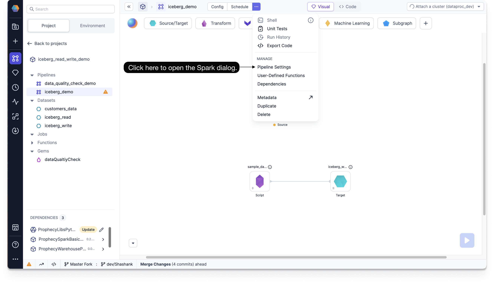
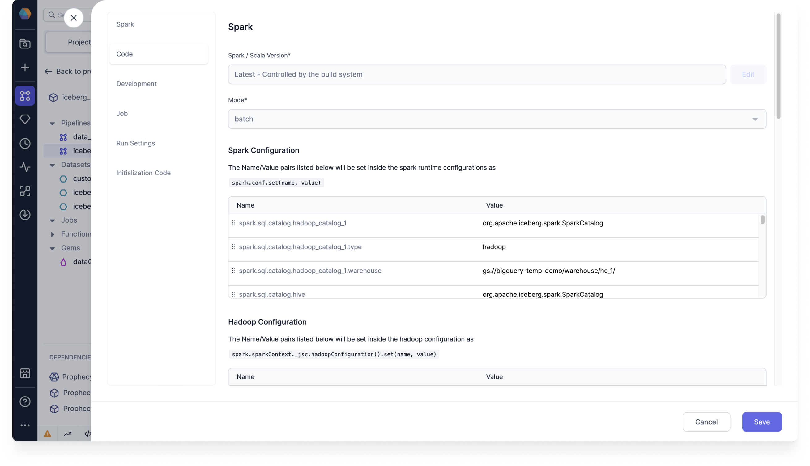

Reads and writes Iceberg tables, including Iceberg Merge operations and Time travel.

## Required Settings

Before you can use Iceberg source Gems, you must configure some required settings at the environment, initialization, and runtime stages.

### Environment Setting

You must configure a required Spark JAR dependency in your Fabric environment.

- JAR dependency

  - Package: `https://repo1.maven.org/maven2/org/apache/iceberg/iceberg-spark-runtime-3.3_2.12/1.5.0/iceberg-spark-runtime-3.3_2.12-1.5.0.jar`

### Initialization Settings

You must configure the following Spark session property during the Spark session initialization.

- Spark session property:

  - Key - `spark.sql.extensions`
  - Value - `org.apache.iceberg.spark.extensions.IcebergSparkSessionExtensions`

  :::note

  This can be done during cluster bootstrap. For example, you can set `--properties "spark:spark.sql.extensions=org.apache.iceberg.spark.extensions.IcebergSparkSessionExtentions" \` with your create clusters command.

  :::

### Runtime Settings

You must configure the following Spark conf properties, which can be done during the Spark session runtime.

These properties allow you to configure multiple catalogs and your respective metastores for Iceberg tables and data management. You can configure Hadoop and Hive as catalogs.

- Spark conf properties

  - Configure Hadoop as catalog

    - `spark.sql.catalog.<catalog_name>=org.apache.iceberg.spark.SparkCatalog`
    - `spark.sql.catalog.<catalog_name>.type=hadoop`
    - `spark.sql.catalog.<catalog_name>.warehouse=gs://<bucket>/<folder_1>/<folder_1>/`

  - Configure Hive as catalog

    - `spark.sql.catalog.<catalog_name>=org.apache.iceberg.spark.SparkCatalog`
    - `spark.sql.catalog.<catalog_name>.type=hive`
    - `spark.sql.catalog.<catalog_name>.warehouse=gs://<bucket>/<folder_1>/<folder_1>/`
    - `spark.sql.catalog.<catalog_name>.uri=thrift://10.91.64.30:9083`

  :::tip

  You can set the default catalog by using `spark.default.catalog=<catalog_name>`.

  :::

To configure the Spark conf properties, follow these steps:

1. Click **...** at the top of the Prophecy canvas, and then click **Pipeline Settings** under Manage.

   

2. On the Spark dialog, under Spark Configuration, add the Spark conf properties.

   

## Source

### Source Parameters

| Parameter                   | Description                                                                    | Required                                                                     |
| --------------------------- | ------------------------------------------------------------------------------ | ---------------------------------------------------------------------------- |
| Catalog Name                | Any configured Hadoop/Hive catalog name                                        | True (If any default catalog is not configured in Spark runtime properties.) |
| Schema Name (Database Name) | Name of the database                                                           | True                                                                         |
| Table Name                  | Name of the table                                                              | True                                                                         |
| Read Timestamp              | Time travel to a specific timestamp (value should be in milliseconds)          | False                                                                        |
| Read Snapshot               | Time travel to a specific version of the table (value should be a snapshot ID) | False                                                                        |

:::note

For time travel on Iceberg tables:

1. Only `Read Timestamp` **_OR_** `Read Snapshot` can be selected, not both.
2. Timestamp should be between the first commit timestamp and the latest commit timestamp in the table.
3. Snapshot needs to be a snapshot ID.

By default most recent version of each row is fetched if no time travel option is used.

:::

:::info

To read more about Iceberg time travel and its use cases, see the [Apache Iceberg docs](https://iceberg.apache.org/docs/nightly/hive/?h=time#timetravel).

:::

### Example {#source-example}

<div class="wistia_responsive_padding" style={{padding:'56.25% 0 0 0', position:'relative'}}>
<div class="wistia_responsive_wrapper" style={{height:'100%',left:0,position:'absolute',top:0,width:'100%'}}>
<iframe src="https://fast.wistia.net/embed/iframe/b1vt6gv6bl?seo=false?videoFoam=true" title="Iceberg source example" allow="autoplay; fullscreen" allowtransparency="true" frameborder="0" scrolling="no" class="wistia_embed" name="wistia_embed" msallowfullscreen width="100%" height="100%"></iframe>
</div></div>
<script src="https://fast.wistia.net/assets/external/E-v1.js" async></script>

### Generated Code {#source-code}

````mdx-code-block
import Tabs from '@theme/Tabs';
import TabItem from '@theme/TabItem';

<Tabs>

<TabItem value="py" label="Python">

```py
def iceberg_read(spark: SparkSession) -> DataFrame:
    return spark.read.format("iceberg").load("`hadoop_catalog_1`.`prophecy_doc_demo`.`employees_test`")
```

</TabItem>

</Tabs>

````

---

## Target

### Target Parameters

| Parameter                   | Description                                                                                                                                                                 | Required                                                                     |
| --------------------------- | --------------------------------------------------------------------------------------------------------------------------------------------------------------------------- | ---------------------------------------------------------------------------- |
| Catalog Type                | File path to write the Iceberg table to                                                                                                                                     | True                                                                         |
| Catalog Name                | Any configured Hadoop/Hive catalog name                                                                                                                                     | True (If any default catalog is not configured in Spark runtime properties.) |
| Schema Name (Database Name) | Name of the database                                                                                                                                                        | True                                                                         |
| Table Name                  | Name of the table                                                                                                                                                           | True                                                                         |
| File Location               | External file path to store data (Only applicable if Catalog type is Hive.)                                                                                                 | False                                                                        |
| Partition Columns           | List of columns to partition the Iceberg table by (Provide it during createOrReplace write mode to leverage overwritePartitions write mode in future.)                      | False                                                                        |
| Merge schema                | If true, then any columns that are present in the DataFrame but not in the target table are automatically added on to the end of the schema as part of a write transaction. | False                                                                        |

#### Supported Write Modes

| Write Mode | Description                                                                                                                      |
| ---------- | -------------------------------------------------------------------------------------------------------------------------------- |
| overwrite  | If data already exists, overwrite with the contents of the DataFrame                                                             |
| append     | If data already exists, append the contents of the DataFrame                                                                     |
| ignore     | If data already exists, do nothing with the contents of the DataFrame. This is similar to a `CREATE TABLE IF NOT EXISTS` in SQL. |
| error      | If data already exists, throw an exception.                                                                                      |

Among these write modes overwrite and append works the same way as in case of parquet file writes.

### Target Example

<div class="wistia_responsive_padding" style={{padding:'56.25% 0 0 0', position:'relative'}}>
<div class="wistia_responsive_wrapper" style={{height:'100%',left:0,position:'absolute',top:0,width:'100%'}}>
<iframe src="https://fast.wistia.net/embed/iframe/8j80hc4k1e?seo=false?videoFoam=true" title="Iceberg-target-example" allow="autoplay; fullscreen" allowtransparency="true" frameborder="0" scrolling="no" class="wistia_embed" name="wistia_embed" msallowfullscreen width="100%" height="100%"></iframe>
</div></div>
<script src="https://fast.wistia.net/assets/external/E-v1.js" async></script>

### Generated Code {#target-code}

````mdx-code-block

<Tabs>

<TabItem value="py" label="Python">

```py
def iceberg_write(spark: SparkSession, in0: DataFrame):
    df1 = in0.writeTo("`hadoop_catalog_1`.`prophecy_doc_demo`.`employees_test`")
    df2 = df1.using("iceberg")
    df3 = df2.partitionedBy("Department")
    df4 = df3.tableProperty("write.spark.accept-any-schema", "true")
    df4.createOrReplace()
```

</TabItem>

</Tabs>

````
