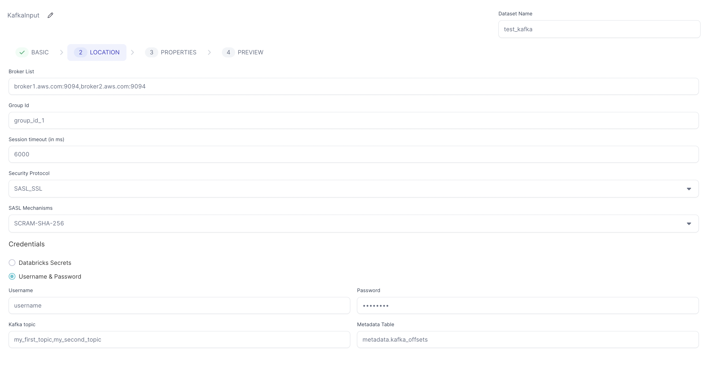

import Requirements from '@site/src/components/gem-requirements';

<Requirements
  python_package_name="ProphecySparkBasicsPython"
  python_package_version="0.0.1+"
  scala_package_name="ProphecySparkBasicsScala"
  scala_package_version="0.0.1+"
  scala_lib=""
  python_lib="1.9.24"
  uc_single="Not Supported"
  uc_shared="14.3+"
  livy="Not Supported"
/>

The Kafka file type is used in [Apache Kafka](https://kafka.apache.org/), which:

- Is an open-source distributed event streaming platform.
- Handles high volumes of data and delivers messages with low latency.
- Supports real-time analytics, stream processing, fault tolerance, scalability, data integration, and event-driven architectures.

## Parameters

| Parameter                    | Tab      | Description                                                                                                                   |
| ---------------------------- | -------- | ----------------------------------------------------------------------------------------------------------------------------- |
| Bootstrap Server/Broker List | Location | Comma separated list of Kafka brokers.                                                                                        |
| Security Protocol            | Location | Security protocol for Kafka. (Default value is `SASL_SSL`.)                                                                   |
| SASL Mechanisms              | Location | Default SASL Mechanism for `SASL_SSL`. (Default value is `SCRAM-SHA-256`.)                                                    |
| Credentials                  | Location | How to provide your credentials. <br/>You can select: `Databricks Secrets`, `Username & Password`, or `Environment variables` |
| Kafka topic                  | Location | Comma separated list of Kafka topics.                                                                                         |

## Source

The Source gem reads data from Kafka stream in batch mode and allows you to optionally specify the following additional properties. This means that Kafka only reads data incrementally from the last offset stored in the specified Metadata table. If the Metadata table is not present, then Kafka reads data from the `earliest` offset.

### Source properties

| Property name                                   | Description                                                 | Default |
| ----------------------------------------------- | ----------------------------------------------------------- | ------- |
| Group Id                                        | Kafka consumer group ID.                                    | None    |
| Session Timeout                                 | Session timeout for Kafka.                                  | `6000`  |
| Store offsets read per partition in Delta table | Whether to store offsets read per partition in Delta table. | false   |
| Metadata Table                                  | Delta table to store offsets for each topic and partition.  | None    |
| Kerberos service name for Kafka SASL            | Name of your Kerberos service to use in Kafka.              | None    |

### Example {#source-example}



### Generated Code {#source-code}

:::tip
To see the generated source code of your project, [switch to the Code view](/getting-started/tutorials/spark-with-databricks#review-the-code) in the project header.
:::

````mdx-code-block
import Tabs from '@theme/Tabs';
import TabItem from '@theme/TabItem';

<Tabs>
<TabItem value="py" label="Python">

```py
def KafkaSource(spark: SparkSession) -> DataFrame:
    from delta.tables import DeltaTable
    import json
    from pyspark.dbutils import DBUtils

    if spark.catalog._jcatalog.tableExists(f"metadata.kafka_offsets"):
        offset_dict = {}

        for row in DeltaTable.forName(spark, f"metadata.kafka_offsets").toDF().collect():
            if row["topic"] in offset_dict.keys():
                offset_dict[row["topic"]].update({row["partition"] : row["max_offset"] + 1})
            else:
                offset_dict[row["topic"]] = {row["partition"] : row["max_offset"] + 1}

        return (spark.read\
            .format("kafka")\
            .options(
              **{
                "kafka.sasl.jaas.config": (
                  f"kafkashaded.org.apache.kafka.common.security.scram.ScramLoginModule"
                  + f' required username="{DBUtils(spark).secrets.get(scope = "test", key = "username")}" password="{DBUtils(spark).secrets.get(scope = "test", key = "password")}";'
                ),
                "kafka.sasl.mechanism": "SCRAM-SHA-256",
                "kafka.security.protocol": "SASL_SSL",
                "kafka.bootstrap.servers": "broker1.aws.com:9094,broker2.aws.com:9094",
                "kafka.session.timeout.ms": "6000",
                "group.id": "group_id_1",
                "subscribe": "my_first_topic,my_second_topic",
                "startingOffsets": json.dumps(offset_dict),
              }
            )\
            .load()\
            .withColumn("value", col("value").cast("string"))\
            .withColumn("key", col("key").cast("string")))
    else:
        return (spark.read\
            .format("kafka")\
            .options(
              **{
                "kafka.sasl.jaas.config": (
                  f"kafkashaded.org.apache.kafka.common.security.scram.ScramLoginModule"
                  + f' required username="{DBUtils(spark).secrets.get(scope = "test", key = "username")}" password="{DBUtils(spark).secrets.get(scope = "test", key = "password")}";'
                ),
                "kafka.sasl.mechanism": "SCRAM-SHA-256",
                "kafka.security.protocol": "SASL_SSL",
                "kafka.bootstrap.servers": "broker1.aws.com:9094,broker2.aws.com:9094",
                "kafka.session.timeout.ms": "6000",
                "group.id": "group_id_1",
                "subscribe": "my_first_topic,my_second_topic"
              }
            )\
            .load()\
            .withColumn("value", col("value").cast("string"))\
            .withColumn("key", col("key").cast("string")))
```
</TabItem>
</Tabs>
````

---

## Target

<Requirements
  python_package_name="ProphecySparkBasicsPython"
  python_package_version="0.0.1+"
  scala_package_name="ProphecySparkBasicsScala"
  scala_package_version="0.0.1+"
  scala_lib=""
  python_lib=""
  uc_single="Not Supported"
  uc_shared="14.3+"
  livy="Not Supported"
/>

The Target gem writes data to each row from the `Dataframe` to a Kafka topic as JSON messages and allows you to optionally specify the following additional properties.

### Target properties

| Property name                        | Description                                                 | Default |
| ------------------------------------ | ----------------------------------------------------------- | ------- |
| Message Unique Key                   | Key to help determine which partition to write the data to. | None    |
| Kerberos service name for Kafka SASL | Name of your Kerberos service to use in Kafka.              | None    |

### Example {#target-example}


### Generated Code {#target-code}

:::tip
To see the generated source code of your project, [switch to the Code view](/getting-started/tutorials/spark-with-databricks#review-the-code) in the project header.
:::

````mdx-code-block

<Tabs>
<TabItem value="py" label="Python">

```py
def KafkaTarget(spark: SparkSession, in0: DataFrame):
    df1 = in0.select(to_json(struct("*")).alias("value"))
    df2 = df1.selectExpr("CAST(value AS STRING)")
    df2.write\
        .format("kafka")\
        .options(
          **{
            "kafka.sasl.jaas.config": (
              f"kafkashaded.org.apache.kafka.common.security.scram.ScramLoginModule"
              + f' required username="{DBUtils(spark).secrets.get(scope = "test", key = "username")}" password="{DBUtils(spark).secrets.get(scope = "test", key = "password")}";'
            ),
            "kafka.sasl.mechanism": "SCRAM-SHA-256",
            "kafka.security.protocol": "SASL_SSL",
            "kafka.bootstrap.servers": "broker1.aws.com:9094,broker2.aws.com:9094",
            "topic": "my_first_topic,my_second_topic",
          }
        )\
        .save()
```
</TabItem>
</Tabs>
````

---

## Example Pipeline

### Source Pipeline Example

In this example, you read JSON messages from Kafka, parse them, remove any null messages, and persist the data to a Delta table.


:::tip
To see the generated source code of your project, [switch to the Code view](/getting-started/tutorials/spark-with-databricks#review-the-code) in the project header.
:::

#### Metadata Table

To avoid reprocessing messages on subsequent pipeline runs, update a table with the last processed offsets for each Kafka partition and topic. When you run the pipeline, the table only gets a batch of messages that arrived since the previously-processed offset.

In this example, you update `metadata.kafka_offsets`, which has the following structure:

| topic           | partition | max_offset |
| :-------------- | :-------- | :--------- |
| my_first_topic  | 0         | 10         |
| my_first_topic  | 1         | 5          |
| my_second_topic | 0         | 10         |
| my_second_topic | 1         | 5          |

Taking this approach provides you the with following benefits:

1. Builds the pipeline interactively without committing any offsets.
2. Production workflows only consume messages that arrived since the previously-processed offset.
3. You can replay old messages by modifying the Metadata table.

:::note
For production workflows the [phase](../../../../concepts/project/gems.md#gem-phase) for the `Script` gem that updates the offsets should be greater than the phase of the Target gem. This ensures that offsets only update in the table after Prophecy safely persists the data to the Target.
:::

#### Spark Code used for script component

:::tip
To see the generated source code of your project, [switch to the Code view](/getting-started/tutorials/spark-with-databricks#review-the-code) in the project header.
:::

````mdx-code-block

<Tabs>
<TabItem value="py" label="Python">

```py
def UpdateOffsets(spark: SparkSession, in0: DataFrame):

    if not ("SColumnExpression" in locals()):
        from delta.tables import DeltaTable
        import pyspark.sql.functions as f
        metadataTable = "metadata.kafka_offsets"
        metaDataDf = in0.groupBy("partition", "topic").agg(f.max(f.col("`offset`").cast("int")).alias("max_offset"))

        if not spark.catalog._jcatalog.tableExists(metadataTable):
            metaDataDf.write.format("delta").mode("overwrite").saveAsTable(metadataTable)
        else:
            DeltaTable\
                .forName(spark, metadataTable)\
                .alias("target")\
                .merge(
                  metaDataDf.alias("source"),
                  (
                    (col("source.`partition`") == col("target.`partition`"))
                    & (col("source.`topic`") == col("target.`topic`"))
                  )
                )\
                .whenMatchedUpdateAll()\
                .whenNotMatchedInsertAll()\
                .execute()
```
</TabItem>
</Tabs>
````
