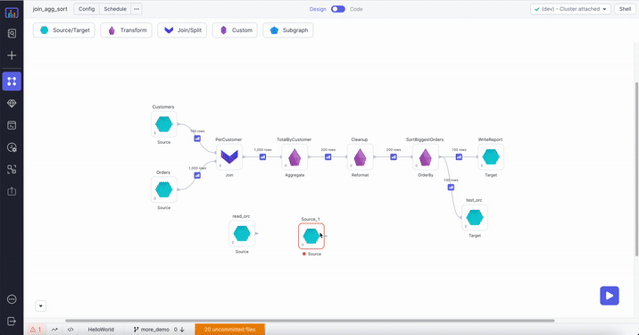
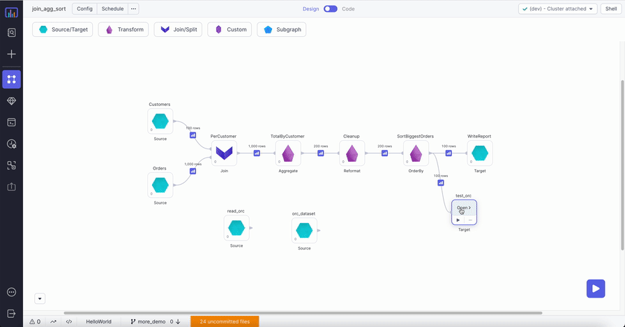

The ORC (Optimized Row Columnar) file type:

- Is a columnar file format designed for Spark and Hadoop workloads.
- Offers high compression ratios, which helps reduce storage costs.
- Optimizes for large streaming reads, but with integrated support for finding required rows quickly.
- Is type-aware, which means it can choose an encoding for the type and builds an internal index while you write to the file.

## Parameters

| Parameter | Tab        | Description                                                                                                                                                                                                    |
| --------- | ---------- | -------------------------------------------------------------------------------------------------------------------------------------------------------------------------------------------------------------- |
| Location  | Location   | File path to read from or write to the ORC file.                                                                                                                                                               |
| Schema    | Properties | Schema to apply on the loaded data. <br/>In the Source gem, you can define or edit the schema as a JSON, or infer it with the `Infer Schema` button.<br/>In the Target gem, you can view the schema as a JSON. |

## Source

The Source gem reads data from ORC files and allows you to optionally specify the following additional properties.

### Source properties

| Property name           | Description                                                                                                                                                                                                 | Default |
| ----------------------- | ----------------------------------------------------------------------------------------------------------------------------------------------------------------------------------------------------------- | ------- |
| Description             | Description of your dataset.                                                                                                                                                                                | None    |
| Use user-defined schema | Whether to use the schema you define.                                                                                                                                                                       | false   |
| Recursive File Lookup   | Whether to recursively load files and disable partition inferring. If the data source explicitly specifies the `partitionSpec` when the`recursiveFileLookup` is `true`, the Source gem throws an exception. | false   |

### Example {#source-example}



### Generated Code {#source-code}

:::tip
To see the generated source code, [switch to the Code view](/getting-started/tutorials/spark-with-databricks#review-the-code) at the top of the page.
:::

````mdx-code-block
import Tabs from '@theme/Tabs';
import TabItem from '@theme/TabItem';

<Tabs>
<TabItem value="py" label="Python">

```py
def read_orc(spark: SparkSession) -> DataFrame:
    return spark.read\
        .format("orc")\
        .load("dbfs:/FileStore/Users/orc/test.orc")
```
</TabItem>
<TabItem value="scala" label="Scala">

```scala
object read_orc {

  def apply(spark: SparkSession): DataFrame =
    spark.read
      .format("orc")
      .load("dbfs:/FileStore/Users/orc/test.orc")

}
```
</TabItem>
</Tabs>
````

---

## Target

The Target gem writes data to ORC files and allows you to optionally specify the following additional properties.

### Target properties

| Property name     | Description                                                                                                                           | Default  |
| ----------------- | ------------------------------------------------------------------------------------------------------------------------------------- | -------- |
| Description       | Description of your dataset.                                                                                                          | None     |
| Write Mode        | How to handle existing data. For a list of the possible values, see [Supported write modes](#supported-write-modes).                  | `error`  |
| Partition Columns | List of columns to partition the ORC files by.                                                                                        | None     |
| Compression Codec | Compression codec when writing to the ORC file. <br/>The ORC file supports the following codecs: `none`, `snappy`, `zlib`, and `lzo`. | `snappy` |

### Supported write modes

| Write mode | Description                                                                                                                                          |
| ---------- | ---------------------------------------------------------------------------------------------------------------------------------------------------- |
| error      | If the data already exists, throw an exception.                                                                                                      |
| overwrite  | If the data already exists, overwrite the data with the contents of the `DataFrame`.                                                                 |
| append     | If the data already exists, append the contents of the `DataFrame`.                                                                                  |
| ignore     | If the data already exists, do nothing with the contents of the `DataFrame`. <br/>This is similar to the `CREATE TABLE IF NOT EXISTS` clause in SQL. |

### Example {#example-target}



### Generated Code {#target-code}

:::tip
To see the generated source code, [switch to the Code view](/getting-started/tutorials/spark-with-databricks#review-the-code) at the top of the page.
:::

````mdx-code-block

<Tabs>
<TabItem value="py" label="Python">

```py
def write_orc(spark: SparkSession, in0: DataFrame):
    in0.write\
        .format("orc")\
        .mode("overwrite")\
        .save("dbfs:/data/test_output.orc")
```
</TabItem>
<TabItem value="scala" label="Scala">

```scala
object write_orc {
  def apply(spark: SparkSession, in: DataFrame): Unit =
    in.write
        .format("orc")
        .mode("overwrite")
        .save("dbfs:/data/test_output.orc")
}
```
</TabItem>
</Tabs>
````
