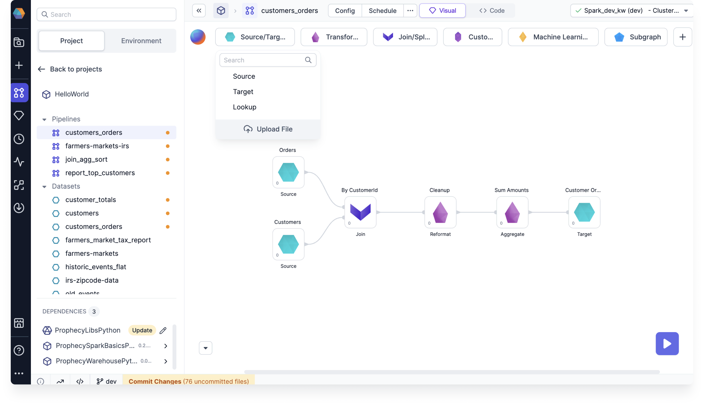

You can upload files of the following types to your file store:

- CSV, and other character separated types like TSV.
- JSON, with a single row per line, objects spanning many lines, or arrays with objects.
- Text, formatted with one line per row.
- XLSX, and the older XLS format.
- XML, using a row tag selector.

## Steps to upload

To upload a file and incorporate it into your Spark pipeline, you can use a Source gem. There are a few ways to get started:

- Drag and drop the file directly to the pipeline canvas.

  

- Open the Source/Target gem drawer and click **Upload file**.

  

- Create a new Source gem, click **+ New Dataset**, and select **Upload file**.

  

After following any of the above steps, you will see the **Type & Format** settings for your file.

## File configuration

Follow these steps to complete the file configuration:

1. Make sure the file type is correct, and click **Next**.
1. Either upload the file to a known file store location, or create a new table in your file store using the **Upload and create a table** option. Then, click **Next**.

   

   :::note
   Once you define the target location and click Next, the file is uploaded to the file path, regardless of whether you complete the gem configuration.
   :::

1. Fill in any properties depending on your requirements.
1. Click **Infer Schema**. _This step is required._
1. Validate or update the schema and click **Next**.
1. **Load** the data if you want to preview the table.
1. Click **Create Dataset**. This action creates the dataset and also creates the table if using the **Upload and create a table** option.

Now, your data is ready for use in your pipeline via the Source gem!
