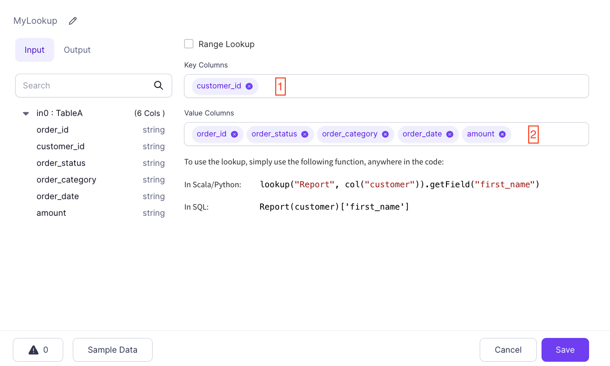
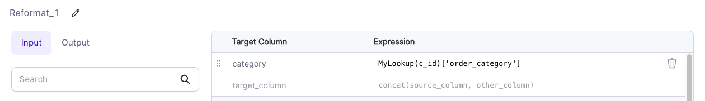

import Requirements from '@site/src/components/gem-requirements';

<Requirements
  python_package_name=""
  python_package_version=""
  scala_package_name=""
  scala_package_version=""
  scala_lib=""
  python_lib=""
  uc_single="14.3+"
  uc_shared="15.4+"
  livy="3.0.1"
/>

Lookup gems allow you to mark a particular DataFrame as a _Broadcast_ DataFrame. Spark ensures that this data is available on every computation node so you can perform lookups without shuffling data. This is useful for looking up values in tables.

:::info
Lookups are implemented as user-defined functions under the hood in Prophecy. Learn about UDF support in Databricks on our documentation on cluster [access modes](/administration/fabrics/Spark-fabrics/databricks/ucshared).
:::

## Parameters

| Parameter     | Description                                                               |
| ------------- | ------------------------------------------------------------------------- |
| Range Lookup  | Whether to perform a lookup with a minimum and maximum value in a column. |
| Key Columns   | One or more columns to use as the lookup key in the source `DataFrame`.   |
| Value Columns | Columns to reference wherever you use this Lookup gem.                    |

## Use a Lookup gem

After creating a Lookup gem, you can use the lookup in other gem expressions.

### Column-based lookups

Assume you created this Lookup gem with the following configurations:



To perform a column-based lookup, use:

````mdx-code-block
import Tabs from '@theme/Tabs';
import TabItem from '@theme/TabItem';

<Tabs>
<TabItem value="py" label="Python">

```py
lookup("MyLookup", col("customer_id")).getField("order_category")
```
</TabItem>
<TabItem value="scala" label="Scala">

```scala
lookup("MyLookup", col("customer_id")).getField("order_category")
```
</TabItem>
<TabItem value="sql" label="SQL">

```sql
MyLookup(customer_id)['order_category']
```
</TabItem>
</Tabs>
````

Assume you also have the following [Reformat](/engineers/reformat) component:



Here, you have a column named `category` that is set to the value of `MyLookup(c_id)['order_category']` in SQL Expression mode. Whatever the value of `order_category` is for the key found in the `c_id` column, which is compared to the source `customer_id` key column, the Lookup gem uses it for a new column.

### Literal lookups

You can use any column reference in a Lookup expression. This means that you can use Lookups with static keys:

````mdx-code-block
<Tabs>
<TabItem value="py" label="Python">

```py
lookup("MyLookup", lit("0000")).getField("order_category")
```
</TabItem>
<TabItem value="scala" label="Scala">

```scala
lookup("MyLookup", lit("0000")).getField("order_category")
```
</TabItem>
<TabItem value="sql" label="SQL">

```sql
MyLookup('0000')['order_category']
```
</TabItem>
</Tabs>
````

This expression evaluates to the value of `order_category` where `customer_id` is `0000`. This is useful in situations where you want to have a table of predefined keys and their values available in expressions.
