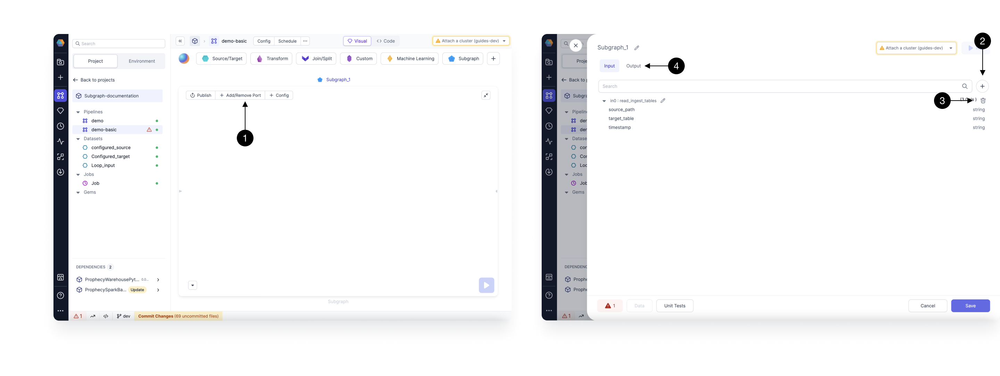

import Requirements from '@site/src/components/gem-requirements';

<Requirements
  python_package_name=""
  python_package_version=""
  scala_package_name=""
  scala_package_version=""
  scala_lib=""
  python_lib=""
  uc_single="14.3+"
  uc_shared="14.3+"
  livy="3.0.1+"
/>

The basic subgraph lets you group multiple gems into a single reusable parent gem. This improves pipeline clarity and helps modularize complex logic. Subgraph gems can be reused:

- Multiple times inside one pipeline
- Across different pipelines in the same project
- Across different pipelines in different projects

## Create a basic subgraph

To create a basic subgraph:

1. Add the Basic Subgraph gem from the Subgraph menu to the canvas. Connect it to another gem on your canvas.
1. Once you've added the gem, click **Open**. This opens the subgraph canvas, where you can add gems just as you would on the pipeline canvas.

## Add/Remove Port

While using a subgraph, you can control the input and output ports as per the requirements. Click on the **(1) Add/Remove Part** Button to open the port settings dialog.

In this dialog, you can add or remove the input or output ports.

- To add an input port, click the **(2) +** button.
- To remove an input port, click the **(3) delete** icon next to the input port you want to delete.
- To manage output ports, switch to the **(4) Output** tab.

The schema for each input and output is also reflected here.

## Subgraph Configurations

Subgraphs support configurations just like [pipelines](/engineers/configurations) do. You can apply configurations in two ways:

- Copy pipeline-level configurations
- Define configurations specific to the subgraph only

### Copy pipeline-level configurations

You can access pipeline configs from the subgraph by copying the pipeline configs to the subgraph configs. Prophecy provides a button inside a subgraph config that lets you copy all pipeline configs to the subgraph. The video below shows how this can be accomplished.

<iframe src="https://fast.wistia.net/embed/iframe/56j5k1f6ea?seo=false?videoFoam=true" title="Getting Started With SQL Video" allow="autoplay; fullscreen" allowtransparency="true" frameborder="0" scrolling="no" class="wistia_embed" name="wistia_embed" msallowfullscreen width="100%" height="100%"></iframe>

### Define subgraph-specific configurations

In subgraph configs, you can define values that can be set at the subgraph level and then be accessed inside any component in the subgraph. These will also reflect under configurations of pipelines using these subgraphs, but they can only be edited from subgraph configs.
