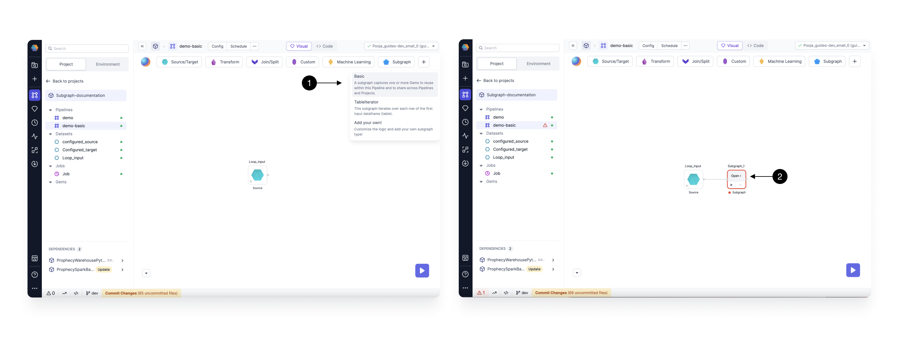

import Requirements from '@site/src/components/gem-requirements';

<Requirements
  python_package_name=""
  python_package_version=""
  scala_package_name=""
  scala_package_version=""
  scala_lib=""
  python_lib=""
  uc_single="14.3+"
  uc_shared="14.3+"
  livy="3.0.1+"
/>

In a **Basic Subgraph**, you have the capability to encapsulate multiple distinct gems within a single, reusable parent gem. This organizational approach enhances the visual clarity of your pipeline by grouping various sections together under a common parent gem. Additionally, it empowers you to break down intricate logic into modular components, thereby streamlining the Data Engineering processes.

Furthermore, the ability to [Publish a Subgraph](/engineers/shareable-subgraphs) extends the utility beyond a singular pipeline. By doing so, you can reuse the encapsulated logic in other pipelines or projects, promoting code re-usability and simplifying the overall development workflow.

## Create a Basic Subgraph

To create a Basic Subgraph, drag and drop the **(1) Basic** Subgraph gem from the Subgraph menu, and connect it to any previously created gem on your canvas.

Once you've added the gem, click **(2) Open**, to open the subgraph canvas.

Once you are on the canvas, you can start adding gems to your subgraph by dragging and dropping from the gems menu.

## Add/Remove Port

While using a Subgraph, you can control the Input and Output ports as per the requirements. Click on the **(1) Add/Remove Part** Button to open the port settings dialog as shown below.

In this dialog, you can add or remove the Input or Output ports.
To Add an input Put click on **(2) +** button. This will add an input Port.
To remove an Input port, Click the **(3) Delete** icon next to the input port you want to delete.

Similarly, you can control the Output Ports by switching to the **(4) Output** Tab.
As you connect the input and output ports to gems Outside the subgraph, you would be able to see the schema for the port reflected here.

## Subgraph Configurations

Subgraphs are configurable just like pipelines are [configurable](/engineers/configurations). For Subgraphs, the configurations can apply in one of two ways: (1) Pipeline level Configurations apply to the Subgraph or (2) Specify Configurations only for the Subgraph

### Pipeline Level Configurations can apply to the Subgraph

Pipeline configs are accessible inside Subgraphs by **copying** the config to the Subgraph. Checkout the video below to see how this works.

<iframe src="https://fast.wistia.net/embed/iframe/56j5k1f6ea?seo=false?videoFoam=true" title="Getting Started With SQL Video" allow="autoplay; fullscreen" allowtransparency="true" frameborder="0" scrolling="no" class="wistia_embed" name="wistia_embed" msallowfullscreen width="100%" height="100%"></iframe>

### Specify configurations only for the Subgraph

In Subgraph Configs, you can define values that can be set at the Subgraph level and then be accessed inside any component in the Subgraph. These will also reflect under Configurations of pipelines using these Subgraphs, but they can only be edited from Subgraph configs.
